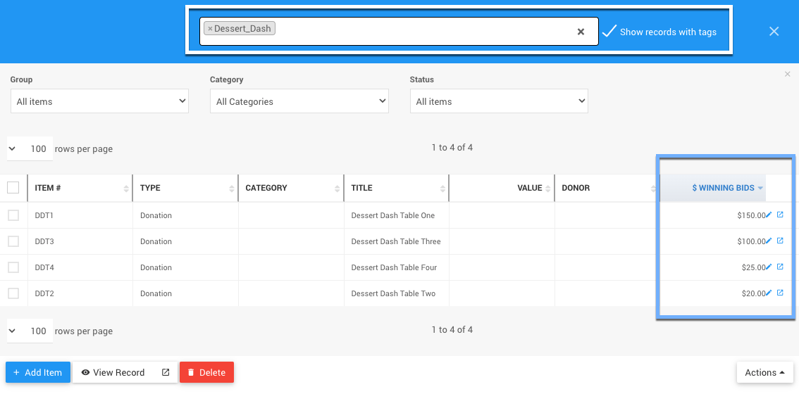

# Dessert Dash <New/> <Updated/> <NewLoc/>

::: glossary
**Dessert Dash**: A "Dessert Dash" is an in-person event fun way to help increase your fundraiser income. You will need a table full of desserts (one for each table of guests). The desserts are displayed for your guests to choose from; and, at the guest tables, each guest writes down the amount they want to contribute to the collective table bid. The table with the greatest bid wins first choice. The next highest table bid would chose second and so on.
:::

<HRDiv/>

  
Dessert Dash: Table Of Contents

  [[toc]]

<HRDiv/>

## In-Person Dessert Dash

With most **In-Person Dessert Dash** activities the bidders will be making "donations" towards winning the prize of being first to the dessert table to choose their favorite of the selection being offered. Following this approach the easiest way to manage this in Auctria would be to create a specific **Donation** type item for each table that is only used for the **Dessert Dash** activity.

You can use something simply for the item number like `DDT1` for the item number and "Dessert Dash Table One" for its title (you could even use that "title" as an item number although keeping the numbers shorter allows for easier bidding such as for those using mobile devices). Adding a **Tag** to the items, for example, `Dessert_Dash` to make them easier to find and report on may also be useful.

<Linked slug="AddNewItem"/>
<Linked slug="DonationItems"/>
<Linked slug="Tags"/>

Another thing to consider, if you are allowing for your participants to make donations online, is to set an **Override Online Bidding Ends At** time for these **Donation** items. This will add some extra incentive to get donations in sooner rather than later and help to generate more buzz around the activity... adding an **Override Online Bidding Starts At** time might also generate some quick bid with the building anticipation of the activity starting. **NOTE**: This is the exception to the rule of not setting **Donation** type item online bidding times.

<Linked slug="OnlineBiddingTimes" anchor="donation-items">Online Bidding Times - Donation Items</Linked>

### In-Person Dessert Dash Overview

1. Create **Donation** items for each table of guests.
2. Remind guests the **Dessert Dash** is going to begin (and end) at a specific time.
3. Generate some "buzz" while the donations for the **Dessert Dash** are being made.
4. Once the **Dessert Dash** "bidding" has ended, review the relevant **Donation** items and compare results. NOTE: Since each guest is donating to their specific table item you will only need to rank those specific items.
5. Announce the winners and enjoy the desserts!

Afterward, since each participant made their own specific donation to the **Dessert Dash** activity they will each see their specific donation/contribution on their **Bidder Statement**.

<Linked slug="BidderStatements"/>

### Dessert Dash Review

The simplest way to review the results of the **In-Person Dessert Dash**, especially if you used a **Tag** to identify your **Donation** items related to the activity, is to use that **Tag** to filter the all items list report. This would then show the amount each **Donation** item raised; or, in other words, the winning tables!

1. Open the all items list report.
2. Use the **Choosing Columns** function to add the `$ winning bids` column to the report.
3. Optionally, set the "Group" to **_Donation only items_**.
4. As needed, filter the report further using your `Dessert_Dash` **Tag** (see suggestion above).
5. Optionally, you can save this as a **View** for future reference although you will still need to filter the results each time.

<Linked slug="ChoosingColumns"/>
<Linked slug="CustomizedViews"/>

::: middle
*An example view with the added __$ winning bids__ column filtered by the __Tag__ "Dessert_Dash".*
:::

<HRDiv/>

## Online Dessert Dash

Although **Dessert Dashes** are generally considered a favorite in-person auction event "game" that helps to generate higher fundraising amounts moving to an **"Online" Dessert Dash** does change how it could be handled in Auctria.

1. Create a **Dessert Dash** item as an **Online** type item.
2. Get a high-quality image of each dessert and make certain to add them to the item (see <IndexLink slug="BatchImageUpload"/>) and provide descriptions to detail what the desserts are — bidders will want to see what they are bidding on so be extra descriptive with lots of imagery especially the scents.
3. Set the **Quantity Available** ( `X` ) to the number of desserts that will be showcased for the dash.
4. **Allow Multiple Winners** for the **Dessert Dash** item — this allows the top `X` bidders to win a dessert.
5. Once the auction item closes, you will be able to see the top bidders that won a "dash" to the dessert "table".

<Linked slug="OnlineItems">Online Item</Linked>
<Linked slug="MultipleWinners"/>

From this point you will need to hear back from the winning bidders as they would have received an **Item Won Notification** (this is an automatic **System Email Notification** and not configurable).

This will be a manual process that may simulate the “dash” although you may need to set some “rules” on how best to handle what time you receive a response back from the bidders.

These "rules" would then translate into the order the dasher / bidder could pick their dessert. This may require a separate communication and response from the bidder. Although it may be much easier to have an **In-Person Dessert Dash** for a number of reasons, this is still something you can do.

Just remember, with some preparation to establish (and post) the "rules" for the **Online Dessert Dash**, which will help to make things run more smoothly, you can have a successful **Dessert Dash** event online using Auctria.

Of course, delivery of the desserts will need to be sorted out and would likely be taken care of after the event.

<HRDiv/>

## Live Dessert Dash

This would essentially follow the same approach as an [Online Dessert Dash](./#online-dessert-dash) with the exception of the bidders seeing their bids updated live on the auction website **and** the auctioneer would be able to entice bidders and increase the funds raised through the live stream of the auction, too.

The live streaming could also allow for the "dash" part by providing a forum for the auctioneer to call on the winning bidders to make their choice at appropriate intervals after the **Dessert Dash** item has closed.

::: ideas
In those cases where multiple bidders are pooling their resources to win an online "dash" to the dessert table, you can use the **Split Bid** function to allow more than one bidder to make a payment to the winning bid. **NOTE**: You cannot split bids via an *online* checkout.
<Linked slug="SplitBid"/>
:::

<ChildPages/>
<Revised text="Added/Updated" date="2022-04-07"/>
