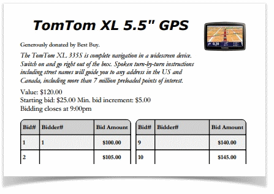
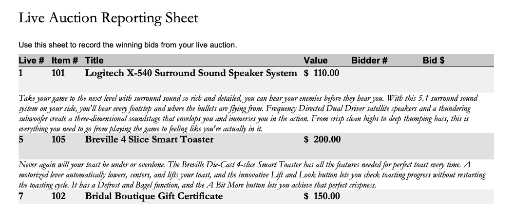
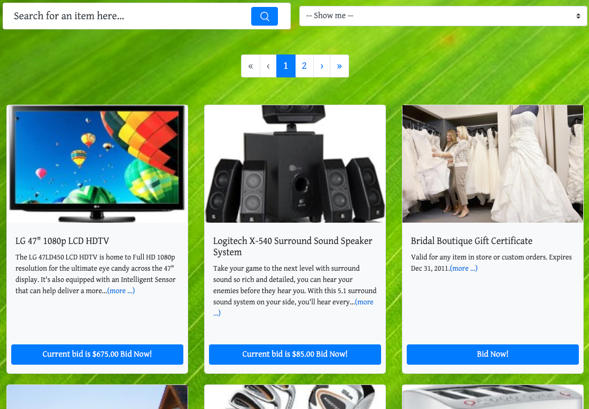

# Auction Concepts

**Auctions** (also referred to as **events**) are central to Auctria. All activity takes place within an auction associated with your Organization.

There are several different types of auctions that generally refer to the types of bidding used at the event.

## Auction Types

Auctria can be used to run a number of different styles of auctions and events. You can mix and match different styles creating a varied fundraising approach. This page gives a brief overview of the terms we use so you can see which type of event best fits your goals.

The most commonly used **Item Types** are *Silent*, *Live*, and *Online* which also often translates to the type of auction being held.

::: middle
| Auction Type    | Most Significant Trait   | Most Common Item Type           |
| --------------- | ---------------- | ------------------------------- |
| Silent Auctions | Paper <IndexLink slug="BidSheets"/> | <IndexLink slug="SilentItems"/> |
| Live Auctions   | Auctioneer/Emcee/Host directed | <IndexLink slug="LiveItems"/> |
| Online Auctions | Electronic/<IndexLink slug="Website"/> based | <IndexLink slug="OnlineItems"/> |
:::

::: green
**NOTE**
Although some auctions might be strictly one type or another, it is also very common to have an event with multiple auction types combined into the event.
:::

### Silent Auctions

**Silent Auctions** traditionally uses paper <IndexLink slug="BidSheets"/> to let bidders record their bids. The bidding may take place on a single evening, or happen over a period of time. With Auctria, you can produce the **Bid Sheets** you need for **Silent Auctions**.

Optionally, with **Silent Auctions** you can enable online pre-bidding. This will allow you to collect bids online via the auction web site before the event. The **highest online bid** is then rolled over to be the **first bid** on the printed bid sheet for the silent auction portion of the event.

### Live Auctions

**Live Auctions** have items being bid on one after the other, generally with an auctioneer running the auction process. <IndexLink slug="LiveItems"/> bids are <IndexLink slug="RecordBid">recorded</IndexLink> in the same way as silent auction bids.

You can print a <IndexLink slug="PrintingLiveReportingSheet"/> to help you capture the winning live bids on paper before entering them in the system.

### Online Auctions

**Online Auctions** are run entirely electronically on the auction website. There are no paper bid sheets, or auctioneer, involved.  

The items are offered for bidding over a pre-selected time period which may extend over multiple days, or weeks, or be focused on a few hours at an event. Bidders place their bids via the event's Auction <IndexLink slug="Website"/>, <IndexLink slug="MobileBiddingApp"/>, or by <IndexLink slug="TextMessages"/> (if enabled).

::: info
There is sometimes confusion between a fully **"Online Auction"** and **"Online Pre-Bidding"** for a <IndexLink slug="SilentItems">Silent</IndexLink> auction -- see <IndexLink slug="OnlineBiddingType"/> for more details on this topic.
:::

<ChildPages/>
<Revised text="Reviewed" date="2021-06-01" time="4:09 PM"/>
