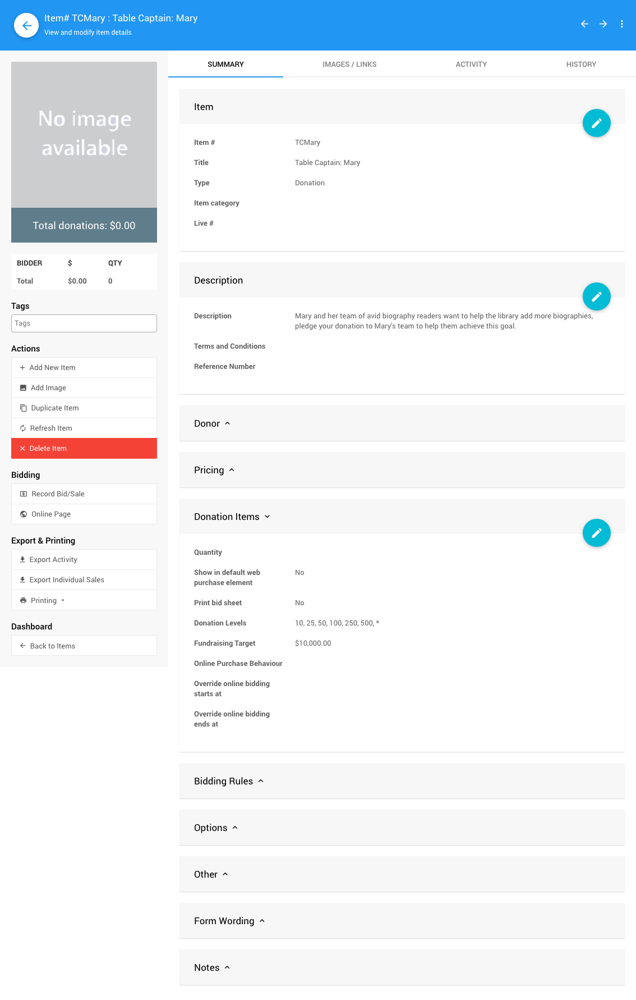
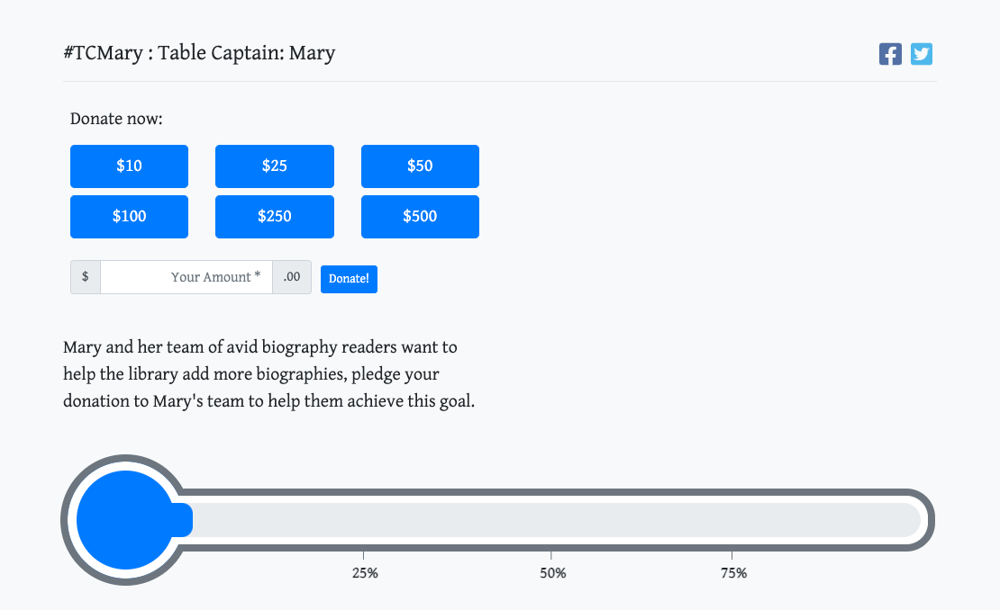
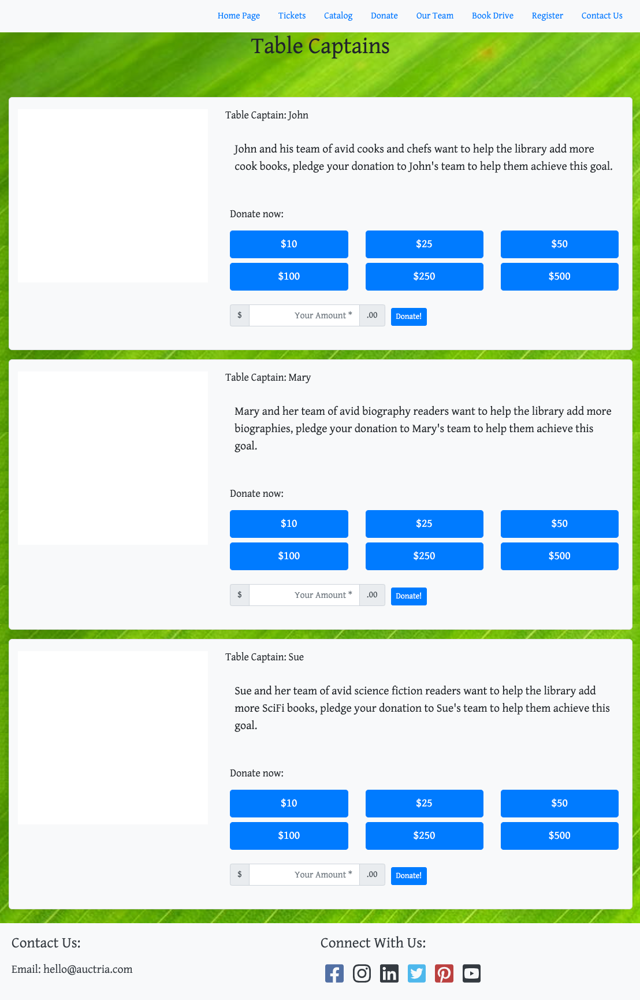

# Peer To Peer Auctions

Most **Peer To Peer Auctions** are based on the idea of providing bidders with the opportunity to support a person, or team, in helping raise funds for a specific event.

This can generally be handled like a <IndexLink slug="FundANeed"/> auction using specific <IndexLink slug="DonationItems"/> for each person, or team, involved in the event. These **Donation Items** are best set up using the <IndexLink slug="RowContent_DonationElement"/> and configuring the items using its <IndexLink slug="RowContent_DonationElement" anchor="donation-items-mode"/> to allow for easier tracking.

::: yellow
**IMPORTANT**
The <IndexLink slug="RowContent_DonationElement" anchor="cash-donation-mode"/> records "cash" donations and **does not provide for tracking** with the same details as using the **Donation Items Mode**.
:::

<HRDiv/>

## Example: Table Captains

As an example, your event may have **Table Captains** that would serve as the main contact point of their "team"; and, the teams are raising funds for their local library. You may be having a friendly competition amongst your **Table Captains** with their reward for raising the most funds as their choice of the primary genre of books the library will be acquiring.

In this case, Mary's team wants to have more biographies to choose from for their efforts... this is likely going to be part of the information you provide for the **Donation Item**.

::: middle
*An example of a possible Table Caption item for Mary's team -- note the custom Item #.*
:::

Mary can now share her **Table Captain** "link" with her team and their donors using the item# *TCMary* as a shortcut to the item details page.

::: middle
*An example, using a URL along the following lines https://charityauction.bid/library-book-drive-2021/TCMary (provided the event was named "Library Book Drive 2021").*
:::

::: green
**NOTE**
You can use the default **Item#** generated by Auctria and then use that specific **Item#** as the shortcut value in the URL although using a **Custom Item #** may help the **Table Captains** share their specific **Donation Item** more easily.
:::

Similar items could be created for John's Cooking team, Sue's Science Fiction team, as well as all of the other **Table Captains** for the event. You can then simply allow for the direct links to be shared by your **Table Captains** and their teams as well as displaying them all together, for example, on the auction website.

::: middle
*An example page with the all of the current "Table Captains" displayed together.*
:::
&nbsp;

::: ideas
- You can further enhance your **Peer-To-Peer** auction events by adding <IndexLink slug="RichContent_ProfileCards"/> to the website and using the **Profile Card** <IndexLink slug="BasicContent_SocialBar"/> element's website address link to point to their *Table Captain's* relevant item.
- You might also consider leveraging the <IndexLink slug="RowContent_SolicitItems"/> form to draw in more *Table Captains* for the event by allowing them to sign themselves up.
:::

<ChildPages/>
<Revised text="Reviewed" date="June 2021"/>
