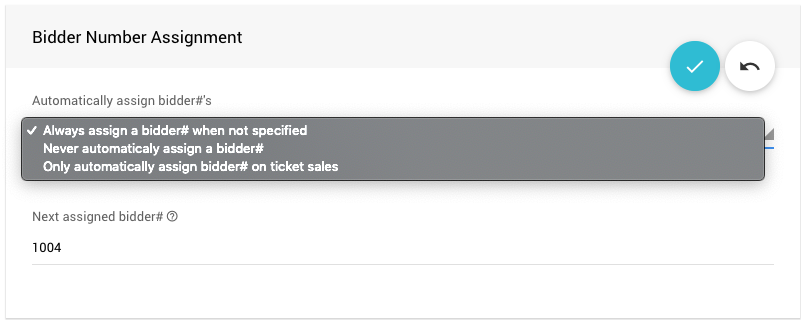
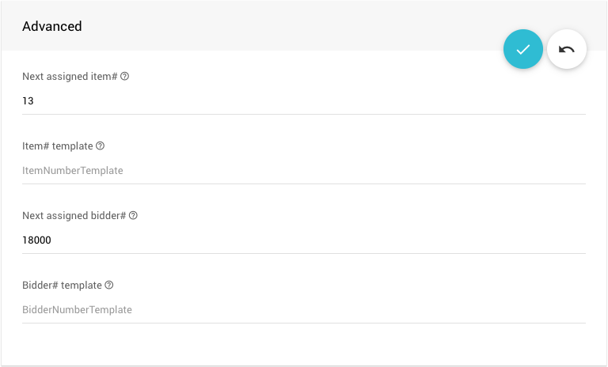

# Bidder Numbers <Updated/>

Auctria requires **Bidders** to be registered to in order to place a bid. Although having **Bidder Numbers** assigned to your bidders is recommended, it is not a requirement in most cases.

<HRDiv/>

## Linked Bidders

Multiple bidders can share a **_bidder#_**, in this case they are said to be **Linked**.

<Linked slug="SharingBidderNumbers"/>
<Linked slug="LinkMergeBidders"/>

<HRDiv/>

## Assigning Bidder Numbers

The defaults for **Assigning Bidder Numbers** can be found either under the **Auction Details** dashboard or the **Bidder Registration/Checkout** dashboard.

<Linked slug="AuctionDetails"/>
<Linked slug="BidderRegistration"/>

The system will automatically assign a **_bidder#_** when people buy tickets, or register, online based on the **Bidder Registration** settings under the **Bidder Number Assignment** properties panel.

::: middle
*An example <IndexLink slug="BidderRegistration" anchor="bidder-number-assignment"/> section from a __Bidder Registration__ dashboard.*
:::

- **Always assign a bidder# when not specified**
  The **default** setting, the system will automatically generate a **_bidder#_** and assign it to the bidder when you <IndexLink slug="AddBidder">add a new bidder</IndexLink>.
- **Never automatically assign a bidder#**
  This will require bidders numbers be manually added at a later time, for example when you <IndexLink slug="CheckIn"/>, or by using the <IndexLink slug="BidderNumbering"/> functionality.
- **Only automatically assign bidder# on ticket sales**
  This will only assign a **_bidder#_** when a ticket is purchased. <IndexLink slug="BidderRegistration">Online registration</IndexLink> (only) will not assign a **_bidder#_** and would need to be addressed in a similar fashion to the **Never automatically assign a bidder#** option.

In the case where you want to hand out bidder numbers, or "paddles", when you <IndexLink slug="CheckIn"/>, you can use the **Never automatically assign a bidder#** option above; or, you can set the system to assign a very high **_bidder#_** automatically using the **Next assigned bidder#** property value..

- **Next assigned bidder#**
  This option setting can be found in the **Bidder Number Assignment** panel as well as in the <IndexLink slug="AuctionDetails"/> page under its **SUMMARY** tab in the "Advanced" panel.

  

  ::: info
  If the value set in the **Next assigned bidder#** field is changed in one option panel, it will be updated in the other option panel to the same value.
  :::

### Using Very High Bidder Numbers

If all the auto-assigned bidder numbers are at, for example, 18000+ then you can easily reassign the numbers at check-in using the <IndexLink slug="CheckIn"/> page. You can also tell, at a glance, if bidders have checked-in by their assigned **_bidder#_**.

A related approach would be to renumber all bidders to very high bidder numbers using the <IndexLink slug="BidderNumbering"/> function before the event and then change the numbers as bidders check-in at the event.

<HRDiv/>

::: recread
- Se <IndexLink slug="AuctionDetails" anchor="advanced-options">Auction Details - Advanced Options</IndexLink> for more information as it relates to using the **Bidder# template** functionality.
:::

<ChildPages/>
<Revised date="2022-03-29"/>
