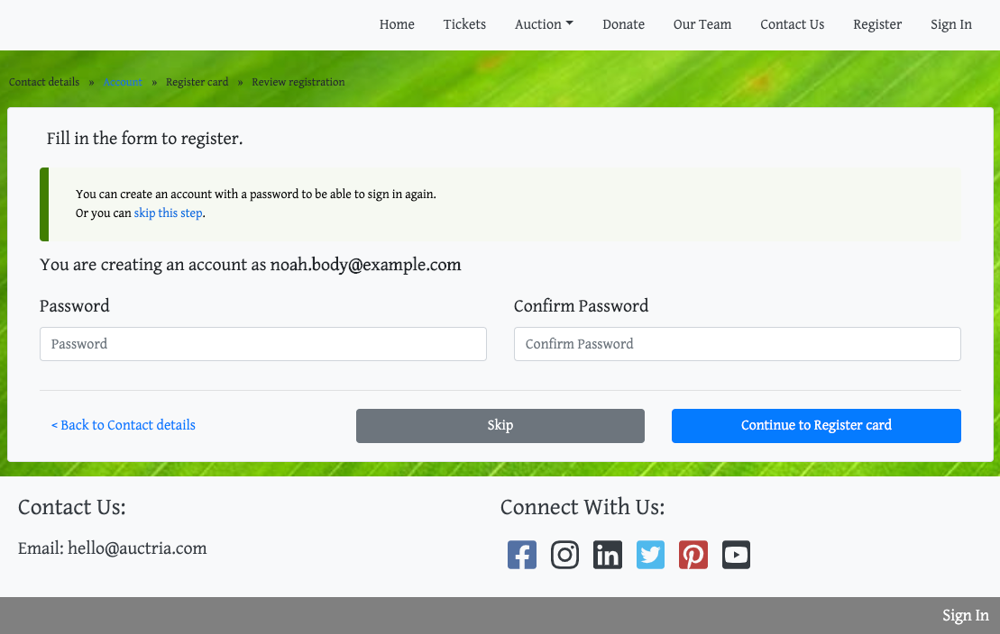

# Bidders & Passwords

If you are doing online bidding, then by default, bidders will be prompted to create a password when they sign up.

This is part of the registration process and happens after the bidder has filled in the **Contact details** part of the registration form.

Auctria associates a password directly with an email address, **not** any specific event. If a bidder registered in a previous year, or for a different event, and set up a password at that point, they would be required to enter their password again to register rather than setting up a new one.

::: tip
**Bidders** are required to register for the specific event even if they already have an email and password credential set with Auctria.
:::

It is not possible to change the bidder's password as an event organizer since the password may be associated with multiple events the bidder is involved in. Any page that asks for a password will also offer a "Forgot your password" link (just in case). See <IndexLink slug="BiddersOnline"/> for more details on other ways bidders can be identified in online events.
