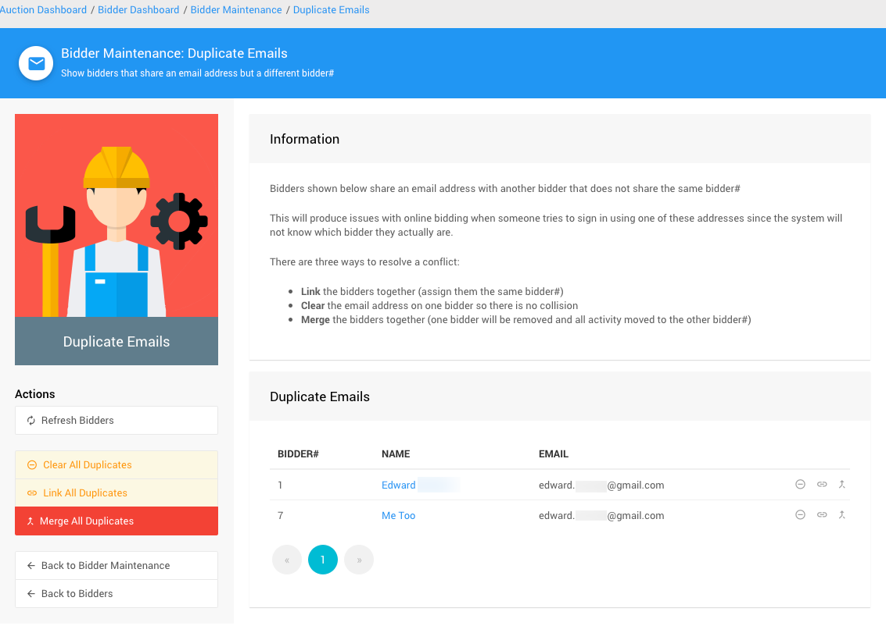

# Duplicate Emails

**Duplicate Emails** can occur for numerous reasons with some of the more commons ones being importing the <IndexLink slug="Bidders"/> from an external source, manually <IndexLink slug="AddBidder">adding bidders</IndexLink> to the event, and/or purchasers using their email address for each of their guests when buying a <IndexLink slug="Tickets">Ticket Item(s)</IndexLink> that provides for multiple admissions/registrants.

## Problems With Duplicate Emails

- **Who is logging in?**
  The Auctria platform has no means to *know* who is logging in when there are multiple bidder records using the same email address in a specific event. This is the single biggest issue when there are duplicate emails in an event.
- **What happens when logging into Auctria?**
  If a bidder tries to log in with an email address that is duplicated in the event, they will receive an error message and not be able to continue. The duplicate email will need to be addressed.

## Fixing Duplicate Emails

You can *fix* most duplicate email issues under the <IndexLink slug="BidderMaintenance"/> functions using the <IndexLink slug="DuplicateEmails"/> dashboard. This function can provide you with a list of bidder records that have **Duplicate Email** addresses.

See <IndexLink slug="DuplicateEmails"/> and <IndexLink slug="LinkMergeBidders"/> for more information on how best to address the bidder records listed.

<ChildPages/>
