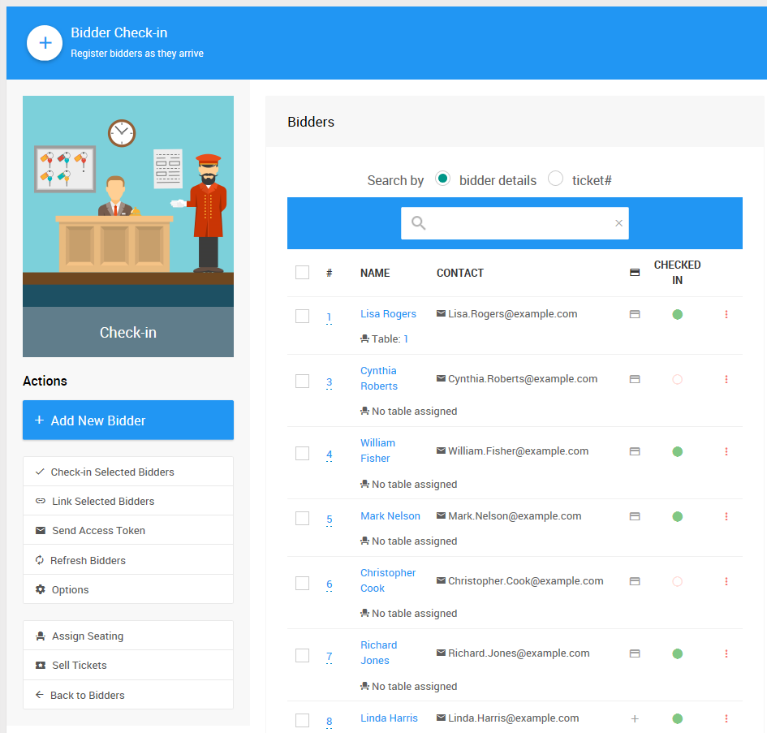

# Introduction To Bidders

Every person that will be completing a transaction that includes a winning bid or purchase of an item through the auction website will require a **Bidder** record be created either before or after the transaction occurs.

Bidder records are created to capture individual guest information such as their name, email address, meal preferences, etc. and to register <IndexLink slug="CreditCards"/> (if credit card processing is enabled).

::: info
Auctria requires a **bidder#** for **every bidder**. *Even if you are not using bidder#'s in your event.*
:::

For example, a guest purchases a raffle ticket through the website. It is a one-time purchase and they pay for the purchase through the website. The software requires a bidder record to record the transaction and the payment history for that guest, even if the guest will not be further involved with the auction. This will create a bidder# during the process.

## Adding Bidders

**Bidders** can be added individually through the dashboard using the <IndexLink slug="AddBidder"/> functions, <IndexLink slug="ImportExport" anchor="import-data">imported</IndexLink> from an Excel `XLS` file, or **Bidders** may be able to register themselves online if enabled.

This would also include registering as part of the purchase of a <IndexLink slug="Tickets"/> item commonly seen with in-person events or some bid conditions. See <IndexLink slug="BidderRegistration"/> for more details on this.

::: yellow
**IMPORTANT**
**Bidders** are saved at the *event* level **and** are required to register for each event they will be involved in even if they have been involved in a previous event held on the Auctria platform.
:::

### Add Bidder During Check-In

During an event you can use the <IndexLink slug="CheckIn"/> page to quickly check bidders in. **Bidders** can be assigned a new **bidder#** at this time, if necessary, or added as a new bidder as they arrive.

### Add Bidder Via Text Message

If your event has <IndexLink slug="TextMessages"/> enabled, you can allow bidder registration by text message as well. See <IndexLink slug="BidderPhoneNumbers" anchor="enable-registration-by-text"/> for more details.

## Managing Bidders

The **Bidder** details can be changed at any point through their respective <IndexLink slug="BidderDetails"/> pages. There are more details about working with bidders available in our User Guide under <IndexLink slug="Bidders"/> in the <IndexLink slug="AuctionTeamExperience"/> section.

## More About Bidders

The following User Guide sections and pages about **Bidders** may also be of assistance.

- <IndexLink slug="BidderConcepts"/>
- <IndexLink slug="WorkingWithBidders"/>
---
- <IndexLink slug="TablesAndSeating"/>
- <IndexLink slug="BidderStatements"/>
- <IndexLink slug="LinkMergeBidders"/>

<ChildPages/>
<Revised text="Reviewed" date="2021-06-15" time="11:57 AM"/>
