# Linking Bidders Versus Merging Bidders <New/>

In Auctria, you can **Link Bidders** that will share the same **Bidder Number** but each have their own **Bidder Record** to log in with and have all of their online purchases, donations, and won items listed separately as well as their own contact information and registered credit card details.

**NOTE**: All purchases, donations, and won items are listed on the single **Bidder Statement** that is available for the **Bidder Number**.

You can also **Merge Bidders**, as needed, to clean up your bidder list to, for example, remove duplicates records or bring together **Bidder Records** where the email address may have been entered incorrectly on one.

::: red
**WARNING**
**_Linked_** bidders can be **Unlinked** while **_Merged_** bidders cannot be un-merged.

<Linked slug="LinkMergeBidders"/>
:::

<HRDiv/>

  
Linking Bidders Versus Merging Bidders: Table Of Contents

  [[toc]]

<HRDiv/>

## Link Bidders

You can **Link** bidders from the **Bidder Check-in** dashboard or from the a **Bidder Record**.

### Link At Check-In

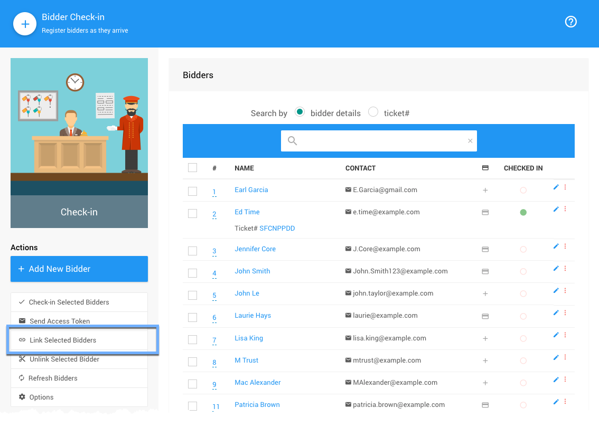

::: middle
*An example showing the __Link Selected Bidders__ "Action" for a list of demonstration bidders.*
:::

If you wish to **Link** two bidders when they are checking in, simply check the appropriate box beside each bidder and then click the **Link Selected Bidders** **_Actions_** button in the sidebar menu.

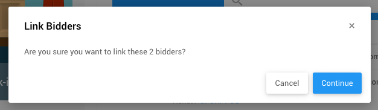

::: middle
*An example confirmation pop-up window when linking bidders.*
:::

Clicking the **Continue** button will complete the process and link the bidders.

### Link From Bidder Record

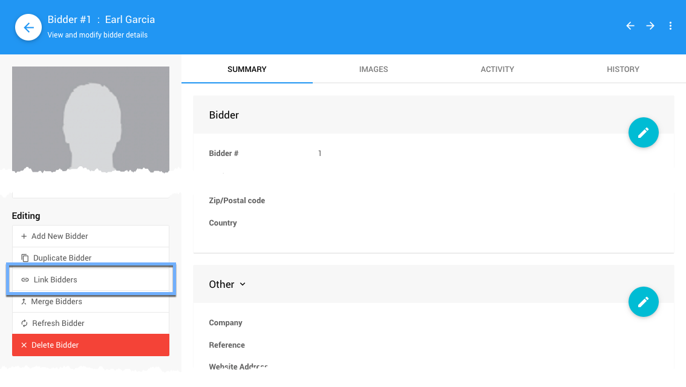

::: middle
*An example showing the __Link Bidders__ "Editing" option for a demonstration bidder.*
:::

Clicking on the **Link Bidders** **_Editing_** Action will open a pop-up window to select the bidder you want to link to the bidder record you are reviewing.

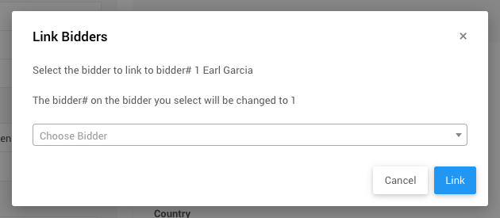

::: middle
*An example showing the __Link Bidders__ pop-up window for a demonstration bidder.*
:::

Selecting a bidder using the drop-down selector and clicking the **Link** button will give a "Last Chance" confirmation to link the bidders as this is a far-reaching and not exactly reversible.

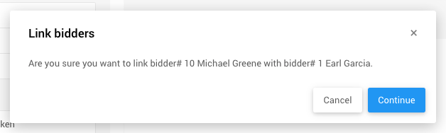

::: middle
*An example showing the final confirmation to __Link Bidders__.*
:::

Clicking the **Continue** button will finalize and complete the linking processes. Following this both bidders will be using the first bidder's bidder number going forward. The second bidder's bidder number will no longer be used.

::: yellow
**IMPORTANT**
After linking the bidder to the "primary" bidder their bidder number will no longer be used and should not be assigned to another bidder going forward especially if any activity was originally recorded to the **Bidder Record**.
:::

<HRDiv/>

## Unlink Bidders

You can **Unlink** bidders from the **Bidder Check-in** dashboard or from the a **Bidder Record**.

### Unlink At Check-In

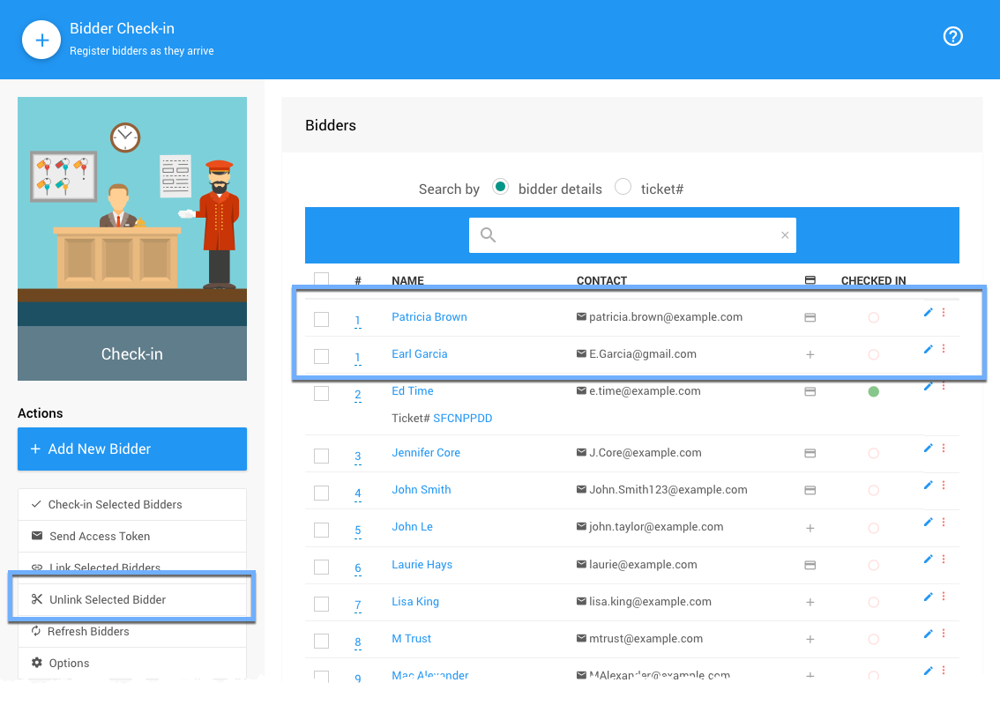

::: middle
*An example showing the __Unlink Selected Bidders__ "Action" for a list of demonstration bidders.*
:::

The **Unlink Selected Bidders** **_Actions_** button in the sidebar will separate the selected bidder and create an appropriate bidder record for the newly unlinked bidder.

::: danger
Only a **_single_** bidder can be unlinked at a time.
:::

The unlinked bidder will have a new **Bidder Number** assigned based on your configuration choices with the default being to add an automatically generated number following the **Next assigned bidder#** value currently set.

<Linked slug="Concepts_BidderNumbers" anchor="assigning-bidder-numbers"/>

To **Unlink The Selected Bidder** click on their respective checkbox and then click the **_Action_** button to trigger the process.

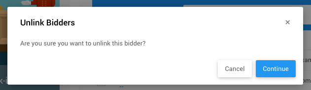

::: middle
*An example showing the __Unlink Selected Bidder__ confirmation pop-up window.*
:::

Clicking the **Continue** button to complete the process.

### Unlink From Bidder Record

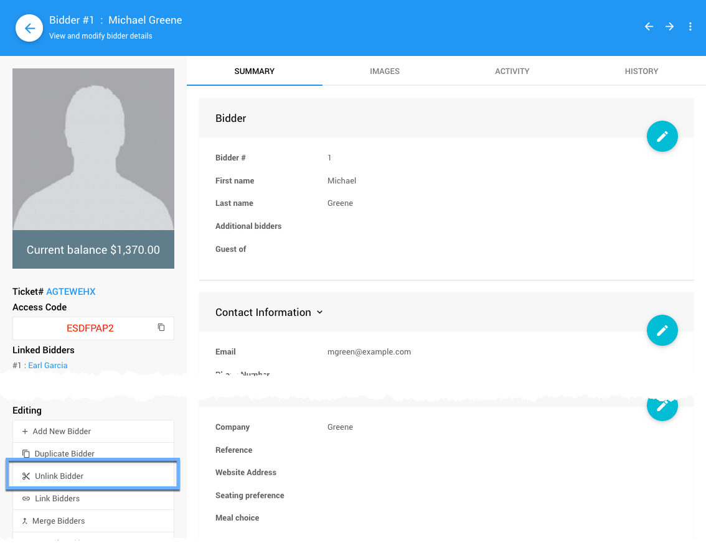

::: middle
*An example showing the __Unlink Bidder__ "Editing" option for the example linked bidder above.*
:::

::: info
Once a bidder has been linked to another bidder, their **Bidder Record** will show the primary bidder's **Bidder Number** as well as a list of the **Linked Bidders** using this **Bidder Record/Number**.

Also to note, you can continue to **Link Bidders** from any of the bidders linked to the "primary" bidder using the **Link Bidders** **_Editing_** Action (see [above](./#link-from-bidder-record)).
:::

Clicking through the **Unlink Bidder** **_Editing_** Action will pop-up a confirmation window specifying the current bidder being unlinked from the current **Bidder Record**.

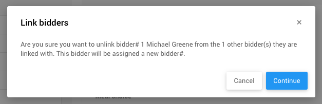

::: middle
*An example showing the __Link Bidder__ confirmation pop-up.*
:::

Clicking the **Continue** button will complete the process and unlink the bidders. A green success banner will be shown temporarily across the top of the page and the unlinked bidder's record will be displayed.

::: ideas
An exception to **_not_ re-using** bidder numbers of previously unlinked bidders is to only re-use it after unlinking the bidder if their "old" **Bidder Number** is still available.

<Linked slug="EditBidderDetails"/>
:::

<HRDiv/>

## Merge Bidders

You can **Merge** bidders from a **Bidder Record**.

### Merge From Bidder Record

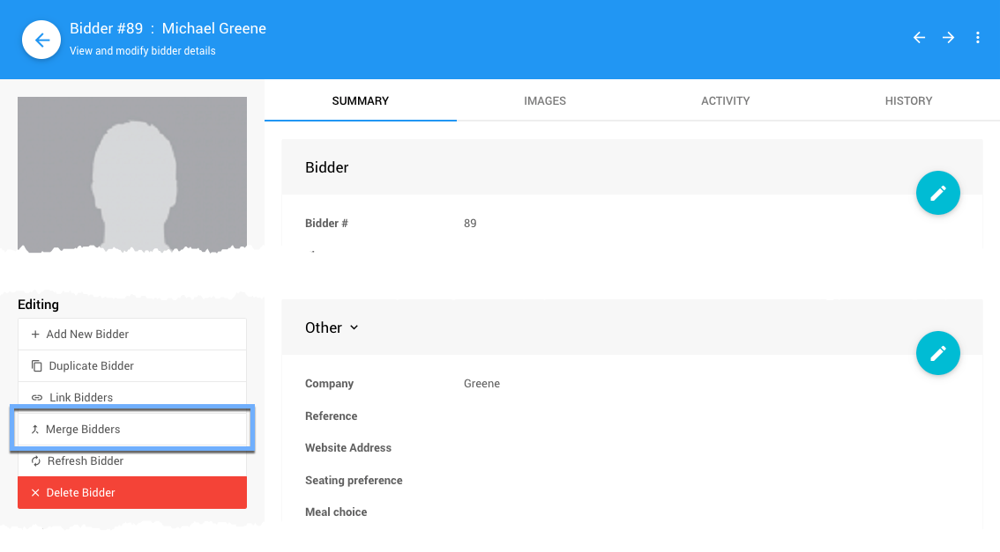

::: middle
*An example bidder record showing the __Merge Bidders__ "Editing" Action.*
:::

Clicking through the **Merge Bidders** **_Editing_** Action will open the pop-up **Merge Bidders** window.

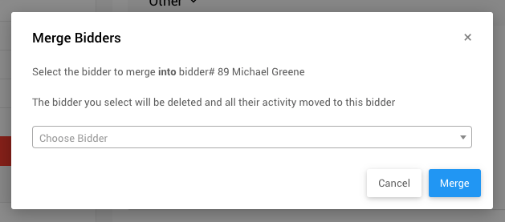

Selecting a bidder using the drop-down selector and clicking the **Merge** button will give a "Last Chance" confirmation to merge the bidders as this is a far-reaching and not reversible.

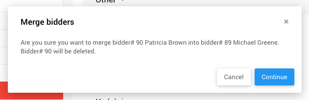

::: middle
*An example showing the final confirmation to __Merge Bidders__.*
:::

Click the **Continue** button to complete the **Merge Bidders** operation. Information in the "primary" bidder will be taken as the most correct where any additional information will be added from the merged bidder if it exists and is not available in the "primary" bidder details.

<ChildPages/>
<Revised text="Added" date="2022-04-21"/>
