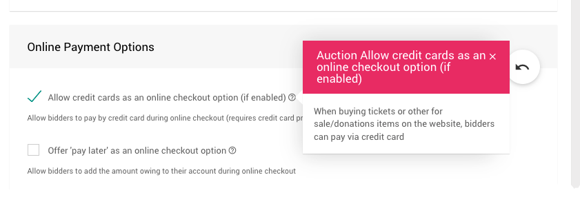

# Auctria And Payment Processors <Updated/>

Auctria currently offers integration with the **Payment Processors** [Stripe](https://stripe.com) and [Authorize.net](https://authorize.net).

<HRDiv/>

## Auctria And Stripe

[Stripe.com](https://stripe.com) is a tier-1 **Payment Processor** that handles all functions for secure transmission and storage of credit card information. Although the credit card information is entered in Auctria, **no credit card payments** or **transfer of funds** are processed by Auctria. All credit card payment processing flows through your Stripe account.

If you don't already have a Stripe account, it only takes a few minutes to complete the sign-up process online at [Stripe.com](https://stripe.com/). To fully establish a link with **Stripe**, you will need to input your bank account information to allocate where to deposit the funds. After completing the **Stripe** setup, you will be able to connect Auctria to your **Stripe** account so you can process credit card payments for your Auctria auction charges.

**Stripe** handles **all** credit card payment funds. Auctria is **not** a part of the financial transaction with your bank. After settlement, and transit time (about 2-5 business days after the payment date), **Stripe** will transfer the funds to your bank account minus the credit card processing fees. See <IndexLink slug="CreditCardCosts"/> for more details on the fees involved.

<HRDiv/>

## Auctria And Authorize.Net

An [Authorize.Net](https://authorize.net) account can be set up as a gateway to a wide variety of existing merchant accounts. If you have an existing merchant account, you can ask them if they support *Authorize.Net*. Please be aware, there are fees associated with a gateway account like this.

When using **Authorize.Net** as a gateway account, the charge is processed by your existing merchant account. You would pay the fees that apply to those transactions (we do not know, and have no control over, what those fees are). See <IndexLink slug="CreditCardCosts"/> for more information.

<HRDiv/>

## Other Payment Processors

If you have an account with another payment processor like **Square** or **PayPal**, these can not be connected to Auctria although you can use them at **Checkout** if you enter the payment details directly into **their app(s)**.

The payments would be recorded in Auctria via the **Checkout** page in the same way as a cash, or check, payment is handled. See <IndexLink slug="CheckoutOptions"/> for information on adding "Other" payment methods.

Also see these <IndexLink slug="FrequentlyAskedQuestions" anchor="credit-cards-questions"/> for more details:
- <IndexLink slug="CanWeUsePayPal"/>
- <IndexLink slug="CanWeUseSquare"/>

<HRDiv/>

## Disable Credit Card Payments

By default, under the **Online Payment Options** of the **Bidder Registration/Checkout** dashboard, you can disable accepting **Credit Card** payments by setting the **_Allow credit cards as an online checkout option (if enabled)_** option to **_No_**.

::: middle
*Un-check the option to disable (set to __No__).*
:::

This is the simplest method of stopping **Credit Cards** from being accepted at **Checkout** online while still allowing an organizer to charge a **Credit Card** from the **Auction Dashboard**.

<Linked slug="BidderRegistration"/>
<Linked slug="BidderRegistration" anchor="online-payment-options"/>
<Linked slug="Checkout"/>
&nbsp;

::: ideas
Another option for not allowing **Credit Card** payments is to disconnect the **Credit Card** processing service that has been enabled.
**NOTE:** By disabling **Credit Card** processing you will also lose all other **Credit Card** functionality.
<Linked slug="StripeConnection" anchor="removing-your-stripe-com-connection-in-auctria">Removing Your Stripe.com Connection In Auctria</Linked>
<Linked slug="AuthorizeNetConnection" anchor="removing-your-authorize-net-connection-in-auctria">Removing Your Authorize.net Connection in Auctria</Linked>
:::

<HRDiv/>

## Auctria And Credit Card Readers

Auctria provides support for some **USB Credit Card Readers** allowing for faster, *more accurate data entry* of credit card numbers (*only*). These devices are generally not the same as, or function like, "readers" provided by services such as Square or similar "Point-of-Sale" services.

See <IndexLink slug="CardReaders"/> for more information under the **Running Your Auction** <IndexLink slug="CreditCards"/> section.

<ChildPages/>
<Revised date="2022-01-31"/>
