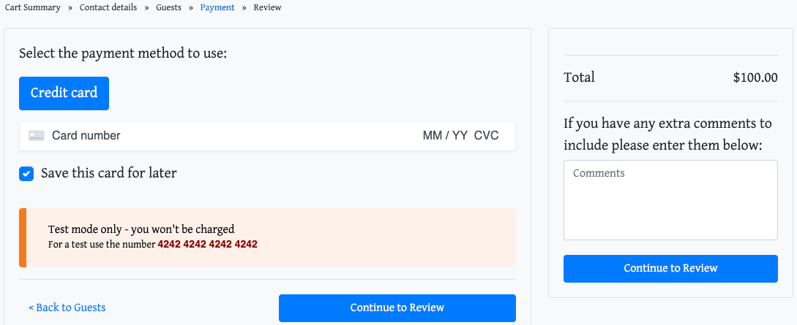
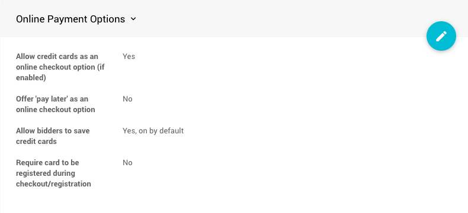
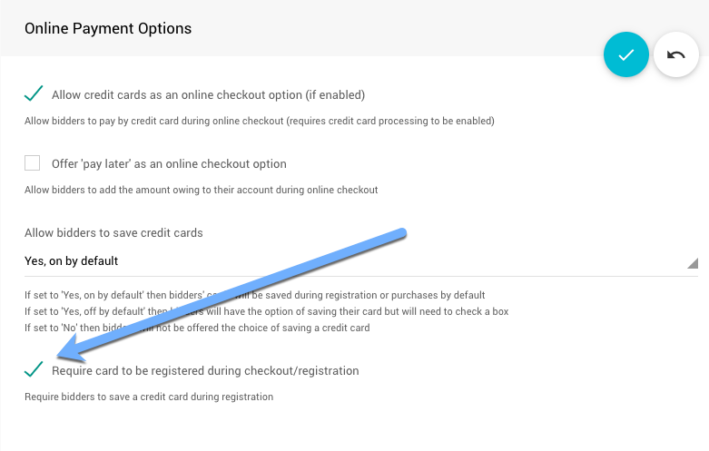
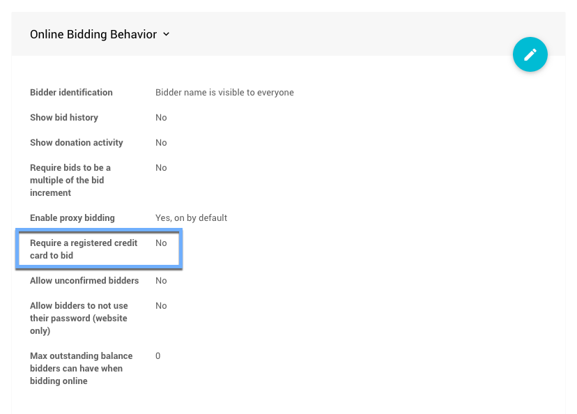

# Registered Cards

With integrated credit card processing enabled, bidders will be able to have a registered credit card that can be charged in the future without having to re-enter their card details.

When a card is registered, the details of the card (card#, expiry, etc.) are **securely stored with your payment processor** and tied directly to that account. Auctria does **not** see, or store, the credit card details directly. We only have a "token" that represents the credit card and it can only be used to charge the credit card through your account.

It is not possible for you to retrieve the full credit card details again, either through Auctria or from the payment processor. You can charge the card (and refund charges) but you will only be able to see the card type and last 4 digits of the credit card number.

## Registering Cards Online

### During Checkout

If a bidder is making a "purchase", such as buying tickets online, by default, they will see an option to save their credit card during the checkout process (on the "Payment" step).

 The **Save this card for later** option is not checked by default (you can change this under **Website** -> **Bidder Registration**) in the <IndexLink slug="BidderRegistration" anchor="online-payment-behavior"/> panel.

### Without Purchases (Registration Only)

If bidders are registering in an online only event, without having to make a payment, they will still be prompted to register a card. New bidders registering can also be required to register a credit card (without making a purchase) as well. This option is set under <IndexLink slug="BidderRegistration"/> in the **Online Payment Options** section.

To enable the **Require card to be registered during checkout/registration** option, click the "pencil" icon to enable editing of the **Online Payment Options**, click the appropriate checkbox.

Click the checkmark icon to save your changes.

## Require A Registered Credit Card To Bid

There is an option under <IndexLink slug="OnlineBidding"/> to **Require A Registered Credit Card To Bid**.

The **Require A Registered Credit Card To Bid** option is turned off by default. If you enable this option, <IndexLink slug="Bidders"/> without a registered credit card will instead be prompted to register one **before** being able to place a bid online.

::: tip
It is **not** possible to force a bidder to save their credit card during this step. We've found that some guests are reluctant to save a credit card online (or may not want the credit card they are using for ticket purchases saved for later).
:::

---

## Should Require Registering A Credit Card Be Enabled?

Many times groups want to enable this option to ensure that they have a way to charge the winning bidder at the end of the event.

While this is a valid concern, we've also seen that requiring a credit card will put some bidders off from registering and hence bidding, so you may get less participation in the event by enabling this.

You will need to weigh the possibility of a bidder not being willing to pay at the end of the event with the possibility of getting less bidder participation.  We have not seen bidders reneging on winning bids be a significant problem, and having a registered card won't necessarily prevent this, since a malicious bidder could dispute the credit card charge (though again this is a very rare occurrence).

Without a registered card you can still send <IndexLink slug="BidderStatements"/> at the end of the event with a **Pay Online** link that bidders can use to pay by credit card once they have won something.

A registered credit card is not a guarantee the card can be charged for a specific amount at the end of the event, it could still be possible for a charge to be declined if the credit card has expired or is over its credit limit.

Making bidder participation as smooth as possible is the best way to maximize the benefits of the fundraiser.
