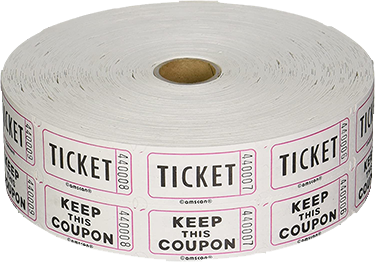
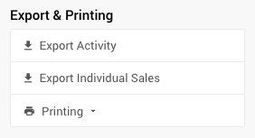

# 50-50 Raffle

Similar to a raffle draw for a single item, a **50-50 Raffle** is often a great way to get more people involved with your event by motivating guests with the chance to win a large prize for a small fee.

::: red
**Auctria only provides the means to sell "lots" that represent the "raffle tickets".**
When you **Run A Raffle** using Auctria you may need to have a method of assigning raffle ticket numbers to bidders, if needed, as well as a means for <IndexLink slug="RunARaffle" anchor="picking-winners"/>.
:::

## Ticket Strategy

First off, determine your raffle ticket sales strategy. In many cases, these types of "raffles" will tend to have a single ticket purchase as well as a multiple ticket option.

More tickets per dollar may provide your guests with a perceived value and give them more chances at winning while fewer tickets per dollar (and still priced at easy to buy points) will allow all guests to easily take part in the raffle. With either option, selling single tickets or selling multiple tickets, both offer your guests more ways to help you make your fundraiser successful.

See <IndexLink slug="RunARaffle"/> and <IndexLink slug="AddRaffleTickets"/> for more details on creating and selling "raffle tickets".

<HRDiv/>

## In-Person Paper Raffle Tickets

Although Auctria can help you with tracking the sale of the "raffle tickets", you will still likely need to use some sort of *paper raffle tickets* for your "in-person" guests to claim their prize.

Paper tickets are often small, relatively inexpensive, and usually have pre-printed numbers allowing you to separate them and put one in the ticket draw box and give the other to your guest.

::: middle
*An example of a common roll of "paper tickets" that might be used.*
:::

Guests would purchase their raffle tickets through Auctria and get an appropriate amount of *paper tickets* representing the number of lots they purchased.

::: yellow
**IMPORTANT**
You will still have to track which guest received which ticket(s) although this is still easy to manage and use to identify the winners. You can use a paper and pen log book or some sort of digital means such as a spreadsheet.
:::

::: ideas
Although Auctria does not provide a "drawing" mechanism, the idea of a "blind draw" by a keynote speaker or other important person -- or randomly picked guest -- during the event could help generate more interest and excitement to build on.

This could even serve as an intermission-style break during an in-person event.
:::

<HRDiv/>

## Virtual 50-50 Raffle

The premise of a **Virtual 50-50 Raffle** may be challenging although it is still something that might be considered. Since there is no "in-person" component you will need to be able to sort out how to choose a winner "virtually". This could be an opportunity to use the **Export Individual Sales** feature set available with **For Sale** items.

<HRDiv/>

## Export Individual Sales

As a special case, <IndexLink slug="ForSaleItems"/> have an additional *Activity* related option under **Exporting & Printing** (in the sidebar) allowing you to **Export Individual Sales** for the specific item as an XLS formatted file.

Clicking the button will immediately start the process and download the file in your browser.

::: info
Using the **Export Individual Sales** on a *Raffle Ticket* item will provide you with a list of buyers of that item. This list might be further reviewed and could potentially be used in a raffle "drawing" external to Auctria.
:::

<ChildPages/>
<Revised text="Reviewed" date="2022-04-14"/>
