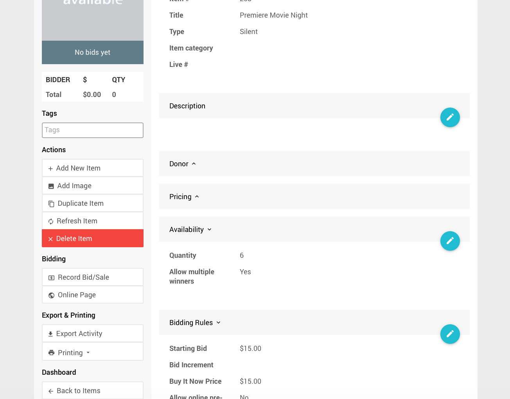

# Buy It Now Only Items

Any <IndexLink slug="SilentItems"/>, <IndexLink slug="LiveItems"/>, or <IndexLink slug="OnlineItems"/> can be set up as a "fixed" price item by making it a **Buy It Now Only** item.

**Buy It Now Only** items are most commonly used for items you want to sell multiple of, for example, a dinner party. They are configured as follows:
* **Buy-It-Now Price** and **Starting Bid** are set to the same value;
* **Allow multiple winners** set to yes; and,
* **Quantity** set to the number available or blank (the same as `0`) for unlimited.

## Bid Sheet

For a silent auction item, the bid sheet will be generated as a 'sign up' sheet showing the number of rows to match the quantity available and each having the fixed price printed on each row.

## Online Bidding

On the website, or mobile app, bidders will have a "buy-it-now" button rather than a "bid" button and can choose to purchase multiples in a single transaction.

::: warning
The **Buy-It-Now** price acts as a maximum bid for items online. If a bid is placed that is higher than the **Buy-It-Now** price the system will cap the bid at the **Buy-It-Now** price of the item.
:::

::: tip
**IMPORTANT**
**Buy It Now** buttons only appear for logged-in bidders registered for the event *and* after <IndexLink slug="OnlineBidding"/> has started.
:::

## Item Closing

A single winner item is closed as soon as someone clicks on the "buy-it-now" button. With a buy-it-now item that supports multiple winners, the item will not be closed until the end of the auction or the last one is sold. However, buy-it-now bids will still appear as *final bids* in the bidder's account immediately even though the item is still open.

## Example: Premiere Movie Night

As an example, your *Premiere Movie Night* item allows 6 winners at a fixed price of $15. Using the following will accomplish this:

- **Starting Bid** = $15
- **Buy It Now Price** = $15
- **Quantity** = 6
- **Allow multiple winners** = Yes (enabled)

::: tip
The **Buy It Now Price** is the **maximum** bid value accepted for an item, if a bidder enters a higher value the bid will be **reduced** to the **Buy It Now Price** and the bidder will be acknowledged as having the **winning bid**.
:::
