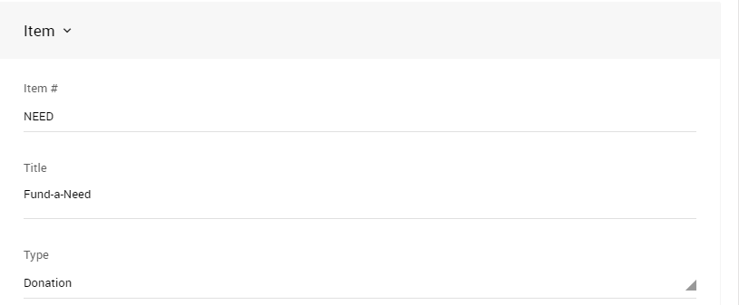
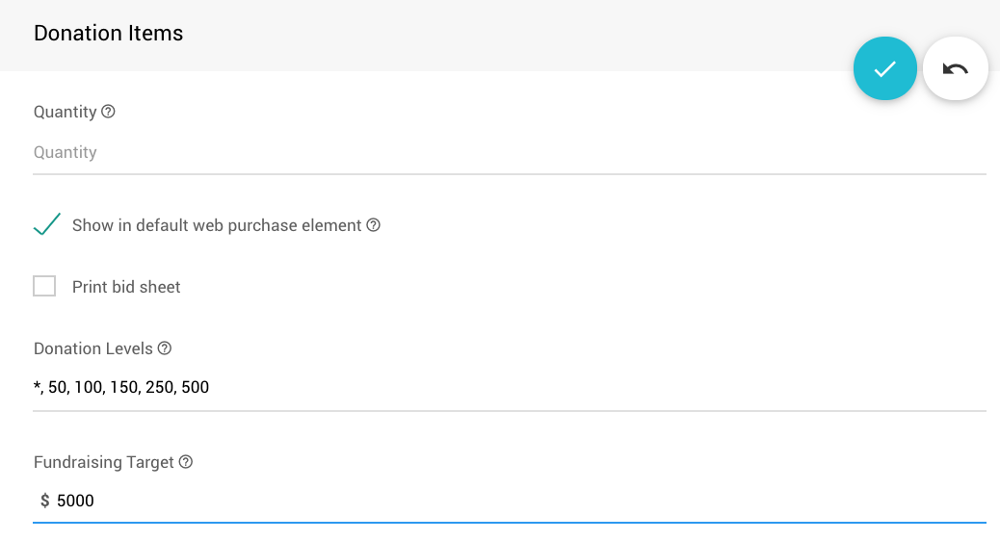

# Fund-A-Need

Many auctions hold a **Fund-a-Need** section where bidders can bid to donate money to either specific projects or to the event more generally. This is handled in Auctria by creating <IndexLink slug="DonationItems"/> (see <IndexLink slug="AddNewItem"/> for more details on this).

## Single Donation Item

Create a **Single Donation Item**, with a title **Fund-a-Need** (or however your organization prefers to label it) and set the type to **Donation** but leave the value blank. If you want, you can set the **Item#** to something easy to remember, for example, "**NEED**" rather than using a generated number.

When you record donations against this item, you will need to *select the bidder* **and** *enter the amount* of the donation.

For more details on recording donations see <IndexLink slug="RecordDonation">Record a Donation</IndexLink>.  

## Multiple Donation Items

If you accept donations for certain levels only, say $100, $500, and $1,000; you can choose to create three <IndexLink slug="DonationItems"/> with suitable titles and set the value to the dollar amount of the donation. You may also want to use meaningful item numbers, for example, "**NEED500**" to represent the $500 donation item.

The advantage of this approach is the amount will automatically be populated when you select the **NEED500** item to record a donation against it, however, this may not scale well if you have a lot of different levels of donations.

<HRDiv/>

## Single Donation Items vs Multiple Donation Items

- For "Live" events, having multiple <IndexLink slug="DonationItems"/> at each value level can be better for entering donations on the <IndexLink slug="BiddingSales"/> page and <IndexLink slug="QuickBidEntry"/>. Selecting the appropriate **Donation Item** will auto-populate the amount.

- A single <IndexLink slug="DonationItems">Donation Item</IndexLink> with multiple **Donation Levels** defined within it (see <IndexLink slug="SettingDonationLevels"/>) works best for accepting donations "Online" through your Auction website. The item will not automatically populate a dollar amount (a selection of buttons with amounts will be displayed); and, it will only display an open amount field in the mobile app.

<HRDiv/>

## Fund-A-Need Online

For a **Fund-A-Need Online**, you can create one <IndexLink slug="DonationItems">Donation Item</IndexLink> that has multiple values. It will display all values as button options; and, you can also include an `*` to have an *open amount* value field displayed as well.

This can be displayed on your website through the <IndexLink slug="RowContent_ItemCatalog"/> element.

...or, you can display the item directly using the <IndexLink slug="RowContent_ItemDetails"/> element.

### Adding A Donation Item Thermometer

To add a **Thermometer** sub-element to the **Donation Item** being displayed you would need to set the **Fundraising Target** value for the **Donation Item**.

### Adding The Donation Activity Details

You can add the **Donation Activity** details to your **Item Details** pages for your fund a need items by enabling the <IndexLink slug="OnlineBidding" anchor="online-bidding-behavior"/> option for the event.

Changing this option to `Yes` will add the "Recent donations" table to the **Item Details** page of the <IndexLink slug="DonationItems"/> pages.

::: info
By default, bidders will be listed anonymously under the "Donated by" column. You can change this with the <IndexLink slug="OnlineBidding" anchor="online-bidding-behavior"/> option for **Bidder identification**.
:::

<HRDiv/>

## No Donation Items

You can also skip having <IndexLink slug="DonationItems" /> altogether and just record the **Donations** directly off the **Donation** tab of the **Record bid, purchase, or donation** page (leaving the item row **empty**). See <IndexLink slug="RecordDonation"/> for more details on this.

These donations will appear on <IndexLink slug="BidderStatements"/> as **Cash Donations**.

<ChildPages/>
<Revised text="Reviewed" date="2022-04-04"/>
