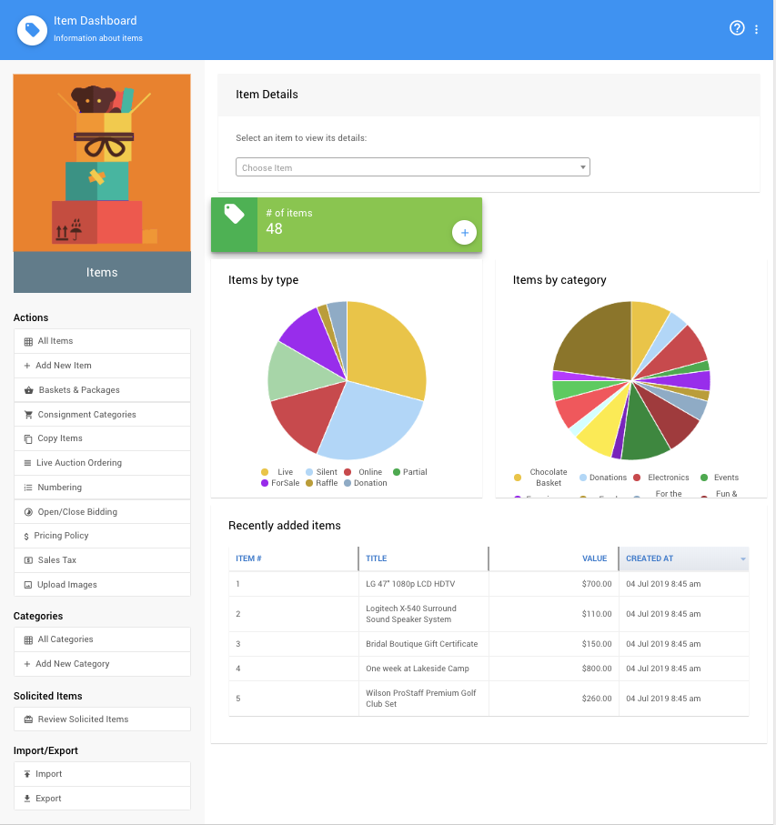

# Items Concepts

Items are a key part of the how Auctria helps run your event.

## Item Dashboard

The **Item Dashboard** gives a quick overview of the "Items by type" and Items by category" you have in your auction in the form of pie-charts.

### Item Details

There is a "Choose Item" selector in the **Item Details** section to go to a specific item's details page.

Clicking on the green box will take you to the main **Items** list report. Clicking on the `+` icon in the green box will open the <IndexLink slug="AddNewItem"/> page.

If the pie-chart labels are not fully visible, hover your mouse pointer over the chart and you will be able to scroll up and down to see more details for each specific pie-chart.

Double-clicking on a line in the **Recently Added Items** list will open that item's details page.

### Actions

Numerous Items related **Actions** are also available from the **Item Dashboard**. See the <IndexLink slug="Items"/> section under <IndexLink slug="AuctionTeamExperience"/> for more detailed information.

### Categories

Item **Categories** can be accessed, add added, from this sidebar menu section. See <IndexLink slug="ItemCategories"/> for more information.

### Solicited Items

You can "Review Solicited Items" from this menu link. See <IndexLink slug="SolicitedItems"/> for more information.

### Import/Export

The Auctria **Import/Export** features can be accessed from this menu section. See the <IndexLink slug="ImportExport"/> section for more details.

<ChildPages />
