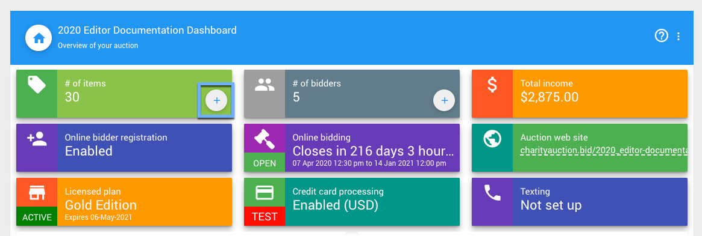
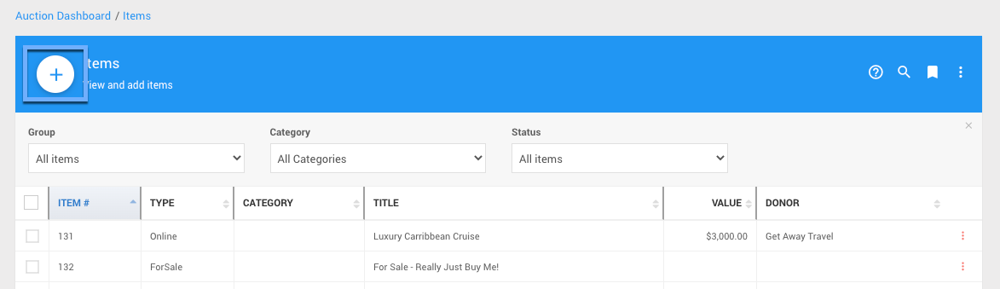
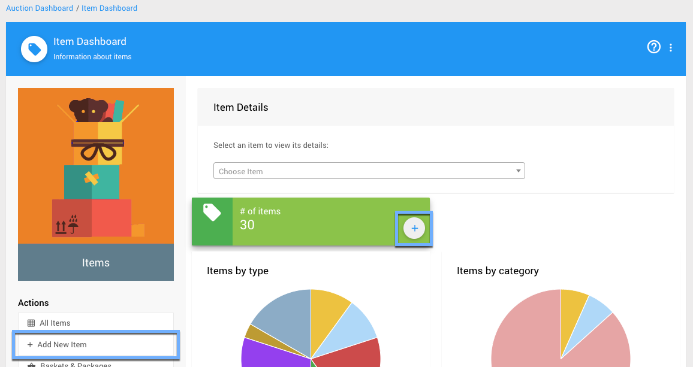
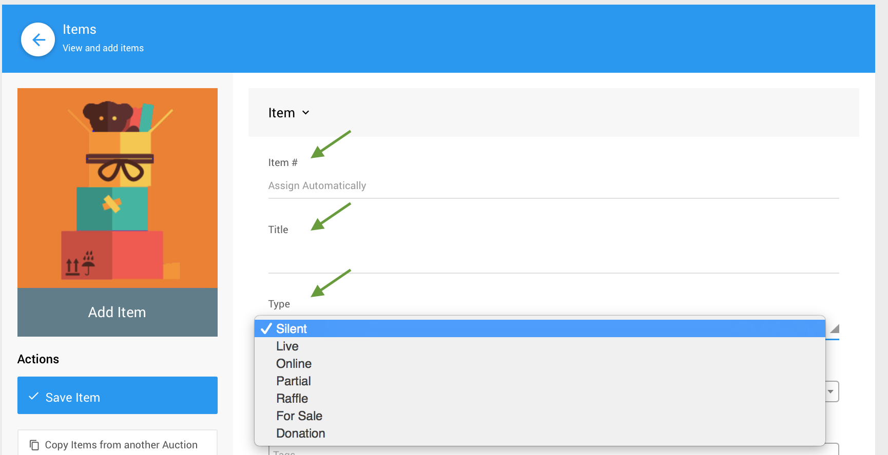
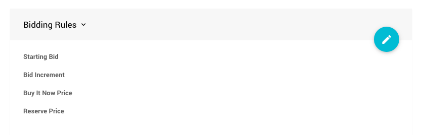

# Introduction To Items

Items have many fields available, but in general if you don't know what something does you can leave it set to the default and then follow up later by reviewing the items specific details. See <IndexLink slug="ItemDetailsSummary">Item Details Summary</IndexLink> for more information on the various item types and their respective fields.

You can define and/or edit an item price, its description, and other details including categories which can be used to organize items.

<HRDiv/>

## Item Types

Item Types are **pre-set by Auctria** with specific functionality assigned to each type.  See <IndexLink slug="ItemTypes"/> to learn what the differences are.

::: info
The most commonly used **Item Types** are *Silent*, *Live*, and *Online*. One way to decide if these types are what you are looking for and which to use is to consider where the final bidding for the item will be taking place:

- paper bid sheet -> <IndexLink slug="SilentItems"/>
- auctioneer -> <IndexLink slug="LiveItems"/>
- electronic -> <IndexLink slug="OnlineItems"/>
:::

<HRDiv/>

## Adding Items

There are a number of ways to start the process of **Adding Items**. From the main <IndexLink slug="AuctionDashboard"/> you can click on the **Items** block `+` icon.

You can also just click on the Items block which will take you to the **All Items** list report page where another `+` icon is available to start the process of **Adding Items**.

There is also a method following menu structures, from the main <IndexLink slug="AuctionDashboard"/>, click on **Items** and then click on the **Add New Item** *Actions* item in the sidebar (or the `+` icon in the "# of items" block).

### Required Fields

If you want to quickly add an item and then fill in the details later, you only need to define the **three required fields** *Item#*, *Title*, and *Type* before saving the item.

- **Item#**
  Auctria will assign an **item#** automatically or you can use your own manually entered number.
  ::: info
  The item number can include numbers and letters although it **must** be unique compared to all other items.
  :::

- **Title**
  The item **must** have a **Title**. The **Title** is generally a "one-line" descriptive name for the item and will be used to identify the item on <IndexLink slug="BidSheets"/>, in <IndexLink slug="BidderStatements"/>, and in the <IndexLink slug="AuctionCatalog"/>.

- **Type**
  The item **type** controls how the item behaves. See <IndexLink slug="ItemTypes"/> under <IndexLink slug="ItemConcepts"/> for more details. The most commonly used types are <IndexLink slug="SilentItems">Silent</IndexLink>, <IndexLink slug="LiveItems">Live</IndexLink>, and <IndexLink slug="OnlineItems">Online</IndexLink>.

For more information about **Adding Items**, see the <IndexLink slug="AddNewItem"/> page in this User Guide.

::: green
**NOTE**
All item information can be edited at any time using its specific <IndexLink slug="ItemDetails"/> page before or during the event although it is **strongly** recommended to **not** change the item number.
:::

### Bidding Rules

Although not strictly a requirement when setting up items, it is often good practice to review the **Bidding Rules** you are using for your  <IndexLink slug="Glossary_BiddableItems">Biddable Items</IndexLink>.

- **Starting Bid**
  This is the value where you want the bidding for the item to start.
  Leaving this blank will default to `$1.00`.
- **Bid Increment**
  This value is the (minimum) amount you want your bids to increase with each successful bid after the initial bid for the item has been made. Leaving this blank will default to `$1.00`.
- **Buy It Now Price**
  This value is the amount you would consider as the **maximum** bid amount. Once this value is reached, bidding for the item will be closed immediately.
  ::: yellow
  **IMPORTANT**
  If the **Buy It Now Price** is *less than* the **Starting Bid** your bidders will not be able to place a bid for the item as no bid would be considered valid under this condition.
  :::
- **Reserve Price**
  This is the **minimum** bid required for the item to be won at auction. Bids will be accepted for the item although no "winning bidder" will be declared if the highest bid is lower than this value.

See <IndexLink slug="PricingExamples"/> for some ideas on what values to consider for the above.

### More Adding Items Options

You can add items manually using the <IndexLink slug="AddNewItem"/> function and you can also add items using the following methods:
- import items from an `XLS` (Excel) spreadsheet file, see <IndexLink slug="ImportExport" anchor="import-data"/>;
- copy items from another event under your organization, see <IndexLink slug="CopyItems" />; and,
- duplicate existing items within your event, see <IndexLink slug="DuplicateItem"/>.

<HRDiv/>

## More About Items

The following User Guide sections and pages about **Items** may also be of assistance.

- <IndexLink slug="WorkingWithItems"/>
- <IndexLink slug="Baskets"/>
---
- <IndexLink slug="OpenItemDetails"/>
- <IndexLink slug="EditItemDetails"/>
- <IndexLink slug="RenumberItems"/>
---
- <IndexLink slug="PricingPolicy"/>
- <IndexLink slug="PricingExamples"/>

<ChildPages/>
<Revised date="June 2021"/>
