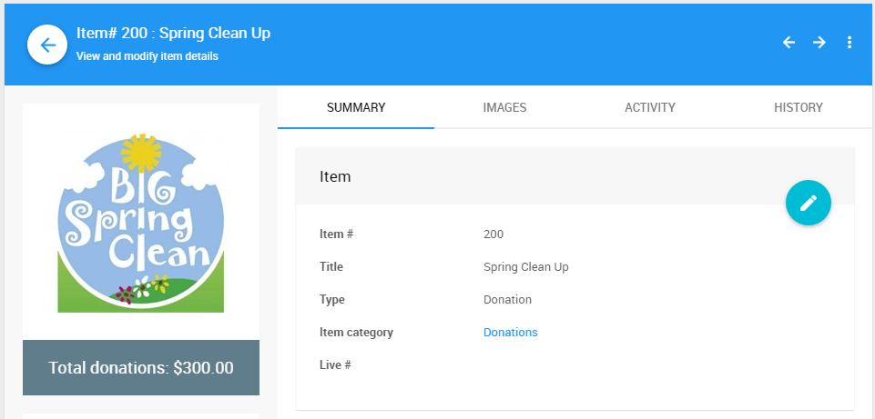

# Donation Items

**Donation Items** are used to represent projects that bidders can donate to for a specific purpose.

For example, a **Donation Item** might be used to raise money for a new school gym and be titled "Spring Clean Up".

Every bid recorded against a donation item is charged to the Bidder. The bid also shows up in the Donations section of the <IndexLink slug="BidderStatements"/>.

See <IndexLink slug="FundANeed"/> and <IndexLink slug="VirtualPaddleRaise"/> for more information on how you can use **Donation Items**.

## Video: Add A Donation Item With A Donate Page

<VimeoVideo video="407418568" date="2020-04-13"/>
