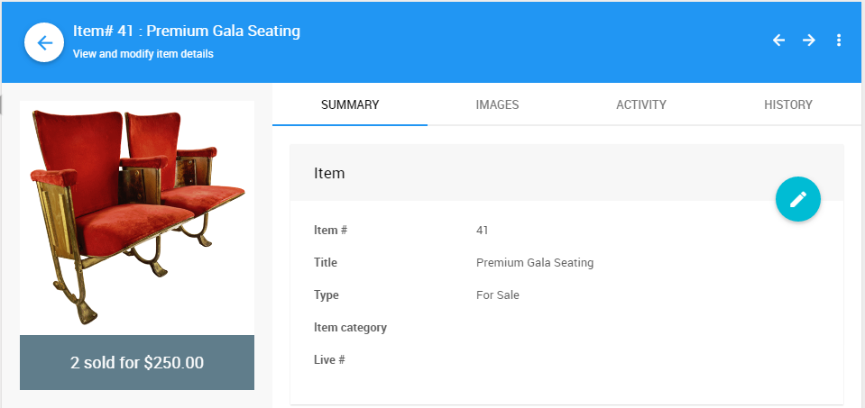
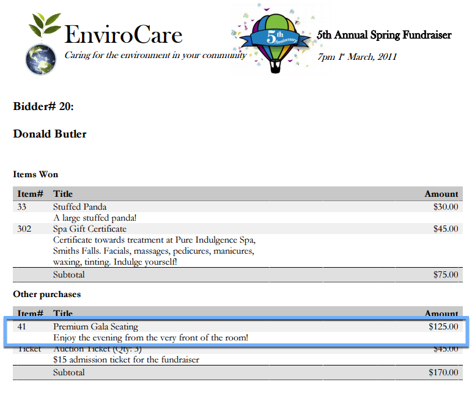
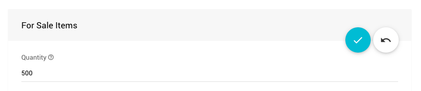

# For Sale Items

**For Sale Items** represent items that are sold for a fixed price. These items are also often "sold" to multiple people. **For Sale Items** are used, for example, when selling auction <IndexLink slug="Tickets"/>, or "raffle tickets" as well as items where the bidder thinks of *buying* the item rather than *winning* it.

See <IndexLink slug="RunARaffle"/> for more information about setting up raffle ticket items.

::: info
**For Sale Items** are not displayed by default in the <IndexLink slug="RowContent_ItemCatalog"/> element.
See <IndexLink slug="ConfigureItemsDisplayed"/> for more information on how to add them to an existing **Item Catalog**.
:::

**For Sale Items** purchases will be shown in the **Other purchases** section of the <IndexLink slug="BidderStatements"/>.

::: middle
*An example __For Sale__ item.*
:::

::: middle
*An example __Bidder Statement__ showing the __For Sale__ item.*
:::

**For Sale Items** can have a **Quantity** set to limit the number available. Setting the value to `0` (or leaving it blank) will make the supply *unlimited* whereas setting a value greater than zero will set a hard-cap on the number that can be sold. This is set on the **Item Details** <IndexLink slug="ItemDetailsSummary"/> tab.

::: yellow
**IMPORTANT**
If someone adds a **For Sale Item** to their cart but then doesn't checkout for several days, it is possible someone else could have bought the item in the mean time. In this case, they will get an error when they try to checkout.

With a **Buy It Now Only** item the **Bidder** would be committing to the item immediately. See <IndexLink slug="BuyItNowItems"/> for more details on this item configuration.
:::

## Export Individual Sales

**For Sale** items also have an additional *activity* related option under **Exporting & Printing** (in the sidebar) that allows you to **Export Individual Sales** for the specific item as an XLS formatted file.

Clicking the button will immediately start the process and download the XLS formatted file to your browser default "download" location.

::: green Use With Your Raffle Tickets
The **Export Individual Sales** will provide you with a list of buyers of the specific **_Raffle Ticket_** item. This list might be used with an external random draw mechanism.
:::

<ChildPages/>
<Revised text="Reviewed" date="2022-04-04"/>
