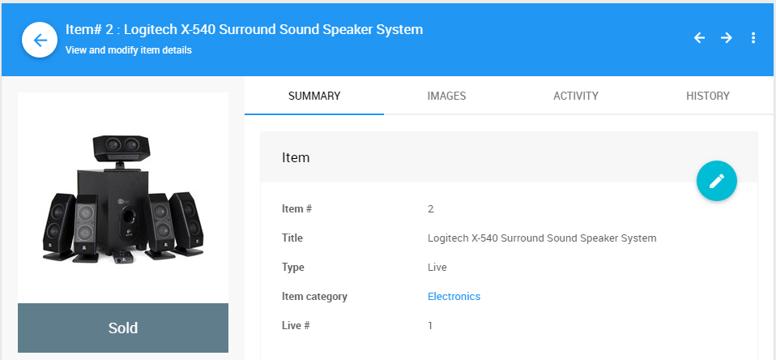

# Live Items

**Live Items** represent items that will be sold during a live auction by an auctioneer and/or a member of the Organizer team.

- <IndexLink slug="BidSheets"/> are not generated.
- Items will be shown in the "live" section of the <IndexLink slug="AuctionCatalog"/>.
- Live items can be assigned a "live number" which would be used to base the order the "live" items will be auctioned off at during the event. *This is in addition to the item#*.
See <IndexLink slug="LiveOrdering" /> for more details.
- <IndexLink slug="OnlineAuctions"/> are supported for "live" items although it is a good idea to check with your "auctioneer" if they will want to be given a potentially high starting bid for the item.

