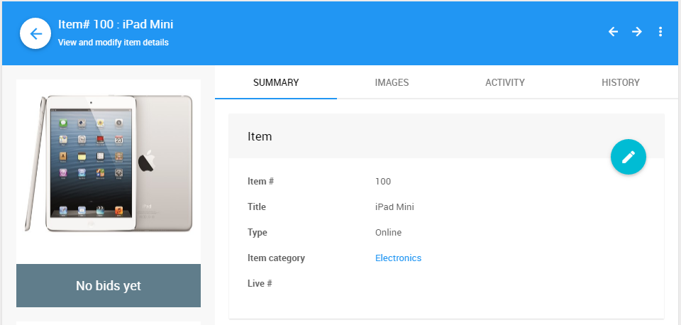

# Online Items

**Online Items** represent items where the bidding is handled completely online by Auctria.

Generally, <IndexLink slug="OnlineAuctions"/> occur over a fixed, preset period of time you define and set to run for as long as you like. The system will be managing the process and therefore allow bidders to use <IndexLink slug="ProxyBidding"/>, too.

