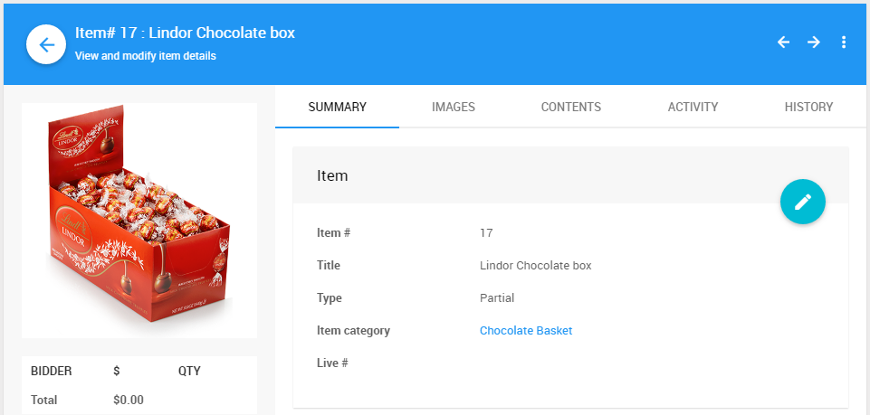

# Partial Items

**Partial Items** are bundled as part of a <IndexLink slug="Baskets">Basket</IndexLink> item and often used to represent items **not** being sold individually. Basket content items can consist of **Partial Items** and/or <IndexLink slug="ForSaleItems"/>.

For example, a box of chocolate might be contained in a chocolate themed basket.

See <IndexLink slug="Baskets">Baskets and Packages</IndexLink> for more information.
