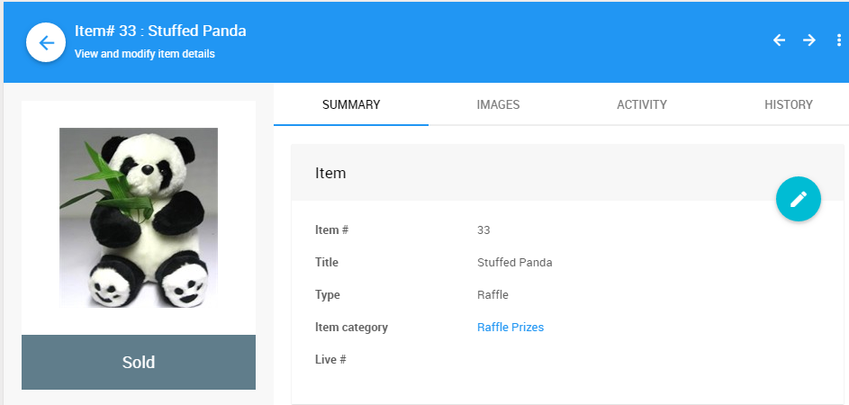

# Raffle Prize Items

**Raffle Prize** items are used as the prizes for raffles; or, as an option in which the item is being awarded to the bidder without a cost.

For raffles, you would create "raffle tickets" as <IndexLink slug="ForSaleItems"/>, and sell these to the bidders.

Tracking the **Raffle Prizes** within Auctria is *optional* since awarding a raffle prize will not affect how much bidders owe or the income you raise. By entering the winning prizes, they will appear on the <IndexLink slug="BidderStatements"/>.

Create each prize item with:

1. **Item type** set to <IndexLink slug="RaffleItems">Raffle Item</IndexLink>; and,
2. **Value** (optional).

You can record the prizes a bidder has won using the **Bid** tab of the **Record Bid** page, just leave the amount blank. You will need to enter the **Bidder#** and **Item#**. There is no dollar amount used when awarding a **Raffle Prize**.

See <IndexLink slug="RunARaffle"/> for more information.

<ChildPages/>
<Revised date="July 2020"/>
