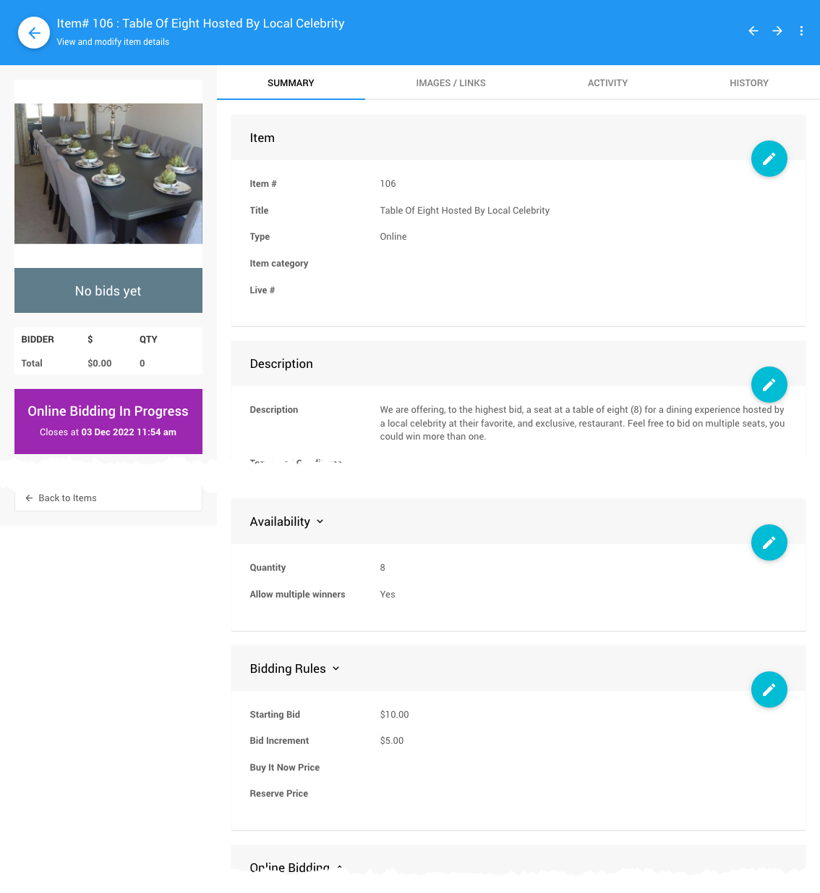

# Multiple Winners With Multiple Quantities

There may be cases where you will have an item, or items, where you have a quantity of that item and you want to allow multiple winners for the item. Your bidders will have the opportunity to win one, two, or maybe even all of the item(s) in question.

## Example: Table For Eight Diners

You might be selling **Tables of 8** to your **Sponsors** which is great although in this example you are offering to the highest bid, a seat at a table of eight (8) for a dining experience hosted by a local celebrity at their favorite, and exclusive, restaurant.

::: middle
*An example item showing some of the key values to set.*
:::

Now, if you have this **Table Of Eight Hosted By Local Celebrity** item and if bidders choose to start bidding by only placing `$10` bids (the **_Starting Bid_** value) then at bid# 9 the requirement would be `$15` (lowest bid/starting bid plus one **_Bid Increment_** value). If your bidders choose to bid higher than the initial starting bid, they would remain a winning bidder longer.

For example, historical bids:
| Bid Number | Amount | Bidder |
| :---: | :---: | --- |
| #1  | $10 | Bidder# 1 |
| #2 | $10 | Bidder# 2 |
| #3 | $15 | Bidder# 3 |
| #4 | $10 | Bidder# 4 |
| #5 | $10 | Bidder# 5 |
| #6 | $10 | Bidder# 5 |
| #7 | $10 | Bidder# 6 |
| #8 | $20 | Bidder# 7 |

These historical bids would be ranked as: #8, #3, #1, #2, #4, #5, #6, #7

Based on historical bids and their respective amounts, winning bidders in order:
| Bid Number | Amount | Bidder | Seat * |
| :---: | :---: | --- | :---: |
| #8 | $20 | Bidder# 7 | 1 |
| #3 | $15 | Bidder# 3 | 2 |
| #1  | $10 | Bidder# 1 | 3 |
| #2 | $10 | Bidder# 2 | 4 |
| #4 | $10 | Bidder# 4 | 5 |
| #5 | $10 | Bidder# 5 | 6 |
| #6 | $10 | Bidder# 5 | 7 |
| #7 | $10 | Bidder# 6 | 8 |

At this point, bid# 9 would be required to be at least `$15` (starting bid + one bid increment), it would replace bid# 7 in the ranking as higher bids than existing bids replace those existing bids based on a **_LIFO_** approach (**_last-in, first-out_**). Carrying on from this point, bids would need to be at least `$15` although bids placed at higher amounts would re-arrange the rankings based on both the bid amount and *LIFO*. For example, bid# 9 was `$15` and bid# 10 is `$30`.

| Bid Number | Amount | Bidder |
| :---: | :---: | --- |
| #1  | $10 | Bidder# 1 |
| #2 | $10 | Bidder# 2 |
| #3 | $15 | Bidder# 3 |
| #4 | $10 | Bidder# 4 |
| #5 | $10 | Bidder# 5 |
| #6 | $10 | Bidder# 5 |
| #7 | $10 | Bidder# 6 |
| #8 | $20 | Bidder# 7 |
| #9 | $15 | Bidder# 8 |
| #10 | $30 | Bidder# 9 |

The new ranking of bids would be: #10, #8, #3, #9, #1, #2, #4, #5

| Bid Number | Amount | Bidder | Seat* |
| :---: | :---: | --- | :---: |
| #10 | $30 | Bidder# 9 | 1 |
| #8 | $20 | Bidder# 7 | 2 |
| #3 | $15 | Bidder# 3 | 3 |
| #9 | $15 | Bidder# 8 | 4 |
| #1  | $10 | Bidder# 1 | 5 |
| #2 | $10 | Bidder# 2 | 6 |
| #4 | $10 | Bidder# 4 | 7 |
| #5 | $10 | Bidder# 5 | 8 |

::: yellow
**IMPORTANT**
Bidder# 5 is no longer winning the two seats they initially bid on. They *will* receive an **_Out Bid Notification_** for the item as their bid was superseded by another guest's bid.
:::

This would carry on until bidding ends... and remind your guests to **_bid early... and bid often!_**
This will help ensure they win at the best possible value.

### Bidding For Multiple Items

We do recognize, as with the example above and "Bidder# 5", there may be times when a bidder wants to win more than one of an item, for example, seats for a couple or family. The guest will need to place multiple bids for the item to register their *intent*.

The bidder will need to place a bid for each *single seat* they want to win.

The general idea is to help ensure bids are fairly applied. There would be no means to **_know_** what the *intent* of the bidding guest is if they could place a single bid for multiple quantities of an item.

If the current bid (based on a per each value) is exceeded by another guest's bid does the new bid apply to all bids lower or just an equivalent quantity matching the new bid?

As the example "table" fills, the idea is to keep it full and as such the approach used by Auctria is to only have new winning bids apply against the same quantity of bids of lower value. Although this might "split" a guest's *intent* to win multiple seats at the table overall it will help to ensure the most winning bids are kept at the highest values for the seats available.

::: info
We recommend letting your **Bidders** know, in advance, what to expect with these **Multiple Winners With Multiple Quantities** items and how this will work to help minimize any confusion with bidding on these items.
:::

<HRDiv/>

## Bidding Amount Rules

The rule for bidding amounts is always:
a) if there are less winning bids than quantity, the "Starting Bid" amount is a valid bid; otherwise,
b) find the lowest winning bid and add one "Bid Increment" value to it for the next valid bid amount.

::: info
**NOTE**: if the bid amount of "lowest winning bid plus one bid increment" is not high enough to be a valid winning bid continue adding additional "Bid Increments" until a valid bid amount is reached.
:::

<HRDiv/>

::: feet Bid Ranking Tables - Seat Column
The **Seat** column only represents the winning seats available at the table, it is not dictating a seating arrangement. This would be handled outside of Auctria.
:::

<HRDiv/>

<ChildPages/>
<Revised text="Reviewed" date="2022-04-04"/>
