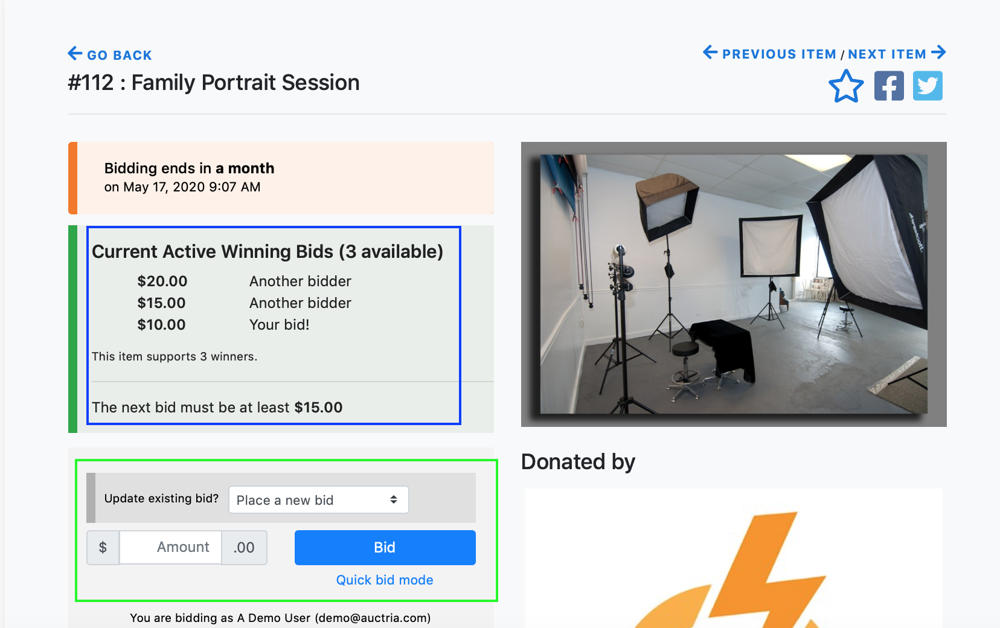

# Allow Multiple Quantities <NewLoc/>

There are a number of ways to set up items to allow selling multiple quantities of those items.

There are three item fields that are relevant:

- **Item Type** - this is a **For Sale** item or an **Auction item (Online or Silent)**. See <IndexLink slug="ItemTypes"/> for more details.
- **Quantity** - the actual number of the item you have available.
- **Allow multiple winners** - for "auction" items, should multiple winners be allowed?

The following shows examples how to set up items in different scenarios.

## Auction Tickets

To sell **Auction Tickets** for a fixed price, with no particular limit on the number of tickets you are planning on selling,  you can create the item as follows:

1. **Item type** is set to **For Sale**.
2. **Value** is set to the price of the ticket.
3. **Quantity** is not specified (set as 0, or blank) to allow an unlimited amount.

Purchases are recorded using the <IndexLink slug="SellTickets"/> functions. This will correctly address all of the related functions tied to <IndexLink slug="Tickets"/> such as creating the associated **Bidder Records**.

## Dinner Party

There is a dinner party Item - with space for 8 guests at a **fixed** price per seat. You can create the item as follows:

1. **Item type** is set to one of <IndexLink slug="OnlineItems">Online</IndexLink>, <IndexLink slug="SilentItems">Silent</IndexLink>, or <IndexLink slug="LiveItems">Live</IndexLink> as appropriate.
3. **Starting Bid** and **Buy-It-Now Price** are set to the **same price**.
4. **Allow multiple winners** is enabled (= yes).
4. **Quantity** = amount available (eg. 8)
5. **Value** can be specified as you like.

If you want to allow bidding on the individual seats rather than a fixed prices sale, see the **Independent Bidding** section in the **3 Sets of Gift Certificates** example below.

## 3 Sets of Gift Certificates

You have three identical restaurant gift certificates to be offered in the auction.

How this is set up depends on how you want the bidding for these items to work.

### Fixed Price

If you are selling gift certificates at a fixed price, treat them the same as the **Dinner Party** example above.

1. **Item type** is set to one of <IndexLink slug="OnlineItems">Online</IndexLink>, <IndexLink slug="SilentItems">Silent</IndexLink>, or <IndexLink slug="LiveItems">Live</IndexLink> as appropriate.
2. **Starting Bid** and **Buy-It-Now Price** are set to the **same price**.
3. **Allow multiple winners** is enabled.
4. **Quantity** = amount available (eg. 3)
5. **Value** can be specified as you like.

### Online Bidding

With Online bidding, the system will manage the **highest bids** for the number of gift certificates.  The bidder can increase their own bid and/or add a second bid.  The system will award the "Gift Certificates" to the **top three bidders**.  

1. **Item type** is set to <IndexLink slug="OnlineItems">Online</IndexLink>
2. **Allow multiple winners** is set to Yes.
3. **Quantity** is set to 3.
4. **Value**, **Starting Bid** and **Bid Increment** can be specified as you like.

### Independent Bidding

If you want to allow **independent bidding**, you would create 3 items:

1. **Item type** is set to one of <IndexLink slug="SilentItems">Silent</IndexLink>, <IndexLink slug="LiveItems">Live</IndexLink>, or <IndexLink slug="OnlineItems">Online</IndexLink> as appropriate.
3. **Starting Bid**, **Bid Increment**, and **Buy-It-Now Price** can be set as you like.
4. **Allow multiple winners** is not enabled.

Once the first item is created, you can click **Duplicate Item** on its **Item Details** page to quickly create an identical item which you will need to assign a different item#. See <IndexLink slug="DuplicateItem"/> for more details.

It can be helpful in these cases to assign related item numbers using number-letter combos, for example, such as 123A, 123B, 123C, etc.

This method produces a number of separate <IndexLink slug="BidSheets"/> equal to the items. In the case of the **3 Sets of Gift Certificates**, there would be three bid sheets generated; in the case of the **Dinner Party**, there would be 12 bid sheets generated.

## Single Bidding Process - Bid Sheet

If you want to have a single bid sheet to handle the bidding for all 3 certificates **and** award the "Gift Certificates" to the top three bidders, set the item up this way:

1. **Item type** is set to <IndexLink slug="SilentItems">Silent</IndexLink> or <IndexLink slug="LiveItems">Live</IndexLink>
2. **Value** is set to the gift certificate value.
3. **Starting Bid** and **Bid Increment** can be specified as you like.
4. **Allow multiple winners** is set to Yes.
5. **Quantity** is set to 3.

If you set the <IndexLink slug="BidSheets"/> to show the bid amount for each row, you can also use the "Repeat bid value on 'quantity' rows" option to generate **Bid Sheets** with each row repeated the 3 times.

This enables bidders to clearly see what the valid bids are, though it can lead to very long bid sheets on items with higher quantities.

<ChildPages/>
