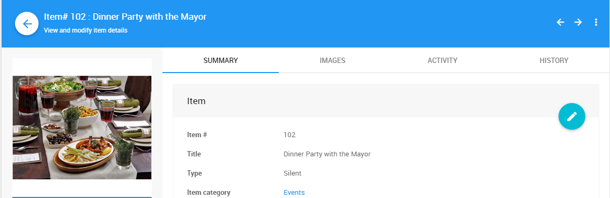

# Allow Multiple Winners <NewLoc/>

Normally, a <IndexLink slug="SilentItems">Silent</IndexLink>, <IndexLink slug="LiveItems">Live</IndexLink>, or <IndexLink slug="OnlineItems">Online</IndexLink> auction item is won by a single bidder. However, sometimes you want to allow multiple bidders to be able to win an item.

To allow more than one winner, go to the **SUMMARY** tab on Item Details. In the **Availability** panel, enabled **Allow multiple winners** and enter the available **Quantity** of the item.

When an item is set to **Allow multiple winners**, the winning bidders are shown on the **Item Details** page under the **ACTIVITY** tab.

Each bidder's bid will also show on their <IndexLink slug="BidderStatements"/> in the **Items won** section.

## Changing Allow Multiple Winners

Some care is needed if you are changing the **Allow Multiple Winners** setting once the item has bids.

The rules that apply here are:
- If you are setting **Allow multiple winners** to **Yes**, the current winning bidder remains as a winner.
- If you are setting **Allow multiple winners** to **No** and there is a *single winning* bidder, they remain as a winner.
- If you are setting **Allow multiple winners** to **No** and there are currently *multiple winning* bidders, all the **winning bids are cleared** and you will have to **re-enter the "true" winning bid**.

## Bidder Experience Placing Bids

When the bidder is bidding on an item with the **Allow Multiple Winners** option enabled, and they have already placed a bid, they will see a drop-down selector for updating their existing bid or to place a new bid if they return to the *Item Details* page when logged in.

Clicking on the drop-down selector beside *Update Existing Bid?* will provide the options to either update your existing bid or to add a new bid for an additional lot of the item.

<ChildPages/>
