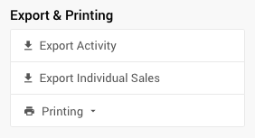

# Pick A Prize Raffle

::: hideaway
## How To Run A Selective Drawing Raffle
## How To Run A "Penny Social" Raffle
## How To Run A "Tricky Tray" Raffle
## How To Run A "Chinese Auction" Raffle
:::

Similar to a raffle draw for a single item, a **Pick-A-Prize Raffle** is often a great way to get more people involved with your event by letting them compete against each other to win one of a selection of <IndexLink slug="RaffleItems"/>.

First off, determine your raffle ticket sales strategy. Although the more tickets per dollar may provide your guests with perceived value and the added excitement of being able to spread their interests over many items, fewer tickets per dollar can increase the sense of providing the guests with a better chance of winning. Either way, selling your tickets in singles and/or multiple quantities for a better value per ticket offers your guests more ways to help you make your fundraiser successful.

::: red
**Auctria only provides the means to sell "lots" that represent the "raffle tickets".**
When you **Run A Raffle** using Auctria you may need to have a method of assigning raffle ticket numbers to bidders, if needed, as well as a means for <IndexLink slug="RunARaffle" anchor="picking-winners"/>.
:::

See <IndexLink slug="RunARaffle"/> and <IndexLink slug="AddRaffleTickets"/> for more details on creating and selling "raffle tickets".

## In-Person Paper Raffle Tickets

Although Auctria can help you with tracking the sale of the "raffle tickets", you will still likely need to use some sort of *paper raffle tickets* for your "in-person" guests to make their "picks" with.

Paper tickets are often small, relatively inexpensive, and usually have pre-printed numbers that distinguish which tear-off ticket goes in the ticket draw box and which the guests use to select the item(s) they want to enter into the raffle for.

::: middle
*An example of a common roll of "paper tickets" that might be used.*
:::

You will still have to track which guest received which tickets although this is still easy to manage and use to identify the winners. The guests would purchase their raffle tickets through Auctria and get an appropriate amount of *paper tickets* to drop into the raffle prize ticket boxes.

::: ideas
Although Auctria does not provide a "drawing" mechanism, the idea of a "blind draw" by a keynote speaker or other important person -- or randomly picked guests? -- during the event could help generate more interest and excitement to build on.

This could even serve as an intermission-style break during an in-person event.
:::

## Virtual Pick A Prize Raffle

The premise of a **Virtual Pick A Prize Raffle** may be challenging although it is still something that might be considered. In essence, you would need to take into consideration the number of prizes for participants to choose from and how to provide the "raffle tickets" they would use for their picks.

### Create A Raffle Ticket Per Prize Item

In most cases, **Pick A Prize** raffles are based on purchasing a group of tickets and then the guest picks which raffle prize, or prizes, they want to enter into the draw for and how many of their tickets they want to put towards that prize. In the case of **Virtual** events, you would need to make available "raffle tickets" that are for specific prizes.

See <IndexLink slug="AddRaffleTickets"/> for more information on how to add raffle tickets to your auction website.

::: yellow
**IMPORTANT**
These individual raffle prize raffle tickets could be sold in groups if you want to discount multiple tickets for a single prize item although you would not be able to provide a group discount across multiple raffle prize raffle tickets.
:::

### Alternate Method Using Comments

An alternative to having a raffle ticket item for each raffle prize is to leverage the comments field that appears in the checkout process. Please note, this is a manually intensive curated process.

First, the "raffle tickets" would need to be configured with an **Online Purchase Behavior** option set to <IndexLink slug="OnlinePurchaseBehavior" anchor="immediate-payment-only"/>. This will send the buyers through the shopping cart process immediately (this is generally best no matter the case).

Next, as the buyers checkout, they can note in the **Comments** field their choices for how they would like their raffle ticket distributed amongst the existing **Raffle Prize** items.

::: yellow
**IMPORTANT**
This approach is best applied if/when there are smaller numbers of **Raffle Prizes** to be chosen from; and, will require an external method to tabulate which bidders are interested in which prizes.
:::

::: info
This alternate approach also allows for multiple raffle tickets to be purchased at a discounted price.
:::

<HRDiv/>

## Export Individual Sales

As a special case, <IndexLink slug="ForSaleItems"/> have an additional *Activity* related option under **Exporting & Printing** (in the sidebar) allowing you to **Export Individual Sales** for the specific item as an XLS formatted file.

Clicking the button will immediately start the process and download the file in your browser.

::: info
Using the **Export Individual Sales** on a *Raffle Ticket* item will provide you with a list of buyers of that item. This list might be further reviewed and could potentially be used in a raffle "drawing" external to Auctria.
:::

<ChildPages/>
<Revised text="Reviewed" date="2022-04-14"/>
