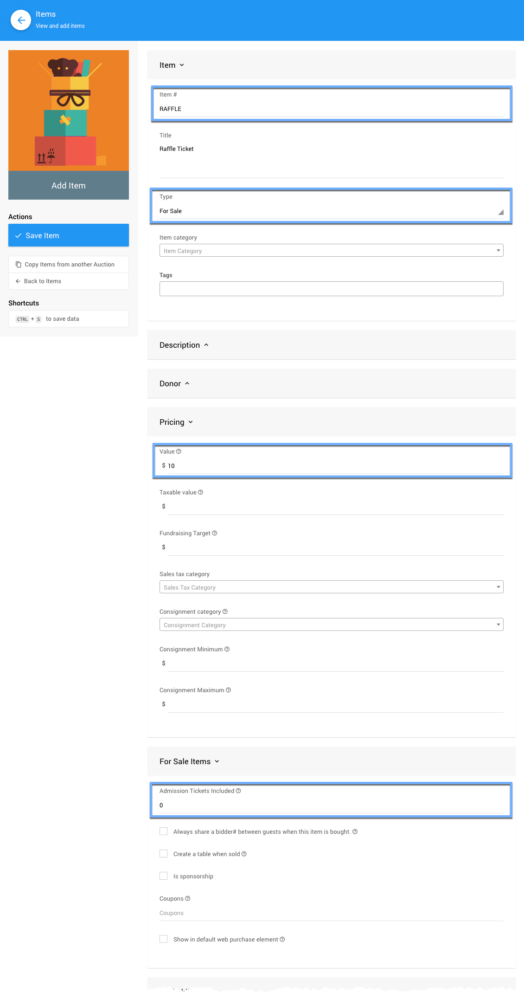
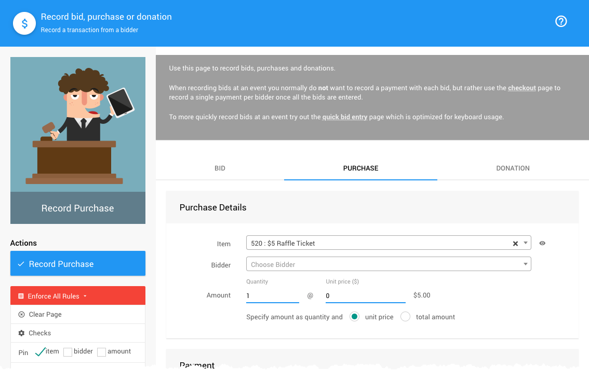
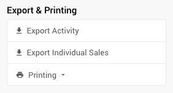

# Run A Raffle <Updated/>

To **Run A Raffle** using Auctria will require at least one item, a *Raffle Ticket*, although you can have multiple "raffle tickets" as needed. You can also use <IndexLink slug="RaffleItems"/> although this is optional as it has no impact on the actual raffle itself.

::: red
**Auctria only provides the means to sell "lots" that represent the "raffle tickets".**
When you **Run A Raffle** using Auctria you may need to have a method of assigning raffle ticket numbers to bidders, if needed, as well as a means for **Picking Winners** (see [below](./#picking-winners)).
:::

In Auctria, "raffle tickets" are generally created as <IndexLink slug="ForSaleItems"/>. In particular, the **Admission Tickets Included** field on these **For Sale** items should be **left blank**.

::: info
In Auctria, the terms for "Tickets" and "Ticket Items" may be a bit confusing. <IndexLink slug="Tickets"/> are used for event **admissions** or **restricted access** for bidding (for example, where the option *Only ticket holders are allowed to bid* is enabled -- see <IndexLink slug="OnlineBidding" anchor="online-bidding-behavior"/> for more details).
:::

<HRDiv/>

  
Run A Raffle: Table Of Contents

  [[toc]]

<HRDiv/>

## Video: Website Editor Add Raffle Tickets Page

<VimeoVideo video="384207844" date="2020-01-11"/>

<HRDiv/>

## Raffle Tickets

You will need to create at least one item set up as a **Raffle Ticket** using the following criteria:

- **Item** type set to <IndexLink slug="ForSaleItems" />
- **Value** set to the price of the ticket
- **Admission Tickets Included** is left blank (or set to `0`).

- If you need to collect <IndexLink slug="SalesTax"/> you can set an appropriate **Sales Tax** category.
- You can manually set the **Item#**, for example, you might use `RAFFLE` to make it easier to remember or be identified by your guests.

If you need to manually record sales of your "raffle tickets" you would use the <IndexLink slug="RecordPurchase"/> function from under the **Bidding/Sales** dashboard.

::: middle
*An example view of the __Record Purchase__ approach for selling "raffle tickets".*
:::

<HRDiv/>

## Selling Raffle Tickets

Although <IndexLink slug="ForSaleItems"/> (like "raffle tickets") can be displayed in any <IndexLink slug="RowContent_ItemCatalog"/> element they are generally best offered on a *purchase* style page such as the page used when selling <IndexLink slug="Tickets"/> items.

Although the above is our recommendation, there are a few options to sell **Raffle Tickets**:

1. The **Raffle Ticket** can be sold on a **Tickets** page. See <IndexLink slug="RowContent_ItemCatalog"/> configured to use the **Items marked 'Show in default web purchase element'** condition. For more details on adding **Raffle Tickets** this way see <IndexLink slug="ConfigureItemsDisplayed"/> (recommended).

2. A separate **Raffle Tickets** page can be created to only display the "Raffle Ticket" items. This is most easily accomplished by using the pre-built section <IndexLink slug="Section_AddSection" anchor="raffle-tickets"/>. This does require you use the `RAFFLE` tag on your "raffle ticket" items.

::: ideas
You can put a button on the home page and/or have a menu item linking to this page (see <IndexLink slug="ConfigureMenuEntries"/> for more details) where you will be using an <IndexLink slug="RowContent_ItemCatalog"/> element. In most cases, it will easiest to use <IndexLink slug="Tags"/> on the **Raffle Ticket** items and then set the appropriate "condition" (**Items matching tags**) for this approach.
:::

3. If you choose to configure your "raffle tickets" as a <IndexLink slug="BuyItNowItems"/>, bidders could "buy" the item although it would actually be treated as a wining bid on the item and the amount would be put "on account" like any *won* item. In this case, bidders would not need to pay for the "raffle tickets" immediately and their accounts would be shown as having a balance.

::: red
**WARNING**
This is not how **Raffle Tickets** are usually "sold". Most events keep "raffle tickets"" as **For Sale Items** and have them paid for immediately.
:::
::: green
**NOTE**
You would set up **Raffle Tickets** as <IndexLink slug="BuyItNowItems"/> if you want them to appear in the "Mobile App" (a **bidding** tool *only*). This is the only way to "sell" items in the app.
:::

Also, since these "Raffle Tickets" would appear as **won items**, having "ticket" in the item title may also be a good idea for reference purposes.

::: yellow
**IMPORTANT**
There is a potential downside using the "Buy It Now" approach. Bidders will need to **register first** before buying "Raffle Tickets" (including **confirming** their email address) instead of being able to buy the tickets in the single transaction used with <IndexLink slug="ForSaleItems"/>.
:::

### Selling Multiple Ticket Bundles

If you are **Selling Multiple Ticket Bundles**, for example a single ticket for $5 or 5 tickets for $20, you would have two <IndexLink slug="ForSaleItems"/>: one for the single "raffle ticket" with a value of $5; and, a <IndexLink slug="Baskets"/> item, to use for the "5 tickets for $20" item.

Once you have the two items created, you would use the <IndexLink slug="CombineForSaleItems"/> function to add the single tickets to the "Basket/Package" and still be able to track all of the tickets sold either as singles or bundles. Total raffle tickets sold would be the amount noted under the single ticket item.

<HRDiv/>

## Export Individual Sales

As a special case, <IndexLink slug="ForSaleItems"/> have an additional *Activity* related option under **Exporting & Printing** (in the sidebar) that allows you to **Export Individual Sales** for the specific item as an XLS formatted file.

Clicking the button will immediately start the process and download the file in your browser.

::: info
Using the **Export Individual Sales** on a *Raffle Ticket* item will provide you with a list of buyers of that item. This list might be further reviewed and could potentially be used in a raffle "drawing" external to Auctria.
:::

<HRDiv/>

## Picking Winners

::: red
**WARNING**
Always check first with your local authorities to ensure you are following any and all applicable rules and regulations before you decide to **Run A Raffle** especially how these requirements apply to **Picking Winners**.
:::

::: recread
- Auctria Blog: [Raffles to Heighten the Auction Success](https://www.auctria.com/blog/raffles-success/)
- Harbor Compliance: [Charitable Gaming Compliance](https://www.harborcompliance.com/information/charitable-gaming-license)

**_These suggestions are no substitute for your own due diligence._**
:::

There are a number of ways and approaches can use for **Picking Winners** of a raffle. Your best options will be those fitting within local requirements and meeting the expectations of your participants... and which will be the most fun!

The following ideas are not an exhaustive list but only some ideas to consider.

- **Paper Tickets**
  One of the simplest methods is to use matched pre-numbered tickets and pick the winning ticket(s) out of a "hat", for example, how you might handle a <Linked slug="5050Raffle"/>.
- **Random Number Generator**
  Using the **Export Individual Sales** report above with the **Random Number Generator** (often seen as the `RAND()` function) feature set found in most spreadsheet applications.
- **Online Random Number Generator**
  Using the **Export Individual Sales** report above with an **Online Random Number Generator** and a spreadsheet application view of the exported sales data (by default you will see a row number beside each row that you might use as your reference).
- **Online Random Picker**
  Using the **Export Individual Sales** report above with an **Online Random Picker** to choose from the list you enter/import into the service.

::: danger
**NOTE**: Auctria will not make recommendations on what approaches to consider.
:::

<HRDiv/>

## Raffle Prize Items

Tracking the **Raffle Prize Items** within Auctria is *optional* since awarding a "raffle prize" will not affect how much the winning bidder owes or the total income raised by the event.

::: info
It is optional to create **Raffle Prize** items as well as record their respective winning bidder although if this is done the **Raffle Prize** items will appear on <IndexLink slug="BidderStatements"/> for reference.
:::

To create "raffle prize" items you would set the <IndexLink slug="ItemTypes"/> as a <IndexLink slug="RaffleItems">Raffle Item</IndexLink> and optionally set a value for the item. The **Raffle Item** type is **not** used for "raffle tickets".

You can record the prizes a bidder has won using the **Bid** tab of the <IndexLink slug="RecordBid"/> page leaving the bid amount blank. You will just need to enter the **Bidder#** and <IndexLink slug="RaffleItems">Raffle Prize</IndexLink> **Item#**.

::: yellow
**IMPORTANT**
There are no dollar amounts used when recording a **raffle prize**. Simply leave this value blank when recording the bid; or, optionally, you can use the value of zero (`0`) which is treated the same as a blank entry.
:::

<ChildPages/>
<Revised date="2022-04-14"/>
