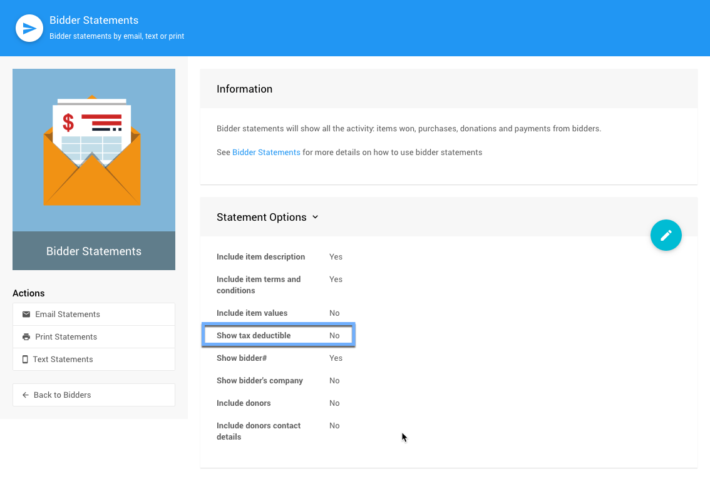

# Taxable Value

If you are a registered charity, bidders may be eligible to claim a tax deduction for their "donations".

## Tax Deductible

The <IndexLink slug="BidderStatements"/> can be configured to show a **Tax Deductible** column for each item.

::: middle
*__Show tax deductible__ is disabled by default.*
:::

By default, the **Tax Deductible** amount is the amount by which the bid, or purchase price, for an item exceeds its **Value** *except* for <IndexLink slug="DonationItems"/> where the full amount is always treated as fully tax receipt-able.

You can override the calculation for an item using the **Taxable Value** field. If set, any bid or purchase amount in excess of the "**Taxable Value**" is shown as tax deductible. By default, the **Taxable Value** field is blank (and treated as `0`) which means use the item's **Value**.

::: yellow
**IMPORTANT**
If you set the item **Taxable Value** to `-1`, which displays as *Priceless*, it will be treated as *fully* tax deductible.
:::

For example, if you have a gala ticket which is $200 but only $75 is tax deductible, you would create the item as a <IndexLink slug="ForSaleItems">For Sale Item</IndexLink> with a value of $200 and a "taxable value" of $125. A bidder purchasing this for $200 would see a tax deductible amount of $75 on their "bidder statement".

<HRDiv/>

Also see <IndexLink slug="ItemValues" anchor="what-is-taxable-value-used-for">What Is "Taxable Value" Used For?</IndexLink> for more information.

<ChildPages/>
<Revised text="Reviewed" date="2022-04-04"/>
