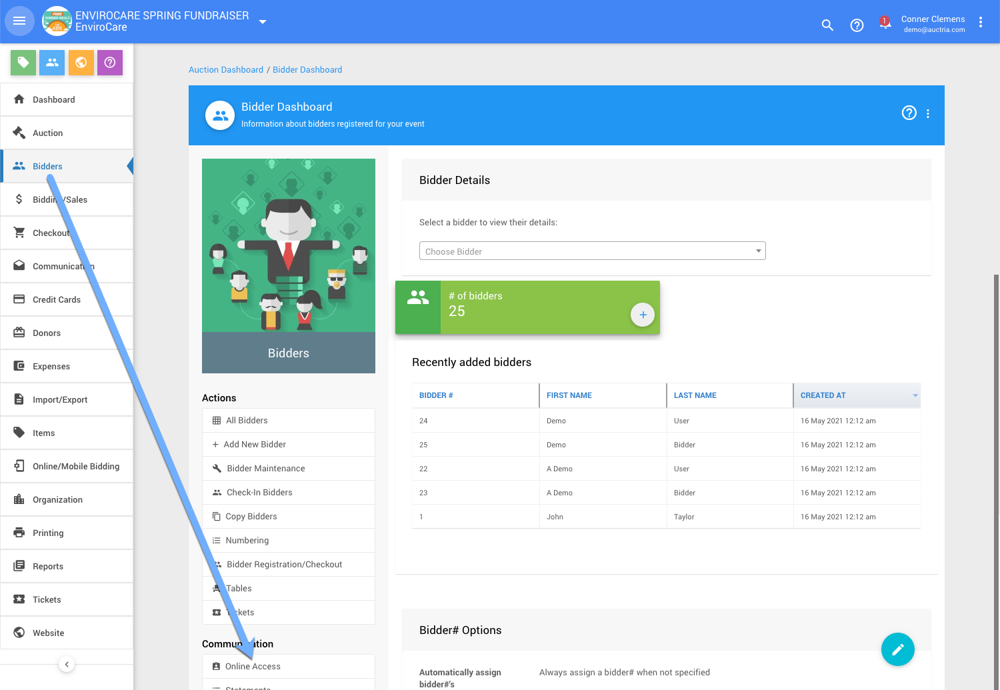
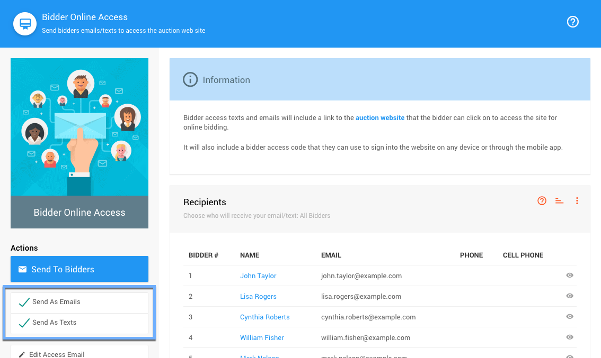
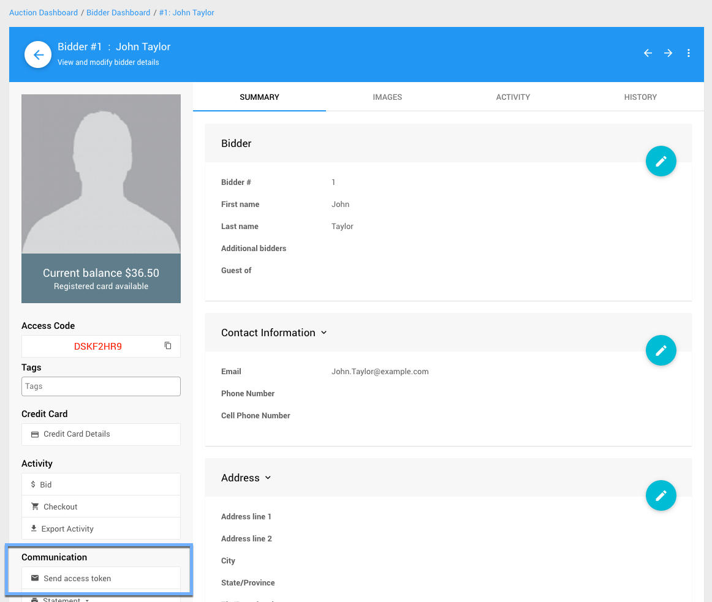
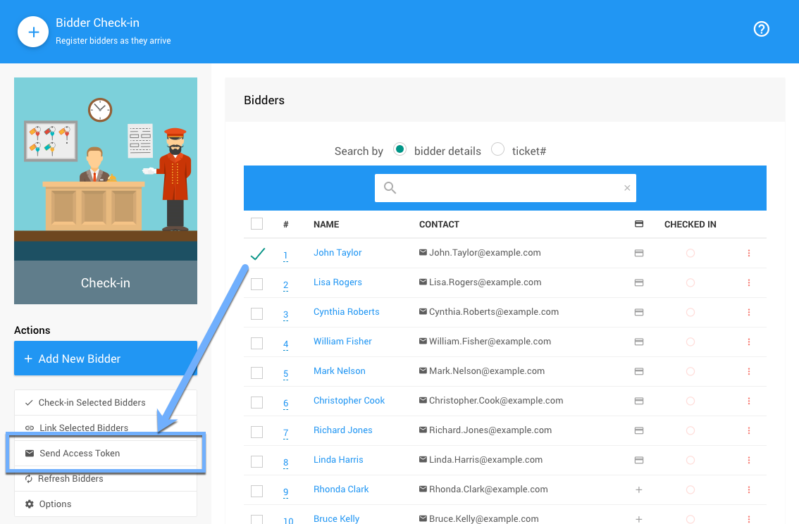
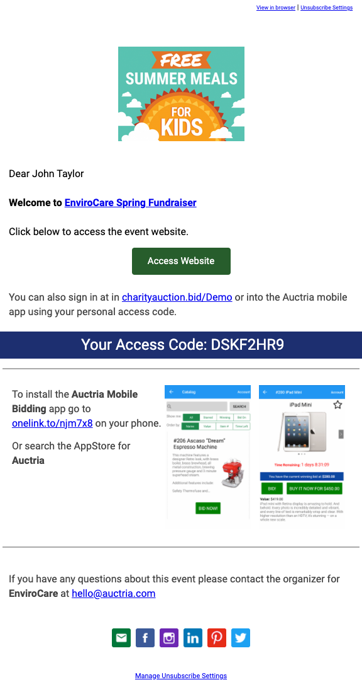
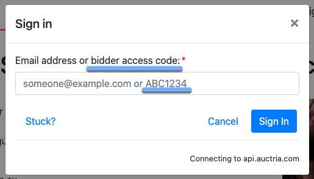
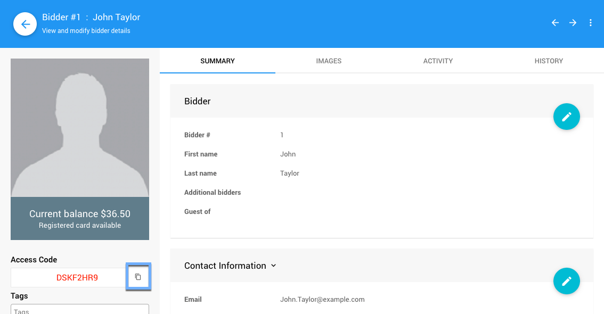

# Bidder Access Tokens <Badge type="yellow" text="(updated)"/>

A **Bidder Access Token** is a link sent by email (or text... or both) that allows the bidder to access the auction website and place bids without having to sign in (or even set up a password).

Using **Bidder Access Tokens** can make getting your bidders online much smoother.

**Bidder Access Tokens** can be sent in bulk via the <IndexLink slug="Bidders"/> dashboard from the sidebar section for **Communication** and the <IndexLink slug="BiddersOnlineAccess"/> action.

Individual **Bidder Access Tokens** can be sent from the specific **Bidder Record**, the **Check-in** page, or as part of the registration process.

## Sending Multiple Bidder Access Tokens

To **Sending Multiple Bidder Access Tokens** at the same time you would use the <IndexLink slug="BiddersOnlineAccess"/> dashboard to select your *Recipients* and email and/or text these participants with their specific unique access code.

::: yellow
**IMPORTANT**
The *Send As...* options used on the <IndexLink slug="BiddersOnlineAccess">Bidder Online Access</IndexLink> dashboard do not persist and are only used when sending access information from that dashboard.
:::

## Sending From Bidder Record

You can send an **Online Access** code from the **Bidder Record** for the specific participant.

::: yellow
**IMPORTANT**
This is an immediate process and does not have a confirmation before sending the **Online Access** information.
:::

Locate and open the specific **Bidder Record** for the participant you want to send their **Online Access** information to, and then click on the **Send access token** option under the *Communication* section of the sidebar.

::: middle
*An example using a demo bidder record.*
:::

## Sending During Check-in

You can send an **Online Access** code from the **Bidder Record** for the specific participant during the **Check-in** process. See <IndexLink slug="CheckIn"/> for more information on this.

::: yellow
**IMPORTANT**
This is an immediate process and does not have a confirmation before sending the **Online Access** information.
:::

::: middle
*An example of a bidder being checked-in and the option to __Send Access Token__.*
:::

::: green
**NOTE**
If checking in more than one person at a time, the **Send Access Token** option will be triggered for each bidder being checked-in.
:::

::: info
If **Text Messages** are enabled, sending the access information from the **Check-in** page will send *both* an email *and* a text message with the details.
:::

---

## Example Bidder Online Access Email

The bidder will receive a simple email similar to the one below.

::: middle
*An example using the same (see above) referenced demo bidder.*
:::

Clicking on the **Access Website** "button" will take the bidder directly to the auction web site using their specific bidder details. If the bidder prefers, they can also manually type the code displayed in the email into the **Sign in** popup window.

::: middle
*An example default __Sign in__ popup window.*
:::

::: green
**NOTE**
If the optional <IndexLink slug="TextMessages"/> features set is enabled for the auction/event, the bidder will also receive a text message if they have a mobile telephone number in their bidder details.
:::

## Bidder Access Tokens Via Text

If you have enabled the <IndexLink slug="TextMessages"/> feature, a bidder can text the word **web** to the auction phone number and the system will respond with a text message that contains a link that will sign them into the web site as the bidder they are registered as using that mobile telephone number.

## Copy and Paste Access Code

If necessary, you can use the "copy" icon to copy the **Access Code** alone from the Bidder Details screen and share this piece of data only.

<ChildPages/>
<Revised date="2021-05-26" time="3:54 PM"/>
