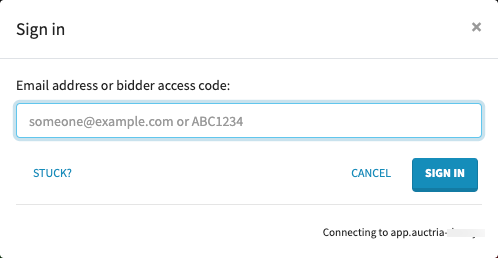

# Bidders in Online Auctions

Enabling bidders to participate in your auction is key to a successful fundraiser. There are several ways bidders can participate in an online auction giving you the flexibility to choose what works best for your event.

## 1. Register via the Auction Website

The **Auction Website** templates are set up to allow a bidder to register with their email address and create a password to identify themselves for online bidding. This is the normal way bidders would participate in a long running event.

However, when dealing with an in-person event at which you want to do online bidding this can be a bit cumbersome as each bidder would need to go through this process on their phone or tablet.

### Email Confirmation

By default, when registering online, the bidder will need to confirm their email address before they are allowed to bid. This is done to ensure the email address is valid and the bidder didn't make a mistake when typing it in. If the email is not able to be confirmed you many note be able to contact them later.

During an in-person event this requirement can be onerous, and can be turned off under **Website** > **Online Bidding** in the "Online Bidding Behavior" panel if you are willing to accept the slight risk of someone entering an incorrect email address. However, if people are picking up items and paying at the event, this is less of an issue than in a purely online event.

## 2. Use Bidder Access Tokens

The <IndexLink slug="BidderAccessTokens"/> are a personalized link/code (often sent in an email) that allows bidders to access the **Auction Website** and bid without having to sign in or even set up a password.

Using **Bidder Access Tokens** can make getting your bidders online much smoother. You can register the bidders at check-in and enter their email address then send them a **Bidder Access Token** and they just click on the link to start bidding.

### Sending Bidder Access Tokens

A bidder access token can be sent directly from the bidder check-in page.

On the bidder check-in page locate the bidder(s) you want, by searching for their name or bidder#, and then select the bidders to send a bidder access token to, and click on the **Send Access Token** button. See <IndexLink slug="BidderAccessTokens"/> for more details.

### Bidder Access Tokens Via Text

If you have enabled the <IndexLink slug="TextMessages"/> optional feature set under <IndexLink slug="Communication"/>, a bidder can text the word `web` to the auction's "Text Messages" phone number and the system will respond with a text message that contains a link that will sign them into the web site under their registered bidder#.

## 3. Using Bidder Access Codes

A bidder access code is a short alphanumeric code the system automatically assigns each bidder which enables them to sign in and participate without needing to register:

On the sign-in pop-up window on the website, the bidder can type their **Bidder Access Code** instead of an email and password credential set.

If you are printing bidder paddles, or labels, you can include the **Bidder Access Code** in those via the <IndexLink slug="WordDocuments" /> feature under the <IndexLink slug="Printing"/> section of the main Auction Dashboard menu.

### Access Code vs Access Token

Bidder **Access Codes** and **Access Tokens** are related, and you can use both.

An **Access Code** is something the bidder would manually type into the web browser, or the mobile app, on their own to access the event.

An **Access Token** is a special link, usually contained in an email, the bidder would click on to access the web site. This requires that the bidder is able to receive email on the device they want to bid from.

See our FAQ: <IndexLink slug="WhyUseAccessTokens"/> for more information.

## 4. No Password Sign In

There is an option (**disabled by default**) to enable bidders to sign in **without a password** and just use their email address.  This clearly is a trade-off between security and convenience -- it would allow anyone to sign in as someone else just using their email address. However, in some cases, making the process easier for bidders during the short window of an in-person event may be worth this trade off.

In a traditional silent auction, a bidder could go around bidding as someone else by writing down the wrong bidder#, but generally this is not a problem in practice. We do not recommend using this for a longer running online auction.

If you want to enable this options, click on **Website** > **Online Bidding** and set the **Allow bidders not to use their password** setting to "Yes".

If you enable this option, at check-in you can enter a bid via the <IndexLink slug="CheckIn"/> page and include the bidder's email address and they would be able to immediately sign in online without having to set up a password or click on any links.

## 5. Registering Via Text Message

If you are using the optional <IndexLink slug="TextMessages"/> feature set (see under <IndexLink slug="Communication"/> in the main Auction Dashboard menu), you can enable bidders to register by text message as well. See <IndexLink slug="BidderPhoneNumbers"/> for more details.

If a bidder registers via text message, they will be associated with their cell phone# but they can also use the `web` <IndexLink slug="TextCommands">text command</IndexLink> to get a link to sign into the website as well.

## 6. Bidding in Kiosk Mode

When using <IndexLink slug="KioskModeBidding"/> you can check-in bidders as normal, or they can register online, and then the bidders just need their bidder# to bid on a kiosk system you have set up. On the tablet or laptop you provide, the kiosk bid form will accept just a bidder# and amount. There is no need for their email address or a password to bid.

