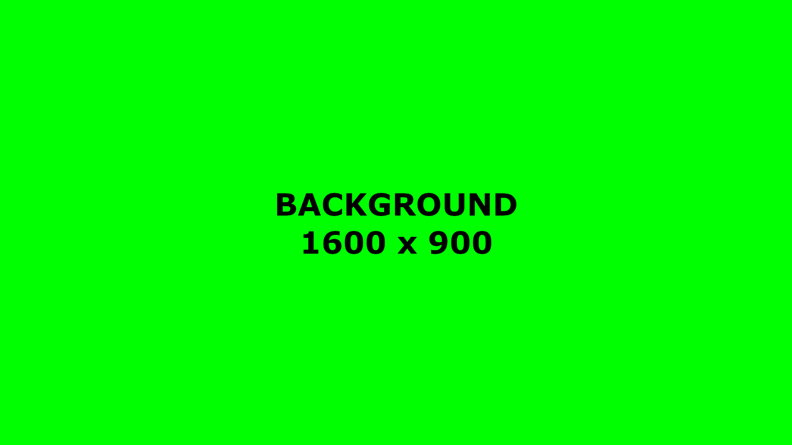
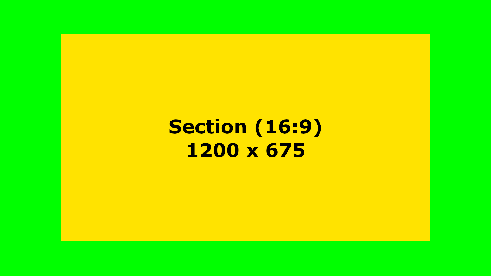
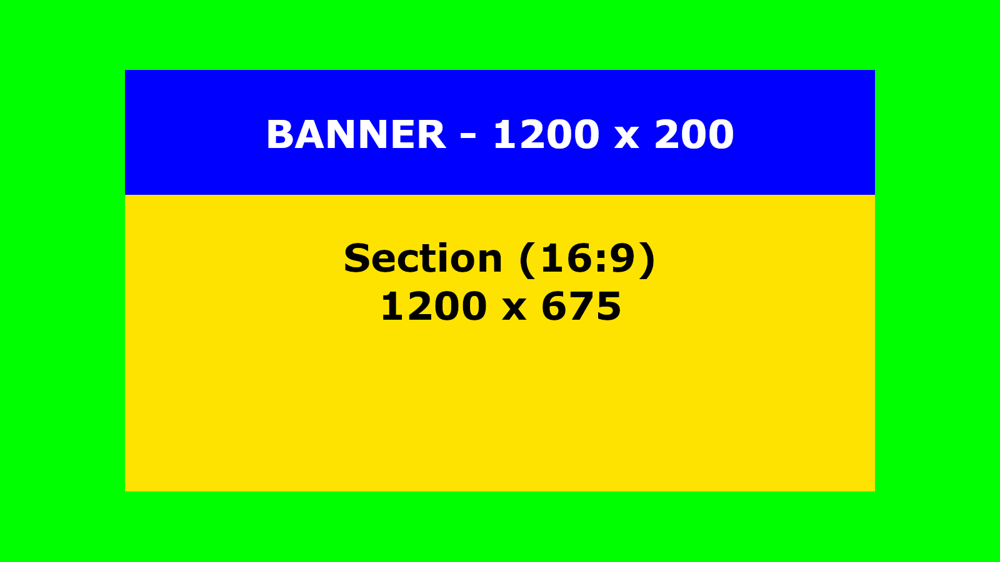
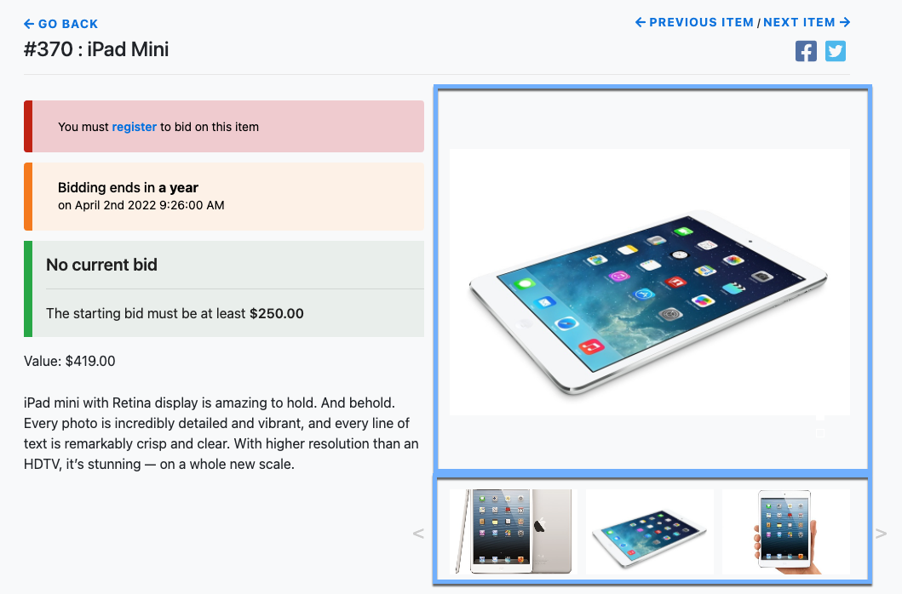
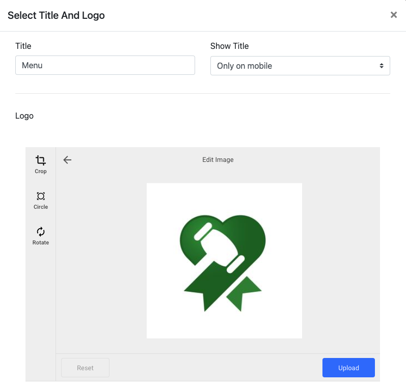
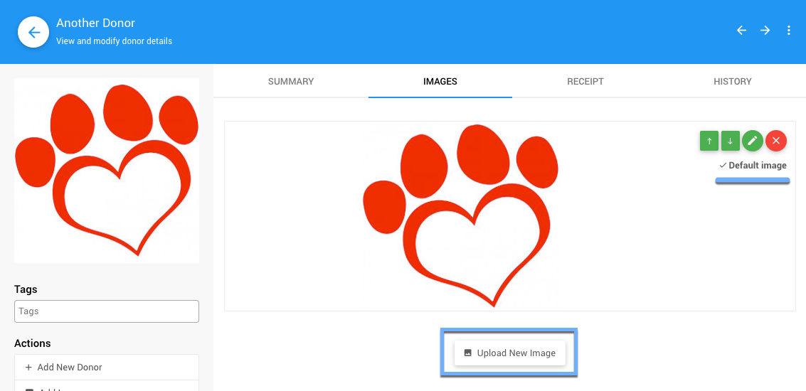

# Image Sizes <Updated/>

In Auctria, **Image Sizes** (or "dimensions") can play an important role where they are used.

::: green
Image **Dimensions** and image **File Size** may be related and in most cases, the larger the image dimensions (for example, measured in pixels) the larger the image file size will be. Using a reasonably sized (read: dimensional values) image will mean a smaller image file size and better times for your guests visiting the auction website.
:::

::: middle
::: ideas
| Image Type | Aspect Ratio | Suggested Sizes |
| ---------- | ------------ | --------------- |
| [Background Images](./#background-images) | `16:9` | `1600px` x `900px` |
| [Section Images](./#section-images) | `16:9` | `1200px` x `675px` |
| [Banner Images](./#banner-images) | `6:1` | `1200px` x `200px` |
| [Item Images](./#item-images) | `1:1`, `4:3`, `16:9` | min. `600px` width |
| [Logo Images](./#logo-items) | `1:1`, `4:3` | min. `300px` width |
:::

## Full Width Images

A **Full Width Image** is one used to span the width of the auction website. These types of images are often used with, for example, <IndexLink slug="ComingSoon">Coming Soon</IndexLink>, <IndexLink slug="SaveTheDate">Save The Date</IndexLink> and other similar pages where you want to have a large image to capture the visitor's attention.

In most cases, for **Full Width Images**, you will want to focus on the image width as far as dimensional sizes go more so than the image height; and, in general, you will want to have an image *aspect ratio* of `4:3` or `16:9` to fit well into the element using the image.

### Background Images

*An example solid color background filling the full width.* *

For **Background Images**, a good "rule of thumb" to use for width would be approximately `1600px` wide (which works out to approximately `1200px` or `900px`, respectively, for the height dimension depending on the aspect ratio of the image). In most cases, the auction website will manage these images to stretch of shrink (while maintaining their aspect ratio) to fit into the space where the image is being used.

### Section Images

*An example of a solid color section background filling its width but not the full width of the page.* *

Images used for a **Section** do not need to be as wide as a **Background Image** and can often times be used at a `1200px` width (approximately `900px` to `675px` for height based on aspect ratio) to work well within an element or section of the auction website.

### Banner Images

*An example of a solid color banner filling the width of the section it is in.* *

**Banner Images** are a special sort of **Full Width**/**Section** image where you want to use a full width image but the height dimension will generally be much smaller in comparison. When creating a **Banner Image**, you can often start between `4:1` and `8:1` aspect ratios.

::: tip
An image in the range of `1200px x 200px`, or a `6:1` aspect ratio, would work well in most spaces where you want to add a **Banner Image** to your auction website.
:::

::: red
**IMPORTANT**
In general, do not have text in your **Banner Image**. The text may be readable in desktop views although in mobile views the text may be too small to be read easily. Instead, use a <IndexLink slug="BasicContent_Text"/> inserted in a row below (or above) the banner for this information.
:::

::: feet Example Images
The *example images* are using arbitrary sizes based on a `16:9` aspect ratio with the exception of the "Banner" using a suggested size recommendation.
:::

<HRDiv/>

## Half Width Images

In the case of **Half Width Images** you would still be looking at the same ideas as a **Full Width Image** although at a smaller width, generally about `600px`. Also to note, this width works well in most cases related to event items as well as any other spaces where a non-**Full Width** image could be used.

<HRDiv/>

## Item Images

*An example Item Details page showing item images, including an auto-generated carousel display.*

For **Item Images**, given the layout of the <IndexLink slug="ItemDetails"/> page, using a **Half Width Image** is often best and, in general, a minimum of approximately `600px` as the shortest dimension for width or height.

::: green
**IMPORTANT**
When using multiple images for an item a small image carousel will be created. For this image carousel to look its best, these item images should be as consistently sized as possible where ideally they have the same aspect ratio and dimensions.
:::

Also to note, in the <IndexLink slug="RowContent_ItemCatalog"/>, under its <IndexLink slug="RowContent_ItemCatalog" anchor="catalog-style"/> properties for the item cards, there are options affecting how the item default image is displayed.

::: tip
In most cases, using a square (`1:1` aspect ratio), `4:3`, or `16:9` image aspect ratio for **Item Images** will produce the best results with the default **Item Catalog** styles as well as using a width in the range of `600px` to `1600px`.
:::

<HRDiv/>

## Logo Images

*An example logo image being selected for the "Header" element.*

For **Auction** or **Organization** (or donors, sponsors, etc.) **Logo Images**, you will be uploading an image under the appropriate **Images** or **Logos** tab using the default <IndexLink slug="UsingImages" anchor="add-an-image">Add Image</IndexLink> functions.

*An example "Donor" logo image. Note the "Default Image" will be used as the "Logo" image.*

It is generally best to go with the more common image aspect ratios of `1:1`, `4:3`, or `16:9` as most elements using these logos work best with these dimensions. The actual dimensional size is not overly relevant for most **Logo Images** although following the **Half Width Images** size as a guideline will work well.

::: tip
Also to note, in many cases, a **Logo Image** using a "square" aspect ratio and dimensions of `300px x 300px` will work very well.
:::

::: warning
*Long and short* images or *tall and thin* images are **not** recommended for **Logo Images**.
:::

<HRDiv/>

## Image Resolution

Most references will point to images for the web should be 72 PPI, compared to images needed for printing which should be 300 DPI.

`DPI` stands for "dots-per-inch" while `PPI` stands for "pixels-per-inch". Generally, the term DPI is used for printed images and the term PPI is used for screens.

<HRDiv/>

## Related User Guide Pages and Sections

- Using a <IndexLink slug="AddStyle_BackgroundImage"/> under the <IndexLink slug="AddStyle"/> properties (most often with pages).
- The <IndexLink slug="BasicContent_Image"/> element when you want to just insert an image on its own.
- Items - <IndexLink slug="BatchImageUpload"/> under the <IndexLink slug="ItemDetailsImagesAndLinks"/> tab.
- Item Catalog - <IndexLink slug="RowContent_ItemCatalog" anchor="catalog-style"/> (**Image height** and **Image scaling** options).
- Adding an <IndexLink slug="AuctionLogo">Auction Logo</IndexLink> and/or an <IndexLink slug="OrganizationLogo"/>.
- Adding a <IndexLink slug="RowContent_Header" anchor="title-logo">Logo</IndexLink> to the <IndexLink slug="RowContent_Header"/> element.
- <IndexLink slug="AddDonorImage"/> and <IndexLink slug="BidderDetails">Bidder</IndexLink> <IndexLink slug="BidderDetails" anchor="images"/> (if they are also a <IndexLink slug="SponsorConcepts">Sponsor</IndexLink>).

<ChildPages/>
<Revised date="2022-02-08"/>
