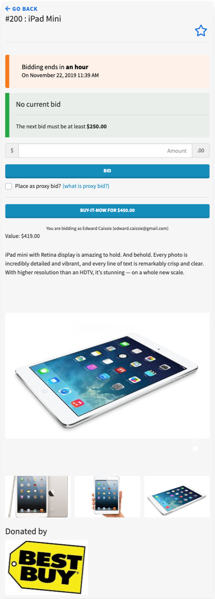
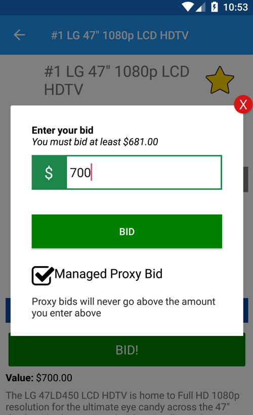

# Online Auctions

Auctria provides the tools to allow you to hold a fully **online auction** or to have an online pre-bidding period for a traditional **silent auction** event.  For more details on the difference between **Silent** and **Online auctions** see <IndexLink slug="AuctionConcepts" />

An online auction can be an event that takes place over a few days or a week, and it can include electronic bidding at an event.

## Online Bidding With Auctria

Auctria supports a number of ways for bidders to participate in online bidding.

The auction web site for each event is mobile friendly, and accessible via the web browser on a phone.  Bidders can register online using their email address or Facebook account and can then place bids for online items.

The mobile app (new in Fall 2018) allows the bidder to install it on their phone and bid for online items as well as receive notifications.  See <IndexLink slug="MobileBidding" /> for more details.

In addition to online bidding via a bidder's own computer or mobile phone you can also set up bidding via **Text messages** or **Kiosk Mode**

## Text Messaging

The text messaging features allows bidders to participate in an online auction from their phone via text messages.  This means that it works from any phone that can send and receive text messages: there is no need to worry about data connections or wifi, or even have a smartphone.

Texting also provides outbid notifications by text.

The downside to texting for an event is that there is no means to browse the catalog just by text.  A bidder can request details on a specific item, but not see a list since that is just too much information to convey by text.

Text messaging works best when there are items set up for bidders to browse which have item#'s clearly marked so they can quickly request the current bid details by text.

See <IndexLink slug="Communication"/> for more details

## Kiosk Mode

Kiosk mode is a special mode that you can use on hardware you set up at the event to enable online bidding via those devices.  This means that bidders at an event can participate in online bidding even when they don't have their own device. There is no need for bidders to register online when using kiosk mode, they don't use their email address or set up a password.  Instead a bidding form is presented that just asks for a bidder# and amount for an item, much like a paper silent bid sheet.

See <IndexLink slug="KioskModeBidding" /> for more details on this mode.

# Bidders

There are a number of ways that bidders can participate in an online auction: from bidding via their computer at home, or their phone from anywhere, or via text message or on tablet or laptop you set up at an event in kiosk mode.

<ChildPages/>
