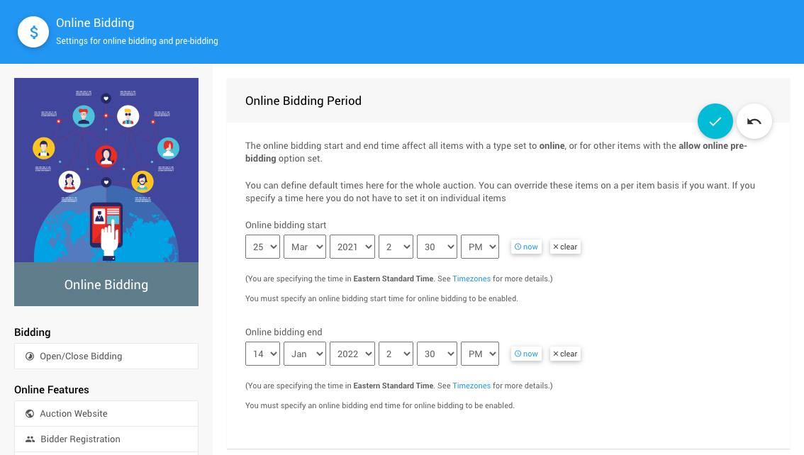
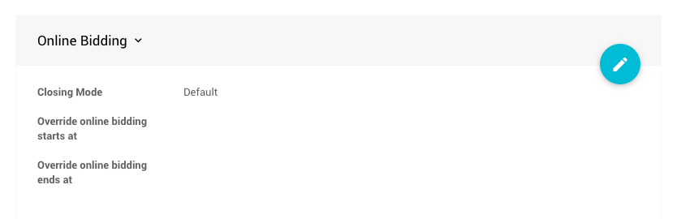
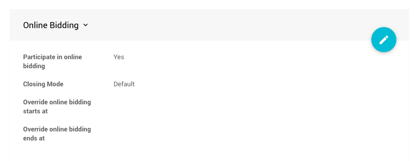
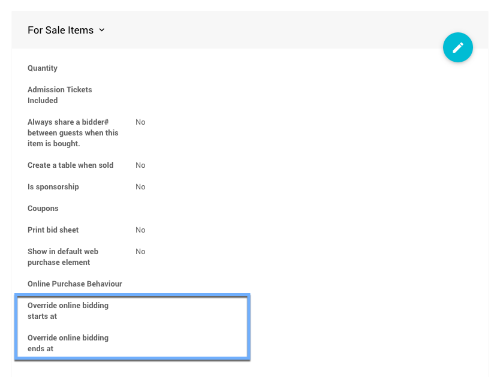
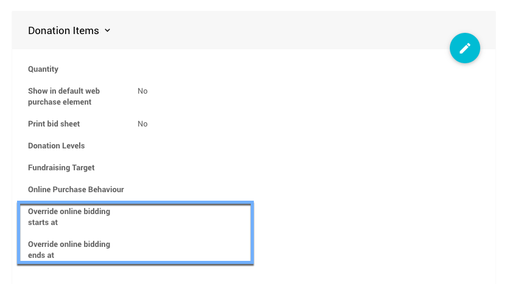

# Online Bidding Times <Updated/>

When setting up an Online Auction you will generally also be setting up the **Online Bidding Period** or default online start and end times for bidding. This primarily affects the **Biddable Items** in your event.

::: glossary BIDDABLE ITEMS
These are **Item Types** participants can place bids for.

| Item Type | Common Usage |
| --------- | ------------ |
| **Online&nbsp;Items** | Primarily "online", or electronically, taken bids where bidding automatically closes at the end of the **Online Bidding Time** set for these items. |
| **Silent Items** | "Final bids" are generally taken from "paper" bid sheets but can be bid online "pre-event" although these items will not automatically close by default. |
| **Live Items** | In most cases, these are items auctioned at an "in-person" event with bidding led by an auctioneer, emcee, or similar "host" at the actual event venue where their "Final Bids" will be recorded. |
:::

<Link/> <IndexLink slug="Glossary_BiddableItems"/>

## Setting Default Online Bidding Times

You can set the default online bidding times in the <IndexLink slug="OnlineBidding"/> dashboard.

Once you have set a start **and** end time for your event they will be used as the default for all items **and** enable *Online Bidding* for the event as well.

::: info
- You can override the default **Online Bidding Period** times on a per item basis.
- If you specify times here, you do not have to set it on individual items.
- *Start* **and** *End* times should be set in all cases when online bidding is wanted.
:::

## Setting Override Online Bidding Times

For **Biddable Items**, you can override the start time, the end time, or both times on a per item basis. This is handled in the **Item Details** <IndexLink slug="ItemDetailsSummary"/> tab of the item by setting the override time in the **Online Bidding** section.

::: middle
*As viewed in an __Online__ item type, this is similar for __Silent__ and __Live__ item types.*
:::

### Biddable Item Type Specifics

- **Online Items** will use the "Override" times to automatically open or close the item for bidding. These times are generally only set at the item level if the time will be different than the default auction online start and end times for the specific item. When the end time is met, item won notifications will be sent as needed to the winning bidders.

- **Silent Items** will use the "Override" times for online "pre-bidding". In general, **Silent Items** will have their online bidding time stop before any "in-person" event. If the **Silent Items** will be available for bidding **_after_** the "online event" ends they will need to have their override end times set appropriately, the default online end times will otherwise end bidding for the items as is.
<Link/> <IndexLink slug="OnlineBiddingType"/>

- **Live Items** will use the "Override" times in a similar fashion as **Silent Items** although, in most cases, **Live Items** will have their bidding closed manually during the live "in-person" event and as such are often managed using the **Live Auction Controller**.
<Link/> <IndexLink slug="MonitorAuction" anchor="live-auction">Monitor Auction | Live Auction</IndexLink>

::: yellow
**IMPORTANT**
To enable "pre-bidding" for **Silent** or **Live** item types you will also need to ensure the **Participate in online bidding** option is enabled (*this option is enabled by default*).

::: middle
*As viewed in a __Silent__ item type, this is the same for a __Live__ item type.*
:::

<Link/> <IndexLink slug="SetupOnlinePreBidding"/>

### For Sale Item Type Bidding Times

By default, <IndexLink slug="ForSaleItems"/> do not have "start" or "end" times. Once they are created and made visible on the auction website your participants are free to purchase them at any time.

<Link/> <IndexLink slug="ConfigureItemsDisplayed"/>

In essence, **For Sale** items ignore the default **Online Bidding Period** times although this does not mean you cannot set "Override" times for these items. This is handled in the **Item Details** <IndexLink slug="ItemDetailsSummary"/> tab of the item by setting the override time in the **For Sale Items** section.

::: info
Setting an "Override" time will affect the visibility of the **For Sale** item regardless of the default **Online Bidding Period** times.
:::

::: recread
- <IndexLink slug="EarlyBirdTickets"/> provides a great "For Sale" type items example.
:::

### Donation Item Type Bidding Times

By default, <IndexLink slug="DonationItems"/> do not have "start" or "end" times. Once they are created and made visible on the auction website your participants are free to make their donation pledges at any time.

<Link/> <IndexLink slug="ConfigureItemsDisplayed"/>

In the same sense as **For Sale** items, **Donation** items ignore the default **Online Bidding Period** and can set "Override" times in the same manner. This is handled in the **Item Details** <IndexLink slug="ItemDetailsSummary"/> tab by setting the override time in the **Donation Items** section.

::: info
Setting an "Override" time will affect the visibility of the **Donation** item regardless of the default **Online Bidding Period** times.
:::

::: ideas
**Do Not Set** "Override" end times for **Donation** items. This will allow visitors to the auction website to continue to make donations as long as possible. By default, the website will eventually "close" by way of the <IndexLink slug="ArchiveAuction"/> functionality so there is no need to actually set an online end time.
:::

<ChildPages/>
<Revised date="2021-11-11"/>
