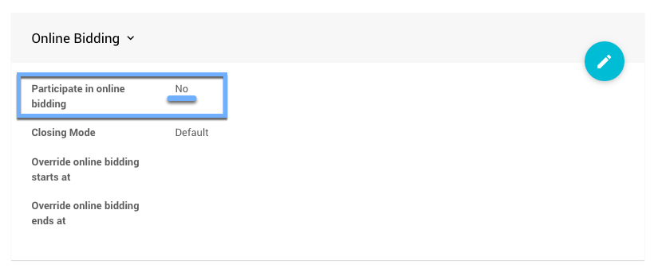

# Online Pre-Bidding vs Online Bidding <Updated/>

Auctria supports two similar but distinct ways of handling online bidding:

1. Full **Online** (only) bidding auctions, using the **Online** type for your items; or,
2. **Silent** online pre-bidding prior to the (in-person event) auction using the **Silent** or **Live** types for your items.

::: glossary BIDDABLE ITEMS
These are **Item Types** participants can place bids for.

| Item Type | Common Usage |
| --------- | ------------ |
| **Online&nbsp;Items** | Primarily "online", or electronically, taken bids where bidding automatically closes at the end of the **Online Bidding Time** set for these items. |
| **Silent Items** | "Final bids" are generally taken from "paper" bid sheets but can be bid online "pre-event" although these items will not automatically close by default. |
| **Live Items** | In most cases, these are items auctioned at an "in-person" event with bidding led by an auctioneer, emcee, or similar "host" at the actual event venue where their "Final Bids" will be recorded. |
:::

With "full online" auctions, all of the bidding for an item happens through the Auctria platform, either via the auction website <IndexLink slug="BiddingExperience_OnlineBidding"/>, <IndexLink slug="TextBidding"/>, <IndexLink slug="MobileBidding"/> or <IndexLink slug="BiddingExperience_KioskMode"/>. There are **no** paper <IndexLink slug="BidSheets"/> involved.

With "online pre-bidding", the initial bidding happens through the Auctria platform (as noted above) and then, **before the actual in-person event starts**, online bidding is closed for the items and the highest online bid becomes the "starting bid" at the auction itself.

<Linked slug="OnlineBiddingTimes"/>

::: red
**WARNING**
Although you can use both the "full online" and "online pre-bidding" approaches in your auction you cannot apply both of these approaches to the same item.
:::

<HRDiv/>

## Which Should I Use?

The process for deciding whether you should use online pre-bidding or full online bidding is straight forward. Ask yourself:

**_Do I want the final part of the bidding process to happen during the in-person event?_**

If **_yes_**, set up the the item(s) as **Silent** type items to use paper **Bid Sheets** and enable **Participate in online bidding** on the specific item records. If you are having an Auctioneer lead the final bidding, set these items up using the **Live** type and enable their **Participate in online bidding** property.

If **_no_**, and you want the bidding for the item(s) to be totally managed by the system (which may include **Kiosk Mode Bidding**), set your items up with the **Online** type.

<Linked slug="SilentItems"/>
<Linked slug="LiveItems"/>
<Linked slug="OnlineItems"/> 
<Linked slug="BidSheets"/>
<Linked slug="BiddingExperience_KioskMode"/>

::: info A Note About "Live" In-Person Auctions

Online pre-bidding is only primarily used for **Silent** auction items. We *do not recommend* it for "Live" auctions and the **Participate in online bidding** option is **_disabled_** by default for all new **Live** type items for this reason.

<Linked slug="Summary_LiveItems" anchor="online-bidding">Live Item Details - Online Bidding</Linked>

Usually, with "Live" auctions, the Auctioneer wants to control the bidding flow and given items are often opened with a high starting bid, the online pre-bidding process could interfere with this. To ensure "online pre-bidding" is not used for an itme do not check its **Participate in online bidding** option.
:::

<HRDiv/>

## Differences Between Pre-Bidding And Online Bidding

The following table highlights some of the differences between the pre-bidding and online bidding.

| Question | Pre-bidding | Online Bidding |
| -------- | ----------- | -------------- |
| What items are included? | Any silent or live item with the **Participate in online bidding** option checked. NOTE: this is the default for all items when they are created. | Items with type **Online**. |
| Is there a bid sheet? | Yes. A bid sheet can be generated and will show the high bid from the "online pre-bidding" as the starting row on the first page. | No. |
| How is the item won? | Bidding happens online prior to the event and then a paper bid sheet is generated. Bidding then continues and finishes in the traditional "Silent" auction way. | All the bidding happens online. |
| Is <IndexLink slug="ProxyBidding"/> allowed? | No, **Proxy bidding** is not allowed because there is no way to move the "proxy bid" from online to the paper bid sheet (see below). | Yes. |
| When is online bidding allowed? | During the time between the online bidding start and end times. | During the time between the online bidding start and end times |
| Is the winner notified automatically? | No. When the online bidding period ends nothing happens other than the system stops accepting online bids for the item. A <IndexLink slug="RecordBid" anchor="final-bids">final bid</IndexLink> must be recorded for the item. | Yes, when the online bidding period ends (see <IndexLink slug="Notifications"/> for more details). |
| Is a Buy-It-Now price supported? | Yes, although the bid sheet is still generated for the item. | Yes. |
| Are items with multiple winners supported? | Yes although not recommended for items that are not "fixed price" (see <IndexLink slug="SellingItems"/> for more information) since it is hard to generate an accurate bid sheet. | Yes. |
| Do I have to manually close the bidding? | It depends -- if a bid is placed during the silent auction, then this would be recorded as a winning bid when you enter the silent auction results. The default when doing this is to close the item to further bids. If no more bids are placed during the silent auction, then the highest online bid is the winner, but the bidding must be closed to indicate this. See **Opening and Closing Bidding** for more details. | No. |
| Is <IndexLink slug="BiddingExperience_KioskMode"/> supported? | Yes – during the online bidding period only. | Yes. |
| Is <IndexLink slug="TextBidding"/> supported? | Yes – during the online bidding period only. | Yes. |

### Proxy Bidding And Online Pre-Bidding

The primary issue with **Proxy Bidding And Online Pre-Bidding** is if we move the bid as shown then the winning paper bid could be lower than the proxy bid amount. However, if we move the full proxy bid amount onto the bid sheet then it is no longer a "proxy bid" since the full amount was used even though nobody bid against the original bidder.

<HRDiv/>

## Switching From Online Bidding To Pre-Bidding

If you set up an event with online items when you intended for the bidding to be finished at the event on a bid sheet, you can change the items from <IndexLink slug="OnlineItems"/> to <IndexLink slug="SilentItems"/> to convert it to "pre-bidding". This can be done en-masse from the item list page, see <IndexLink slug="MassChanges"/> for more details.

::: yellow
**IMPORTANT**
The one area this may cause a problem with is items with proxy bids.
If proxy bidding was enabled for the event (the default online bidding option) and a bidder placed a proxy bid then you won't know the high bid on the item.
:::

If you attempt to record a silent bid at the end of the event and it is below the proxy bid amount, the silent bid you tried to enter will be discarded and the proxy bid will be bumped up to the level of the silent bid.

In order to remove the proxy bid you would need to delete the bid on the item's activity tab so you can then record the winning silent bid (see <IndexLink slug="RemoveProxyBid"/> for more details). However, this may cause some confusion for the online bidder that placed the proxy bid since they had previously bid at least that amount.

<ChildPages/>
<Revised date="June 2022"/>
