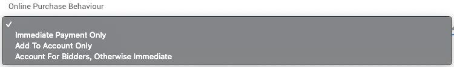

# Online Purchase Behavior

The **Online Purchase Behavior** option in Auctria provides for the handling of how <IndexLink slug="ForSaleItems"/> and <IndexLink slug="DonationItems"/> are added to the "shopping cart", or if they go "on account" for the <IndexLink slug="Bidders"/>.

## Online Purchase Behavior Options

For <IndexLink slug="ForSaleItemsDetailed" anchor="for-sale-items"/> the default option is **_Immediate Payment Only_** method; and, for <IndexLink slug="DonationItemsDetailed" anchor="donation-items"/> the default option is **_Account For Bidders, Otherwise Immediate_** option.

### Immediate Payment Only

The **Immediate Payment Only** method takes the purchaser directly through the checkout process to finish *buying* the specific item.

::: yellow
**IMPORTANT**
The purchaser **must** go through the purchase process with this option although the item can be removed from the "cart" before finishing the sales transaction.
:::

This process will not include any outstanding balances the bidder may have as the transaction will be solely focused on the one at hand. If the bidder/purchaser is not already registered for the event, they will be taken through <IndexLink slug="BidderRegistration"/> during the checkout process.

Once the purchaser completes the transaction, a **Bidder registration/purchase receipt** <IndexLink slug="SystemEmails">System Email</IndexLink> will be sent with a record of *this purchase only*.

::: red
**WARNING**
If you are using <IndexLink slug="CouponCodes"/> with <IndexLink slug="ForSaleItems"/>, you **_must_** to use the **Immediate Payment Only** method for the **Coupon Code** to be **_valid_** when making the purchase.
:::

The **Immediate Payment Only** option is generally used for such things as <IndexLink slug="Tickets"/> (when they are required) and for limited supply items where it is important to ensure the item is paid for up front to ensure it is properly accounted for.

### Add To Account Only

The **Add To Account Only** method will add the item to the bidder/purchaser's account for them to pay at a later time.

::: yellow
**IMPORTANT**
The **Add To Account Only** method does **not** go through <IndexLink slug="ShoppingCart"/> -- the item goes directly on the bidder's account.
**_NOTE_**: the item **_cannot_** be removed from the cart by the bidder.
:::

The item will appear on <IndexLink slug="BidderStatements"/> and be included in the total balance owing for the bidder.

Once an item has been added to the bidder account, they can visit their <IndexLink slug="MyAccount"/> page to pay their outstanding balance.

::: yellow
**IMPORTANT**
Bidder's will only be able to pay their full balance from the **My Account** page. A <IndexLink slug="Checkout_RecordPayment" anchor="partial-payment"/> will require an organizer and using the <IndexLink slug="Checkout_RecordPayment"/> functions.
:::

The **Add To Account Only** option is often used with **For Sale** items that have an unlimited quantity available for bidders to buy and donation related items where it makes more sense to allow the bidder to pledge their donation without having to interrupt their interaction with an ongoing event.

### Account For Bidders, Otherwise Immediate

The **Account For Bidders, Otherwise Immediate** method dynamically processes the *purchase* based on if the bidder is logged in or not with logged in bidders seeing the **Add To Account Only** method. If the bidder is not logged-in, they will see **Immediate Payment Only** method for their transaction.

::: yellow
**IMPORTANT**
The Auctria platform cannot know a bidder is registered for an event without them actually being logged into the event. This bidder's **logged-in status** is what defines the method being used for this option.
:::

The **Account For Bidders, Otherwise Immediate** option takes into account the ideas used with the *Immediate Payment Only* and *Add To Account Only* options allowing both upfront payment as needed while still minimizing the possible interruptions to the bidder's interaction with the event by only requiring they immediately pay if not registered.

<ChildPages/>
<Revised text="Reviewed" date="2021-11-12"/>
