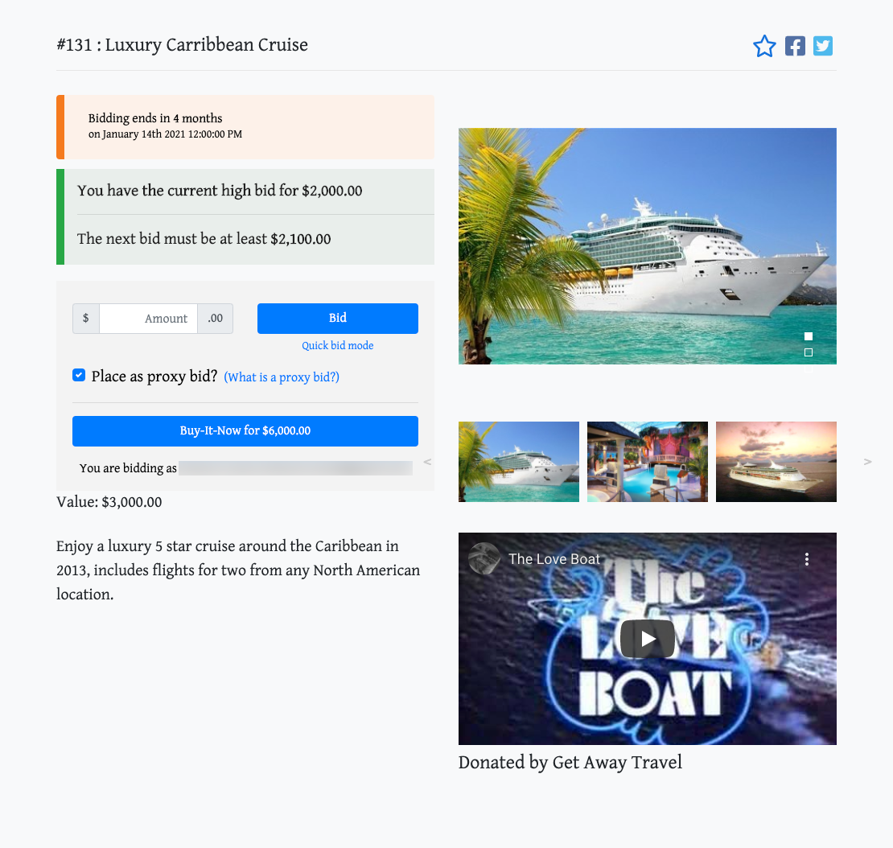
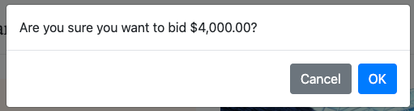
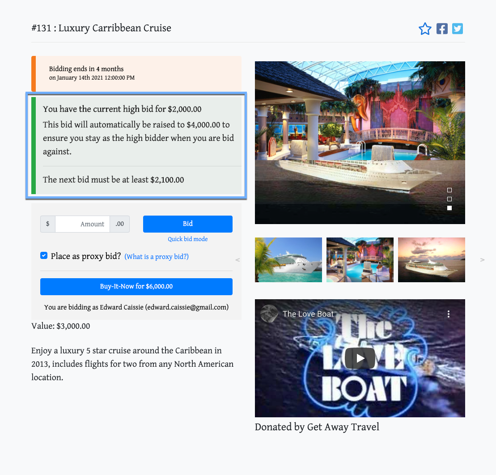
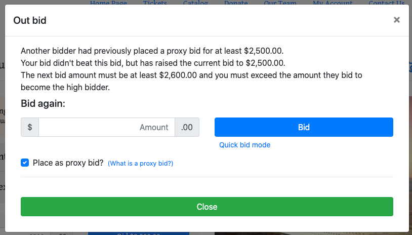
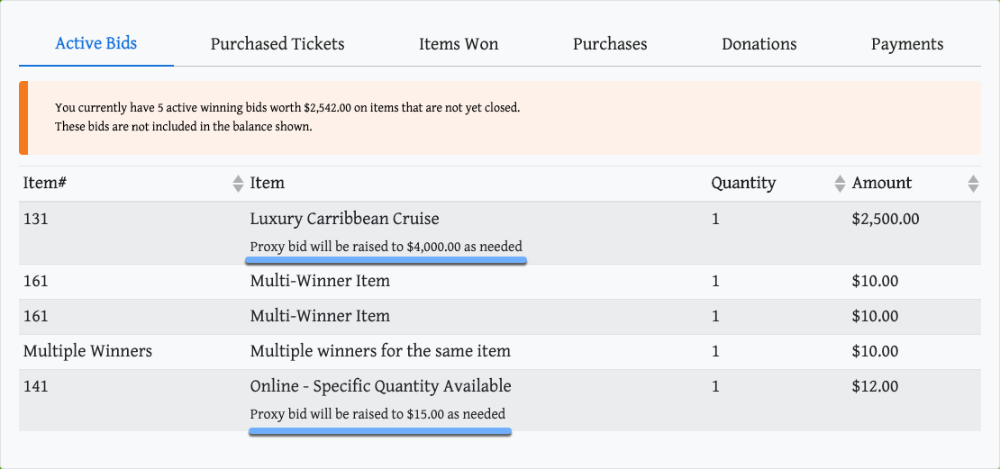
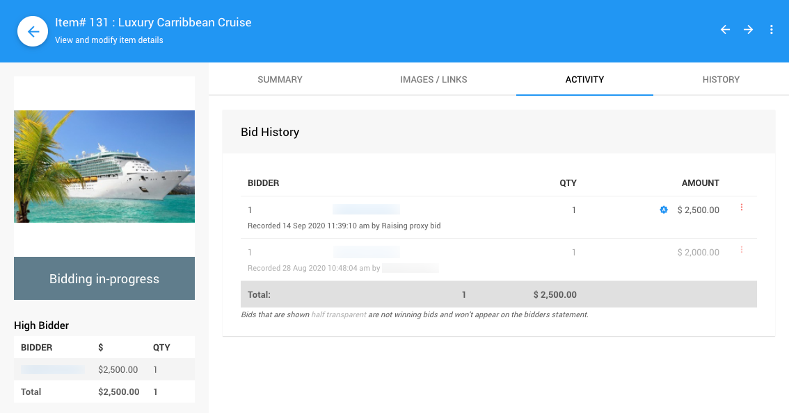
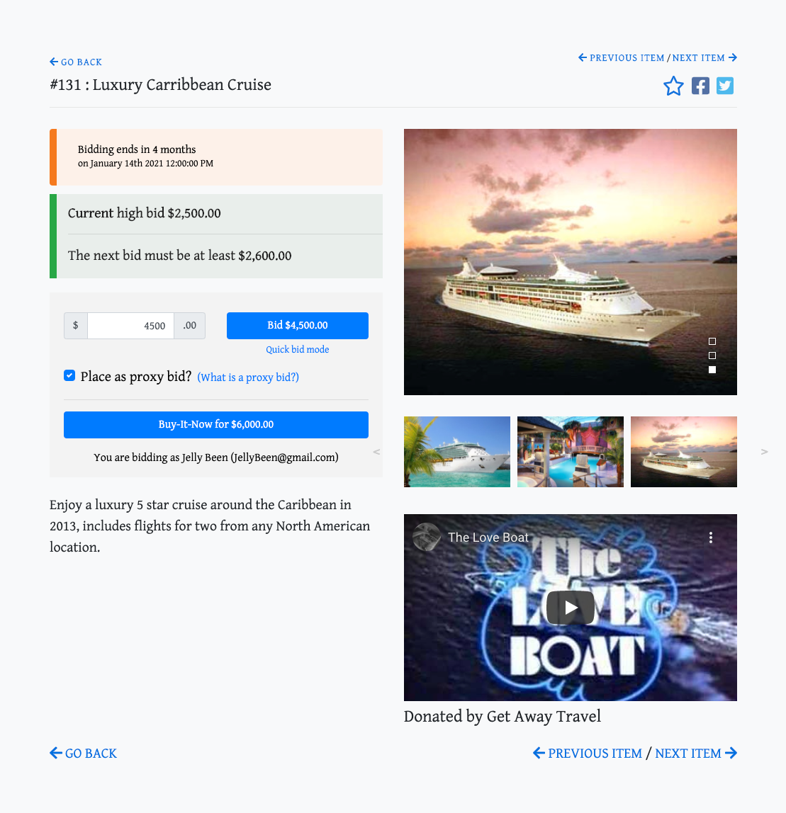
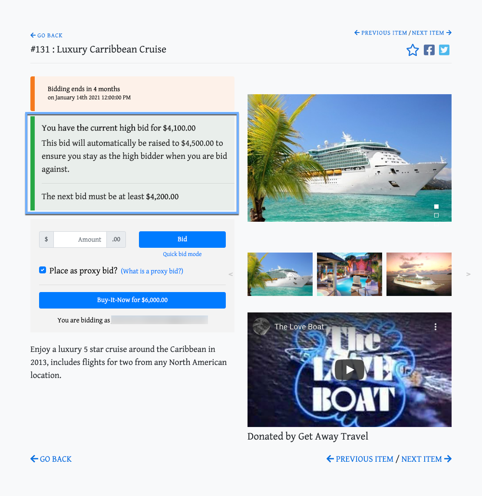

# Proxy Bidding Example

Many people are familiar with proxy bidding from websites such as eBay which use it in their auctions. See <IndexLink slug="ProxyBidding"/> for setup and <IndexLink slug="ProxyBiddingRules"/> to learn more about its rules and limitations.

## Placing Proxy Bids

When a bidder is placing a bid for an online item, either directly on the website or in **Kiosk Mode**, they have the option to make the bid an **Automatic proxy bid**.

### Example 1

In this example, the item has a current bid of $2000.

In a traditional <IndexLink slug="SilentItems">silent</IndexLink> auction, they would start their bidding at $2,000 and periodically check to see if they have been outbid by someone else. They could still do that in this case, but since they know they are willing to go up to $4,000, they choose to place a **Proxy bid** for the $4,000 amount instead.

They enter the full amount on the page and click the blue **Bid $4,000.00** button (the button label dynamically updates to match the bid amount).

A confirmation pop-up window will appear showing a bid of $4000 is being made.

Once confirmed, the Item Details will update to show the bid for $2000 remains as the high bid (since it was placed by the bidder); and, the system will automatically raise the bidder's bid up to $4000, if needed.

::: tip
The information about the **Proxy Bid** is only displayed because they are the high bidder. Any other bidder viewing the page would not see this information.
:::

---

Another bidder sees the page and decides to place a bid for $2500 on the item.

This bid will not succeed as it was below the $4,000 **Proxy bid** in place for the item (even though the second bidder could not see that). The system will raise the first bidder's bid up to $2,500 and the new minimum bid for the item will become $2,600. This will also trigger the display of an **Out Bid** popup advising the bidder they were not successful.

The pop-up window advises there was a **Proxy Bid** placed as the explanation for the **Out Bid** notification. The second bidder will now have the option to immediately place another bid for the cruise; or, they can *Close* the pop-up window.

When the first bidder looks at their **My Account** page they will see the current high bid for the item.

Also to note, existing **Proxy Bids** will be shown for all items, if they have been placed.

::: warning
The **Proxy bid** amount is only seen by the bidder. It *cannot* be seen from the dashboard.
:::

---

After thinking about it, and not wanting to lose out, the second bidder decides they are willing to go up to $4500 for the cruise and place that as their **Proxy Bid**.

This bid succeeds because it is above the $4000 *Proxy Bid* placed by the first bidder. The second bidder's bid is now at $4100 which was the minimum needed to beat the $4000 *Proxy Bid*.

### Example 2: Proxy Bidding and Bid Increments

"Bidder# 31" places a bid for $571.52 on an item when its current bid was $450. At that point the bid was more than the bid increment ($50.00), so was allowed.

The bid was then raised to $550 by "Bidder# 53" bidding this amount (and *Bidder# 53* was advised a proxy bid exceeded their current bid), and then *Bidder# 53* bid $600 ... this bid caused the proxy bid (by *Bidder# 31*) to max out at $571.25, but at this level the $600 bid was not enough to win since it needs to be $50 higher than this.

A bid of at least $621.25 is needed to be the high bidder which is $50 higher than the previous high bid to meet the bid increment requirements.

To override this there are a couple of options:

1. if *Bidder# 53* wants, you could still record a bid for $600 to them via the bidding/sales page and override the warning about the bid increment; or,
2. you could reduce the winning bid back to $550 (see <IndexLink slug="EditBid"/>) so a $600 bid would be accepted in the future.

There is also a setting under Website -> Online Bidding --> <IndexLink slug="OnlineBidding" anchor="online-bidding-behavior"/> for **Requires bids to be an exact multiple ...** If enabled, bidders would not be able to place 'odd' bid amounts but will be required to strictly stick to the bid increments and not just an amount greater than the current bid plus a multiple of the increment value.
