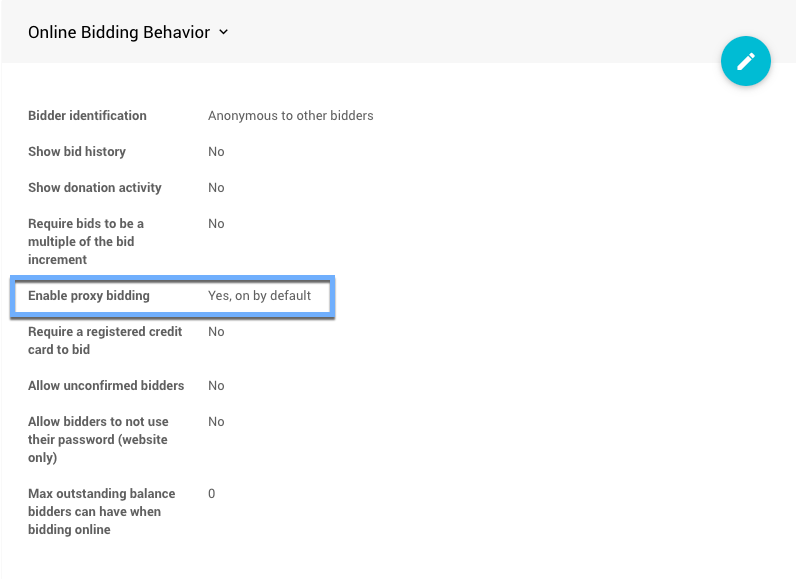
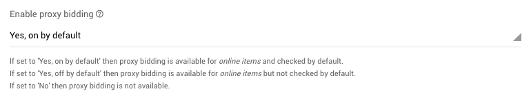

# Proxy Bidding

::: info
**Proxy Bidding** is a feature available for **Online Items** **ONLY** and allows the system to manage a bidder's *maximum bid* to ensure that they remain as the high bidder for as long as possible.
:::

**Proxy Bidding** provides a bidding mechanism to keep the actual bid as low as possible yet provide a path to remain the winning bidder. With proxy bidding, if you are the highest bidder at the auction's close you become the winner. As the winner, with proxy bidding, you will only pay the lowest possible winning bid which may not actually be the *maximum bid* you bid placed for the item.

::: yellow
**IMPORTANT**
**Proxy Bidding** does not function with items using the <IndexLink slug="MultipleWinners"/> option. The *Maximum Bid* placed on a **Multiple Winners** item will be considered the **actual bid**!
:::

Many people are familiar with a form of "proxy bidding" from websites such as eBay which use it in their auctions. Please see our <IndexLink slug="ProxyBiddingRules"/> to learn more about how it is handled on the Auctria platform.

## Enable Proxy Bidding

To **Enable Proxy Bidding**, go to **Website** > **Online Bidding** from the main <IndexLink slug="AuctionDashboard"/>. Then, in the <IndexLink slug="OnlineBidding" anchor="online-bidding-behavior"/> section, you can set your preference.

Clicking on the option, when in *edit mode*, will provide the **Proxy Bidding** options you can make available to your bidders.

- **Yes, on by default** then proxy bidding is available for <IndexLink slug="OnlineItems"/> and checked by default.
- **Yes, off by default** then proxy bidding is available for <IndexLink slug="OnlineItems"/> but not checked by default.
- **No** then proxy bidding is not available

::: yellow
**IMPORTANT**
If **Proxy Bidding** is turned off **after** a "Maximum bid" ("proxy" bid) has been made it will **only affect future bids** that are placed. The original **Proxy Bids** will remain active unless manually removed. See <IndexLink slug="RemoveProxyBid"/> for more details.
:::

<ChildPages/>
<Revised text="Reviewed" date="2022-03-09""/>
