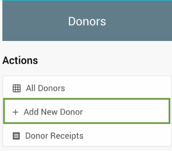
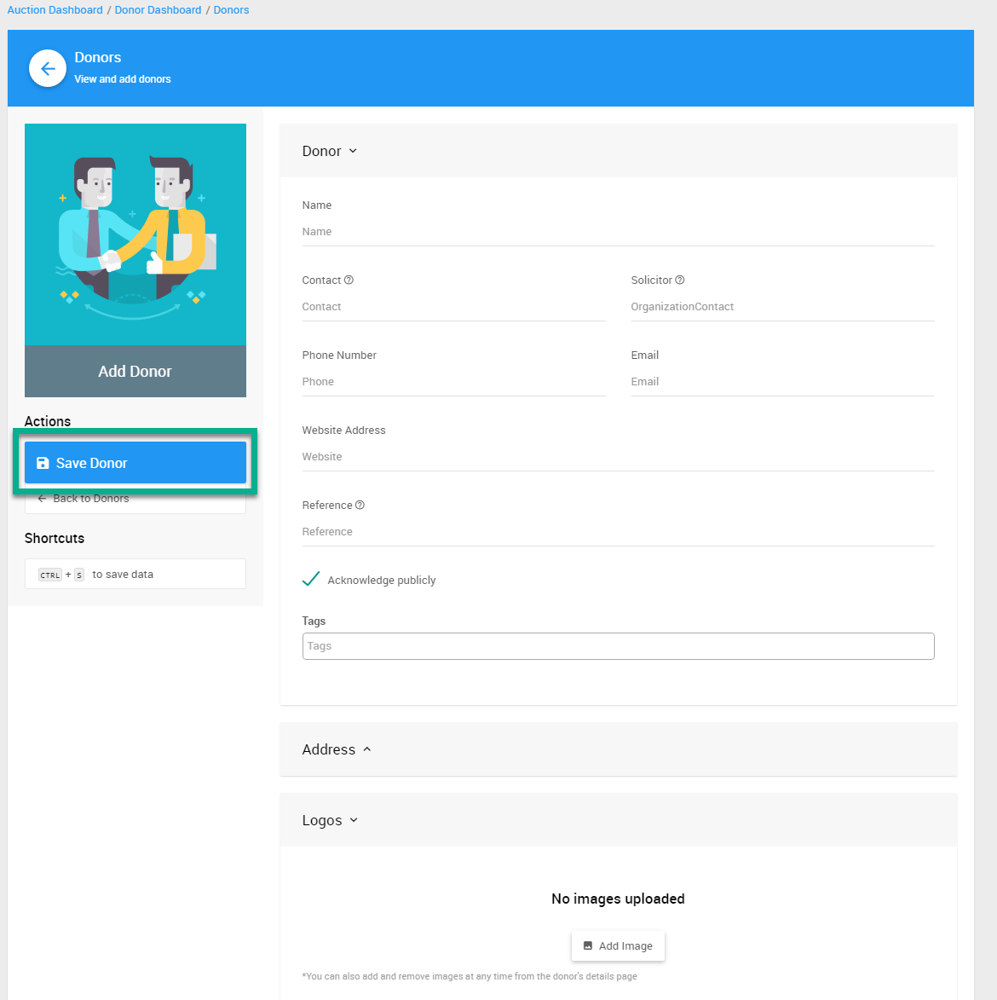
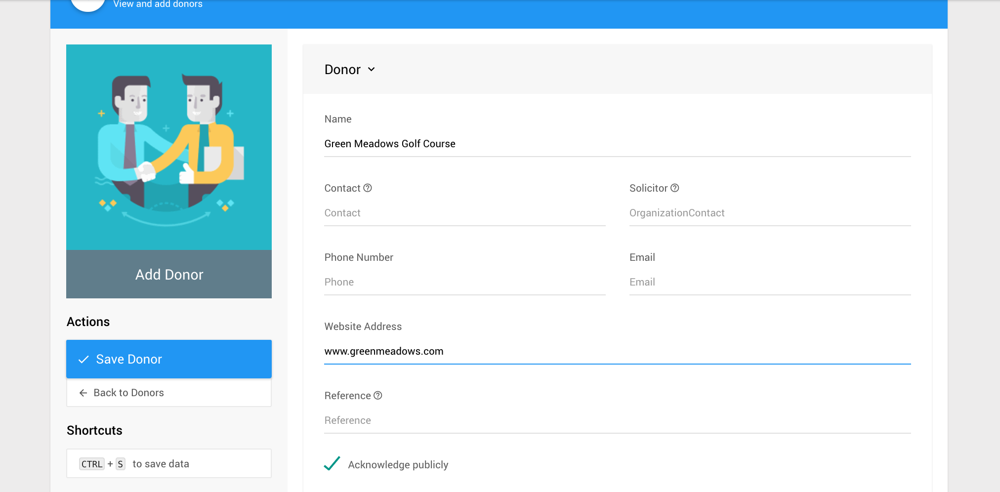
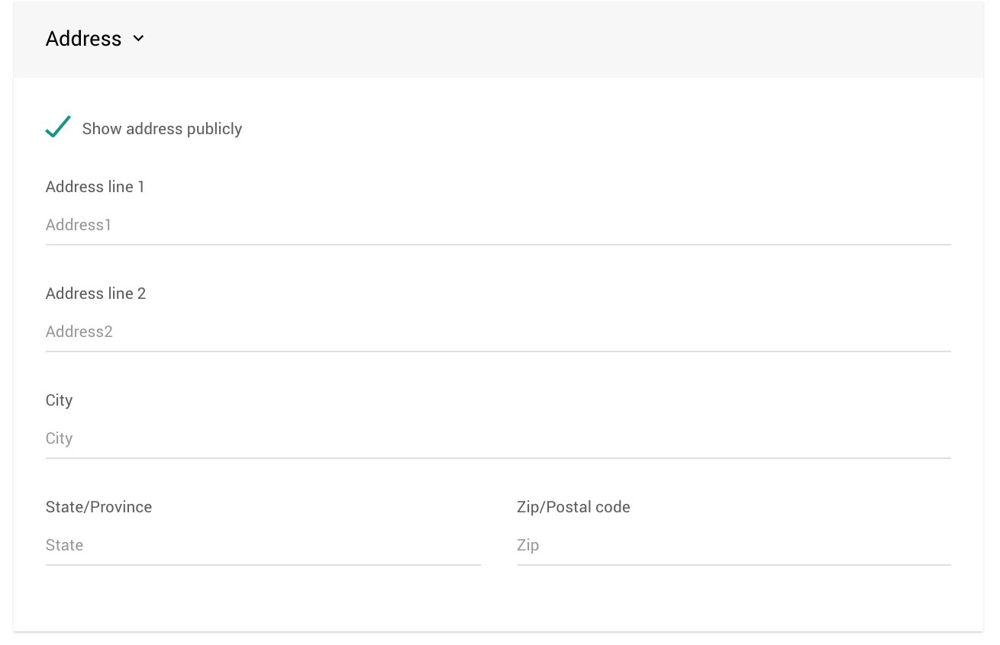
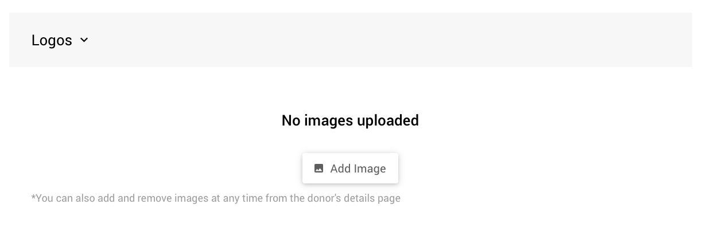
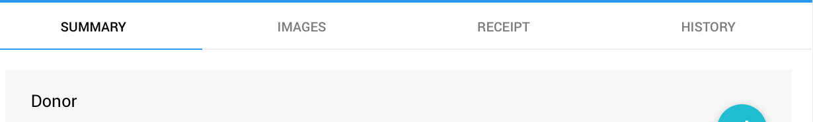

# Introduction To Donors

**Donors** are the people, or companies, that support your event by donating items or through sponsorships. **Donors** will be acknowledged on the auction website and on printed forms for the items they donated and can also be acknowledged as **Sponsors** on the website as well.

To access the **Donors** dashboard, click **Donors** from the main <IndexLink slug="AuctionDashboard"/> menu.

::: info
All **Donors** are available to every auction you host as the are saved at the Organization level. There is no need to copy donors from one auction to another. See <IndexLink slug="DonorsActiveAndInactive"/> for more details.
:::

<HRDiv/>

## Adding A Donor

To enter the information for an individual Donor, click **Donors** and then **Add New Donor** under the *Actions* sidebar menu.

Enter the information for the new Donor. You can enter as much, or as little, information as you want... the **Name** field is the only required detail that needs to be added.

Click **Save Donor** to save the changes.

For more information, see the <IndexLink slug="AddDonors"/> page.

### Optional Donor Fields

There are a number of fields you can provide for donors:

- **Website**:
  You can link **a website** to the Donor’s name and whenever the donor is shown online it will be linked to that address.
  

- **Acknowledge publicly**
  Donors will only be shown on the website or printed forms if the **Acknowledge publicly** checkbox is checked.  This should be checked by default for new donors.

- **Donor Address**
  To show or hide the **Donor’s Address** information, click the Address heading to expand and enter the address of the donor. By default, the **Show address** publicly checkbox is selected. Currently the **show address** field only affects the printed gift certificates.
  

### Donor Logo

The **images** tab displays images that have been uploaded for the Donors, such as a company logo or brand logo. By adding an image of the Donor's logo, that image will be available to be included in the auction catalog and on some printed forms.

<HRDiv/>

## Active and Inactive Donors

A newly added donor will be considered "inactive" until a <IndexLink slug="DonorDonations">donation or sponsorship</IndexLink> is recorded for them in the current auction. This is this case even for **Donors** that were entered specifically into this auction. See <IndexLink slug="DonorsActiveAndInactive"/> for more information.

<HRDiv/>

::: recread
The following sections and pages about **Donors** may also be of assistance.

- <IndexLink slug="Donors"/>
- <IndexLink slug="WorkingWithDonors"/>
- <IndexLink slug="DonorReceipts"/>
- <IndexLink slug="DonorReports"/>
:::

<ChildPages/>
<Revised text="Reviewed" date="2022-03-31"/>
