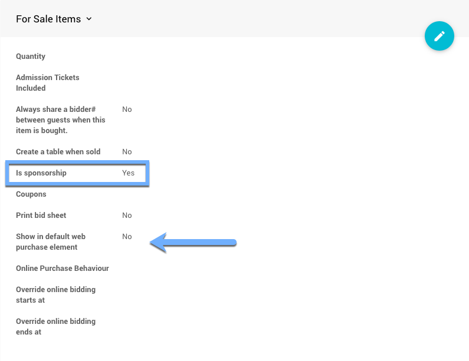

# How To Manually Record Sponsorships <Badge text="(new)"/>

There are basically three ways to **Manually Record Sponsorships** in Auctria.

You can **Sell Tickets** to the sponsor that are designated as **Sponsorship** items; you can **Sell For Sales Items** that has been designated as **Sponsorship** items; or, you can **Add A Donation** and set its type as a **Sponsorship**.

## Sell Sponsorship Tickets

When using <IndexLink slug="Tickets"/>, it is required to use the <IndexLink slug="SellTickets"/> function to record purchases of the **Sponsorship Ticket** item. This will generate the appropriate number of bidder records associated with the **Sponsorship**.

::: tip
**IMPORTANT**
Remember, **Sponsorship** *Tickets* require a value be set for the "Admission Tickets Included" **and** the "Is sponsorship" option be enabled.

:::

## Sell For Sales Items As Sponsorships

Although a **Ticket** item is a special configuration for <IndexLink slug="ForSaleItems"/>, when you sell non-ticket <IndexLink slug="ForSaleItems"/> as **Sponsorships**, and you are recording them manually, you would use the <IndexLink slug="RecordPurchase"/> function.

::: tip
**IMPORTANT**
Remember, <IndexLink slug="ForSaleItems">For Sale Item</IndexLink> **Sponsorships** require the "Is sponsorship" option be enabled.

:::

::: ideas
Mixing and matching items is quite common, especially on "Tickets" pages. If you are not selling **Sponsorship** tickets but do have other **Tickets** available for your guests you might consider enabling the *Show in default web purchase element* option so the **Sponsorships** are available where the general "admission" tickets are being purchased.
:::

## Add A Donor Donation As A Sponsorship

To manually record a **Donation** and have it recognized as a **Sponsorship** requires the use of the <IndexLink slug="AddDonorDonation"/> function **and** setting the *Donation* **Type** to "Sponsorship".

::: warning
Using the <IndexLink slug="RecordDonation"/> function requires both a <IndexLink slug="DonationItems">Donation Item</IndexLink> and a <IndexLink slug="Bidders">Bidder</IndexLink> be used, using the **Add A Donor Donation** function does not.
:::

*An example of a manually entered donation as sponsorship.*

::: tip
**IMPORTANT**
The description you use for the **Add A Donor Donation As A Sponsorship** approach will be used in the <IndexLink slug="RowContent_SponsorsCatalog"/> as its "title" and the pledge **Value** will be used for its placement in the display hierarchy.
:::

<ChildPages/>
