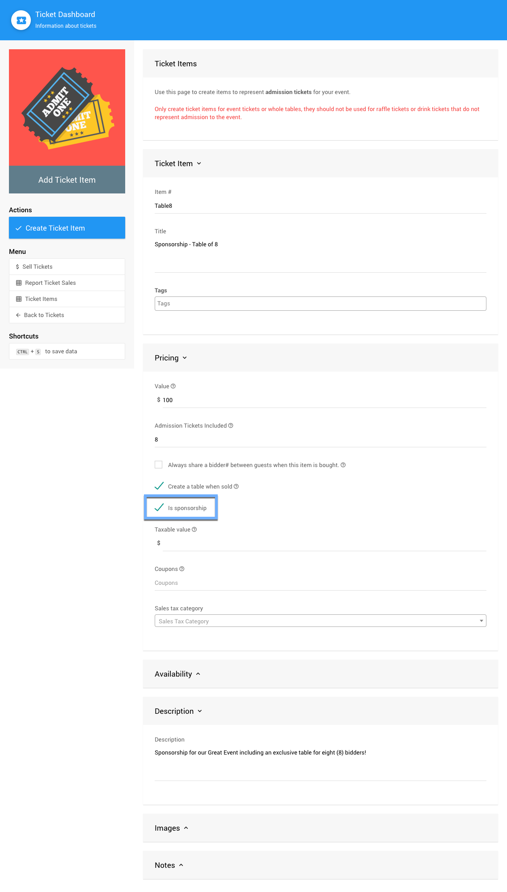
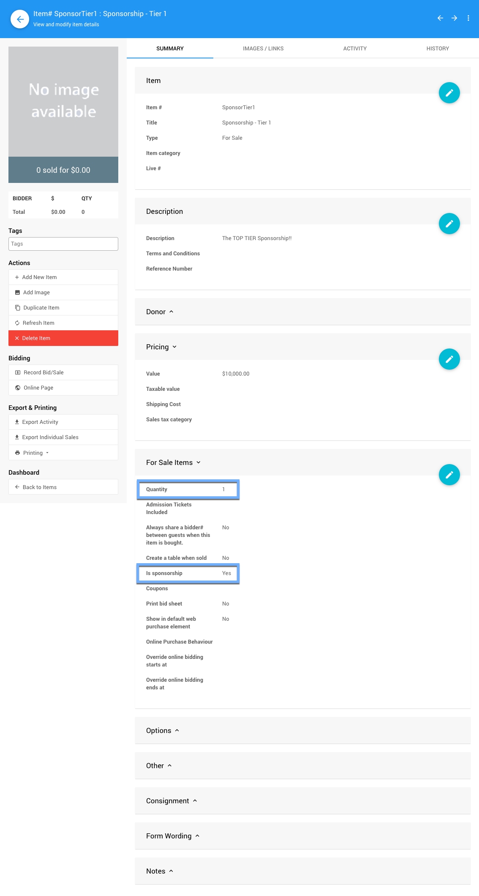
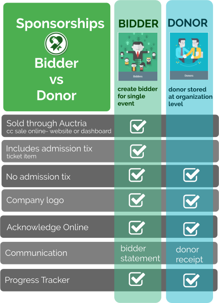

# Selling Sponsorships <Badge type="yellow" text="(updated)"/>

**Sponsorships** in Auctria are best handled as an item bidders can purchase. In many cases, **Sponsorships** are also configured as <IndexLink slug="Tickets"/> since they will generally include a number of admissions to the event, especially with "in-person" event or events where the number of participants are limited.

## Sponsorships As Tickets

For a **Sponsorship** as a <IndexLink slug="Tickets"/> item, you would start with the <IndexLink slug="CreateTickets"/> process. Using the **Add New Ticket Item** process allows for the appropriate number of bidder records to be created when the **Sponsorship** is purchased by the "Sponsor" on the auction website or when an Organizer uses the <IndexLink slug="SellTickets"/> function.

::: middle
*An example Sponsorship ticket item.*
:::

::: yellow
**IMPORTANT**
When creating a **Sponsorship** item, enable the *Is sponsorship* property under the *Pricing* options. This allows the other **Sponsorship** functions and feature sets to work correctly such as the <IndexLink slug="RowContent_SponsorsCatalog"/> element and <IndexLink slug="RowContent_SponsorsRow"/> element.
:::

## Sponsorships As For Sale Items

**Sponsorships** are not required to be <IndexLink slug="Tickets"/>, you can create **Sponsorship** items that are simply a means for a bidder to pledge money to the event and receive recognition for their "donation". To create a **Sponsorship** using the <IndexLink slug="ForSaleItems"/> type you would start with the <IndexLink slug="AddNewItem"/> function.

::: info
See <IndexLink slug="SellingItems"/> for more information about creating an item to sell.
:::

::: middle
*An example of a "For Sale Item" Sponsorship with a limited quantity available.*
:::

::: green
**NOTE**
You can create a <IndexLink slug="Tickets"/> item by setting the appropriate value for the *Admission Tickets Included* property of the *For Sale Items* options (this is done via the *Pricing* options when using the <IndexLink slug="CreateTickets"/> function).
:::

## Limiting Sponsorships

In some cases you may want to limit the number of available **Sponsorships** for your event, this is accomplished by setting the (*Availability*) **Quantity** for the **Sponsorship** either while creating the item or afterward by modifying the *For Sale Items* **Quantity** property (as noted above).

::: yellow
**IMPRTANT**
Although **Limiting Sponsorships** may create an urgency for bidders, be careful when setting the *Quantity* value as having too few of a sponsorship may end up "leaving money on the table" if there are not enough to meet your bidders' demands.
:::

## Sponsorships: Bidder Versus Donor

::: middle
*An infographic showing the "Bidder" approach provides more "Donor" options.*
:::

---

See <IndexLink slug="Concepts_RecordingSponsorships"/> and <IndexLink slug="Concepts_DisplayingSponsors"/> for additional information.

<ChildPages/>
<Revised date="2021-05-27" time="10:03 AM"/>
