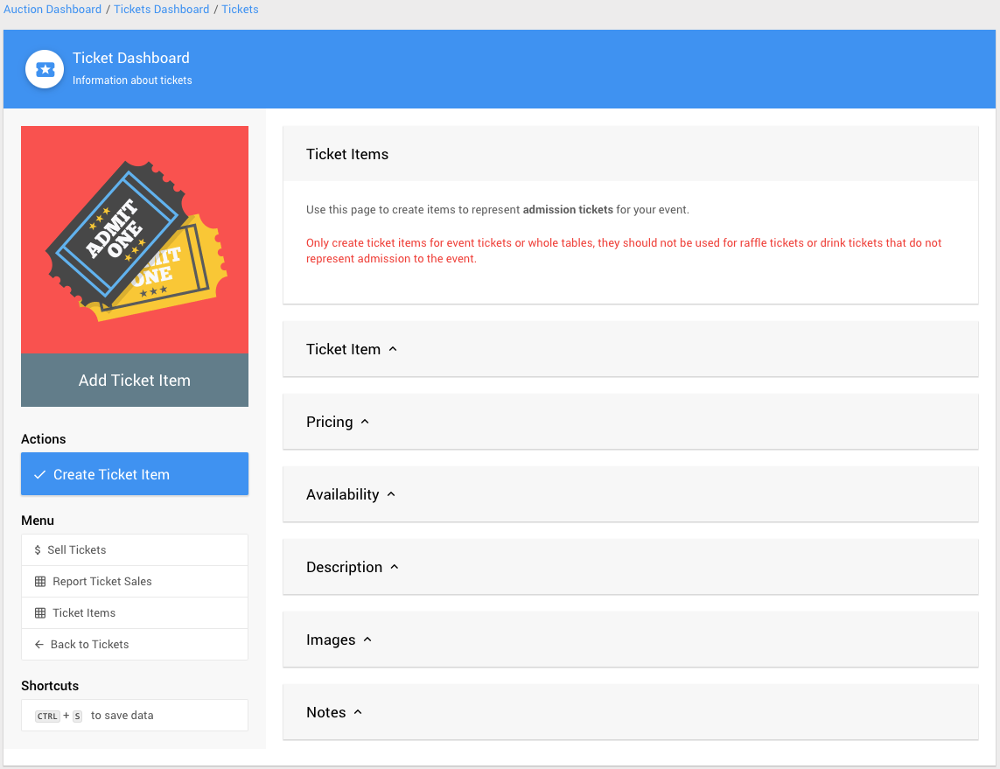
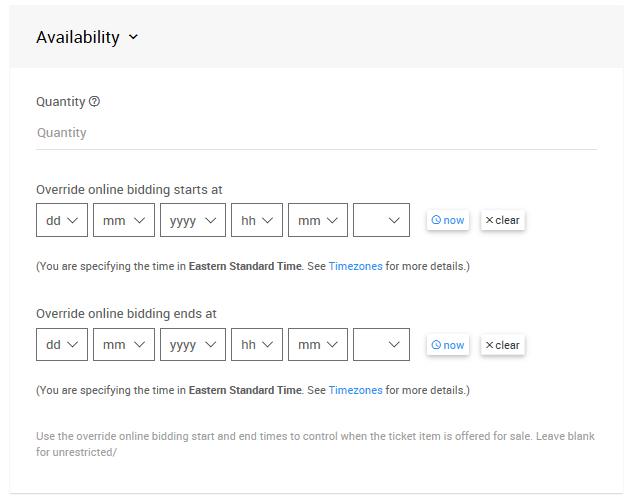

# Introduction To Tickets <NewLoc/>

You can use **Tickets** to track in-person event admissions as well as provide <IndexLink slug="E-Tickets"/> via email to guests that have been assigned a ticket. You can also use **Tickets** items to optionally restrict bidding in auction catalogs.

::: yellow
**IMPORTANT**
The **Tickets** item in Auctria is based on using a special item as an **admission ticket** to the "in-person" event and/or as a restriction on who can place bids on the items available.
:::

"Raffle tickets" are **not** considered <IndexLink slug="Tickets"/>. If you are selling "raffle tickets", these would be handled as standard <IndexLink slug="ForSaleItems"/>. Likewise, items representing, for example, concert or sports tickets in an auction would also be treated as standard "items", often times as **For Sale Items**, and should not be configured as **Tickets** item.

<HRDiv/>

## Adding Tickets

To add a ticket item, click on <IndexLink slug="Tickets"/> from the main Auction Dashboard menu, then click on <IndexLink slug="CreateTickets"/>.

Tickets are always created as <IndexLink slug="ForSaleItems"/> and have all the normal item fields such as a Title, Description, Value, etc. In addition, there are a number of fields that apply specifically to **Tickets** in the **Pricing** panel:

- **Admission Tickets Included**
This is the key field that identifies an item as a **Ticket** and should be set to a number. For a single ticket item, this would be set to `1`; for a table, it represents the number of guests included at the table. For example, a table of eight would have this value set to `8`.

- **Always share a bidder# between guests when this item is bought.**
This field is used if you want all the guests associated with a sale of this item to share a bidder# automatically. This is often used for "couples" ticket.

- **Create a table when sold**
If this ticket item represents a whole table, and you are using Auctria to track tables and seating, check this box and the "table" will automatically be created and the *guests seated* at it. See <IndexLink slug="TablesAndSeating"/> for more details.

<HRDiv/>

## Multiple Ticket Items

You can create as many ticket items as you need. A common requirement is to have an early bird tickets and regular tickets. You can use the "Override online bidding start", and end, times on the ticket item to control when it will be available for sale.

For example, with an "early bird" ticket item, you would set the **Override online bidding ends at** time to be when you want to stop selling these "early bird" tickets; and, then with the regular tickets you would set the **Override online bidding starts at** time to be when you want to start selling the "regular" tickets.

::: yellow
**IMPORTANT**
If you are **selling sponsorships**, and they **include admission tickets** as one of the *perks*, these types of sponsorships should be created as <IndexLink slug="Tickets"/> items. See our <IndexLink slug="SponsorConcepts"/> section for more information.
:::

<HRDiv/>

## Offering Discounts

You can define a **coupon code** that can be given to bidders to offer either a percentage off, or a fixed dollar discount.  See <IndexLink slug="CouponCodes" /> for more details.

<HRDiv/>

## Limiting Ticket Sales

You can set the **Quantity** field per **Tickets** item to limit the number that will be sold. If you need to limit the number of tickets sold across different ticket items (e.g.: you can sell 300 tickets in any combination of individuals or tables), you will need to use the "<IndexLink slug="Baskets"/>" feature set to track total sales. See <IndexLink slug="CombineForSaleItems"/> for more details.

<HRDiv/>

## Online Ticket Sales

Adding a new **Tickets** item will automatically configure it to be listed on the default **Tickets** page of any default website template that has a "Tickets" page. This also applies to adding the <IndexLink slug="Section_AddSection" anchor="Ticket Sales"/> **Pre-built** section to an auction website page.

<ChildPages/>
<Revised date="August 2021"/>
