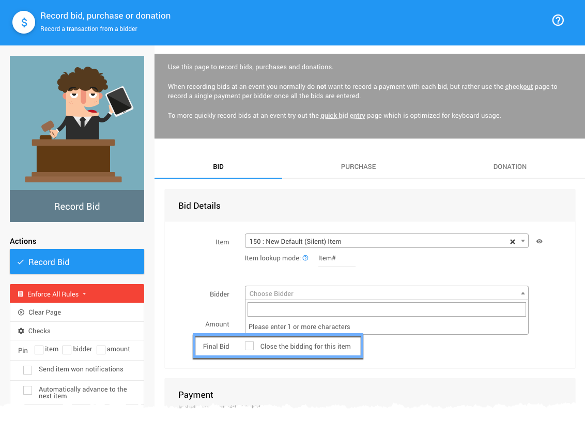
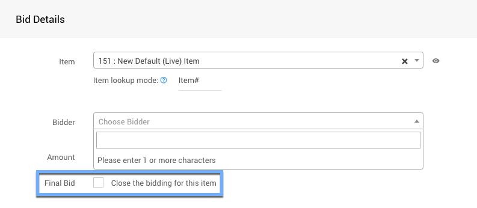
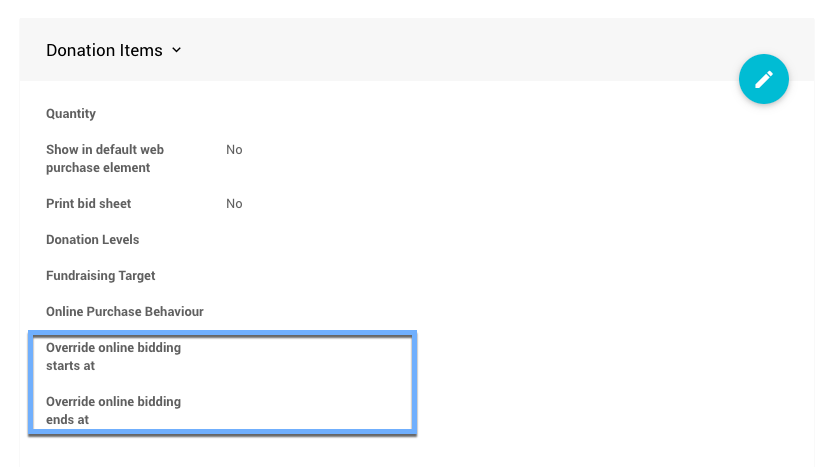
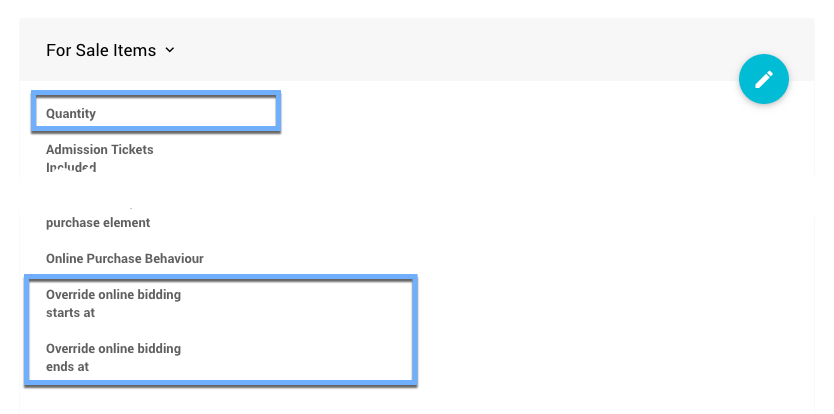

# Closing Online Bidding <New/>

At the end of an event, after the **Online Bidding Times** have ended, the **Biddable** items will be closed to new bids.

For the **Online** type items the item will be closed and **Item Won Notifications** will be sent out to the winning bidders. For **Silent** type and **Live** type items, new bids will not be accepted although their respective **Final Bids** will need to be entered for the item to be closed.

Although, in general, the ideas for closing items are very similar, there are some points to consider depending on the event and item types themselves.

::: info
When an auction is **Archived**, **_no_** items are available to be bid on, purchased, or make donations for.
:::

<HRDiv/>

  
Closing Online Bidding: Table of Contents

  [[toc]]

<HRDiv/>

## Online Auctions

For **Online Auctions**, you will generally have a default start and end time set under **Online Bidding** (or have an **Override Online Bidding End Time** set for the specific item) which makes things very easy and simple to close... you just wait for the **Online Bidding Time** to pass.

Done!

When using **Online** type items with appropriate **Online Bidding** end times set, Auctria will manage the closing of these items for you. Once the end time has passed, the item will automatically close; and, if there is a winning bid, an **Item Won Notification** will be sent to the winning bidder.

<Link/> <IndexLink slug="OnlineBidding"/>
<Link/> <IndexLink slug="OnlineBiddingTimes"/> 
<Link/> <IndexLink slug="SystemEmailsSummary" anchor="online-bidding-item-won-time">System Emails | Online Bidding - Item Won (time)</IndexLink>

<HRDiv/>

## Silent Auctions

For **Silent Auctions**, the general idea is bidding will be completed on **paper** at an **in-person** event. With **Silent** items, when the event is over, you will need to **Record Bids** for your **Silent Items** from your **Bid Sheets** and to close the item the bid will need to have the **Final Bid** checkbox enabled.

::: middle
*An example __Silent__ type item highlighting the __Final Bid__ option for the item.*
:::

You can also record a payment for the item at this time although for this particular part of the process the key is to **_record the bid_** and **_close_** the item which will send out an **Item Won Notification**; and, if **Credit Card** processing is enabled, the notification will have a **Pay Online** link.

<Link/> <IndexLink slug="RecordBid"/>
<Link/> <IndexLink slug="SilentItems"/>
<Link/> <IndexLink slug="BidSheets"/>
<Link/> <IndexLink slug="CreditCards"/>

<HRDiv/>

## Live Auctions

For **Live Auctions**, the general idea is bidding will take place at an **in-person** event and will be lead by an **"Auctioneer"**. Either during the event, or afterward, you will need to record the winning bids for the items. This is very similar to the **Silent Auction** method of recording bids (see above).

::: middle
*An example __Live__ type item highlighting the __Final Bid__ option for the item.*
:::

Depending on the timing, you may be able to record the winning bids when as the **"Auctioneer"** sells the item, too. Again, the key is to **_record the bid_** and **_close_** the item using the **Final Bid** option.

This will also send out an **Item Won Notification**.

::: info
There are many options for recording **Live** type item bids and a printable **Live Reporting Sheet** is available to record these bids on paper and then recorded in Auctria although any method of tracking bids can work until they are recorded in Auctria as the item's **Final Bid**.
:::

<Link/> <IndexLink slug="RecordBid"/>
<Link/> <IndexLink slug="LiveItems"/>
<Link/> <IndexLink slug="PrintingLiveReportingSheet"/>

<HRDiv/>

## Non-Biddable Items

The **For Sale** type and **Donation** type items will remain open until you close them (or make them unavailable) as these are considered **Non-Biddable**. For example, **For Sale** items and **Donation** items will remain open after the event has ended. These items are not affected by the default **Online Bidding Times** although they can be affected by their specific **Override Online Bidding** times.

In general, it's fine to leave these items open as long as relevant to allow potential "donors" to continue to give even after the event has "closed".

::: yellow
**IMPORTANT**
Using the **Exclude from catalog** option, **_hiding_** items, and/or **Hiding The Website Page** where the items are displayed will still leave them available for sale. They simply won't be easy to find although a direct link to their respective auction website page will still allow transactions be processed for these items.
:::

<Link/> <IndexLink slug="ItemsNotShowing" anchor="exclude-from-catalog-option">Exclude From Catalog</IndexLink>
<Link/> <IndexLink slug="ConfigureItemsDisplayed"/>
<Link/> <IndexLink slug="HideWebsitePages"/>

### Closing Donation Items

Although not necessary, the best way to *close* a **Donation** type item is to set its specific **Override Online Bidding End Time** to a point in the past. Doing this will stop Auctria from receiving any further donations for the specific item.

::: middle
*The __Item Details__ | __Donation Items__ section highlighting the Override times.*
:::
&nbsp;

<Link/> <IndexLink slug="OnlineBiddingTimes" anchor="donation-item-type-bidding-times"/>

### Closing For Sale Items

If you want to close <IndexLink slug="ForSaleItems"/>, the best method is often to adjust the **_Quantity_** value equal to the number that were sold. This will still show the item although it will have a **_"Sold Out"_** banner.

::: middle
*The __Item Details__ | __For Sale Items__ section highlighting the Quantity and Override times.*
:::

You can also **_close_** a **For Sale** item using the **_Override online bidding ends at_** property in the same manner as a **Donation** item.

::: info
If the **For Sale** item has **_no purchases_**, you can adjust the item configuration to a **Buy It Now Only** item setup and with an **Override end time** set to *Now*. This will effectively close the item immediately.

<Link/> <IndexLink slug="BuyItNowItems"/>
<Link/> <IndexLink slug="OnlineBiddingTimes"/>
&nbsp;
:::

<Link/> <IndexLink slug="OnlineBiddingTimes" anchor="for-sale-item-type-bidding-times"/>

<HRDiv/>

::: recread
- <IndexLink slug="Walkthroughs_ArchivingYourAuction"/>
- <IndexLink slug="Walkthroughs_HandlingPayments"/>
:::

<ChildPages/>
<Revised text="Added" date="2022-01-05"/>
