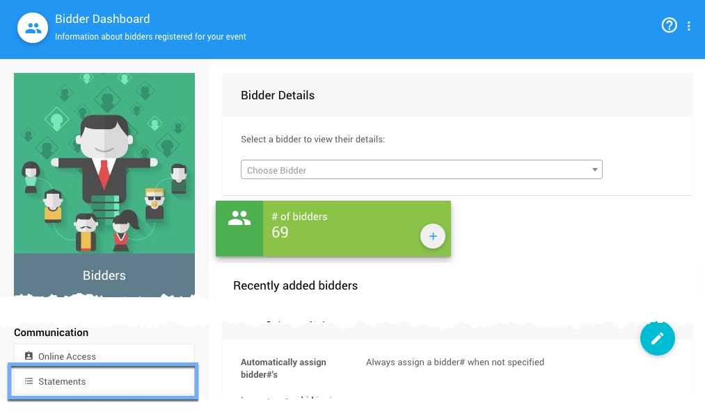
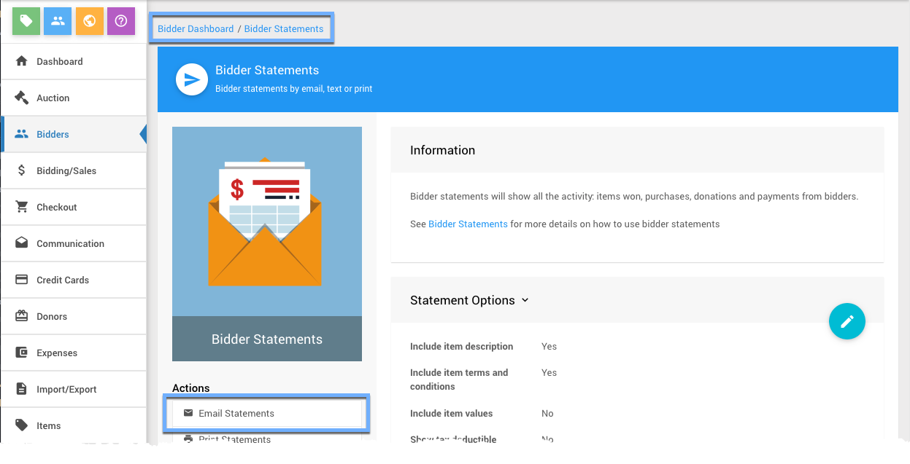
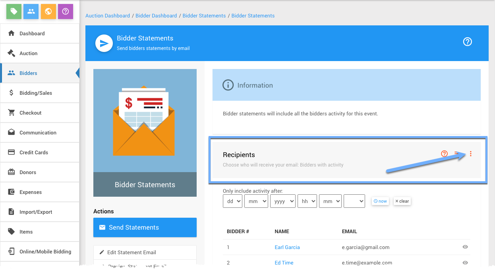
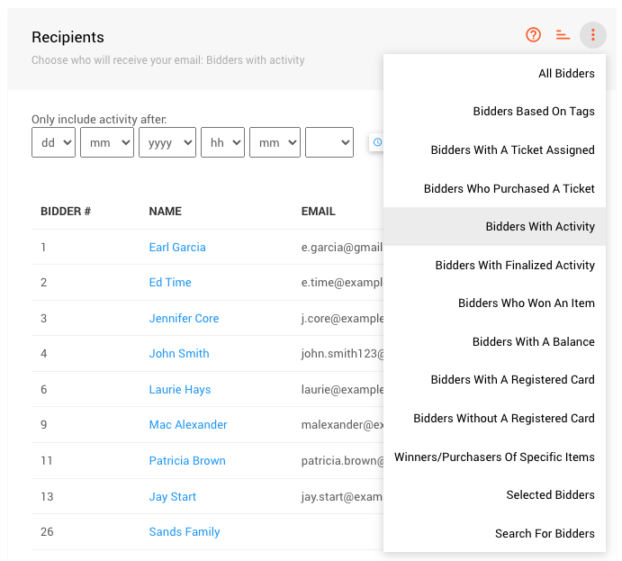
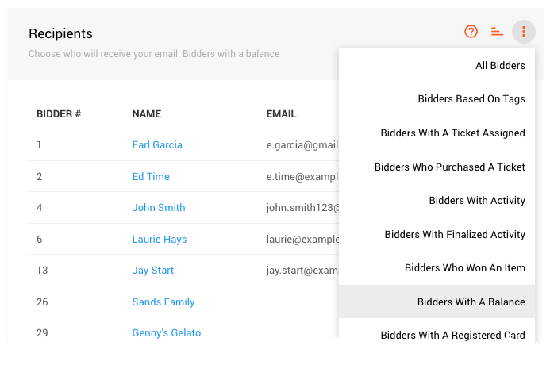
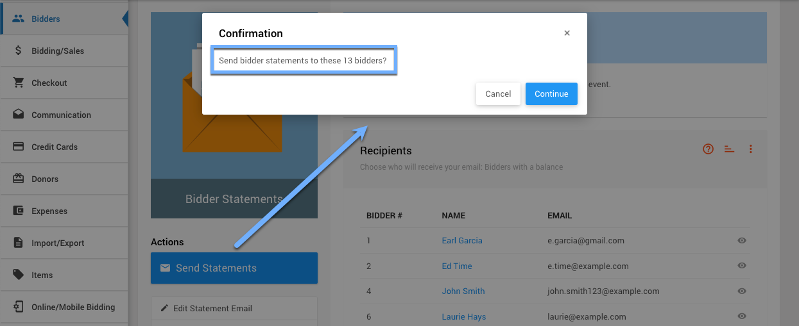

# Email Bidders With A Balance

One of the more common **Communications** you might want to send out is a **Bidder Statement** to those **_Bidders With A Balance_**.

::: middle
*An example passthrough sending a __Bidder Statement__ to __Bidders With A Balance__.*
:::

1. From the main **Auction Dashboard**, click through the **Bidders** sidebar menu item to the **Bidders Dashboard**.
2. From the **Bidders Dashboard**, scroll down and click through **Statements** and then **Email Statements** to bring you to the **Email Bidders** dashboard.
3. Click on the **_Recipients_** option menu (three vertical dots at the far-right) to open its filter selector and choose the **_Bidder With A Balance_** option. The listed **Recipients** will automatically update.
4. Click **Send Statements** and your done!

<HRDiv/>

  

    Email Bidders With A Balance: Table of Contents
  

  [[toc]]

<HRDiv/>

## Bidder Dashboard

From the **Bidder Dashboard** you can click through the **_Statements_** button under the sidebar **Communication** menu.

<HRDiv/>

## Bidder Statements

From the **Bidder Statements** dashboard you can click through the **_Email Statements_** button under the **Actions** sidebar menu.

<HRDiv/>

## Bidder Statements Recipients

From the **Bidder Statements - Send** dashboard you can select the appropriate **Recipients** filter by clicking on its *options menu* (three vertical dots) at the far-right of its section header.

<HRDiv/>

## Recipients Filter

The **Recipients** filter defaults to the **Bidders With Activity** option with the bidders that will be send the email being displayed in the list below.

::: middle
*The default filter is __Bidders With Activity__, great for "Thank You" emails.*
:::

Changing the **Recipients** filter will automatically update the listed bidders.

::: middle
*The __Bidders With A Balance__ filter will only send to those with unpaid accounts.*
:::
&nbsp;

::: ideas
The **_Recipients_** filter is used in many places. There are many common uses with other **System Emails** as well as **Custom Emails** such as, for example, sending "Thank You" notes to your fundraiser participants.

<linked slug="CustomEmails"/> 
:::

<HRDiv/>

## Send Statements

Once you have your **Recipients** filter set appropriately, you can click on the **Send Statements** button under the **Actions** sidebar menu. This will pop-up a confirmation window noting how many bidders will be emailed.

Clicking the **Continue** button will send the email statements.

<HRDiv/>

::: recread
- See <IndexLink slug="BidderStatements"/> for more details on this specific **System Email**.
- See <IndexLink slug="SystemEmailsSummary"/> for a brief overview of each of the **System Emails**.
:::

<ChildPages/>
<Revised text="Added" date="2022-01-24"/>
