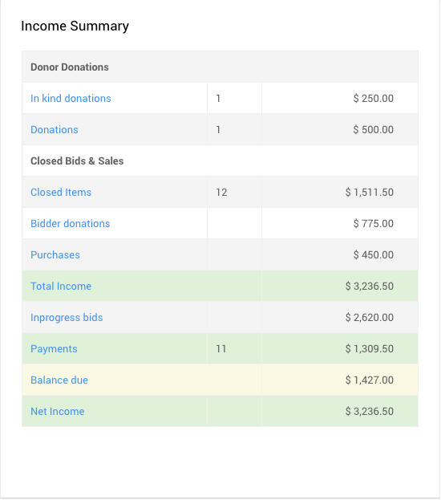

# Auction Closing <New/> <Updated/>

<VimeoCarouselShowcase showcase="9158843"/>

<HRDiv/>

Once your auction event has ended you will generally want to close out the items that were available, at least those items considered as **Biddable** and also review your **Non-Biddable** items (**For Sale** type and **Donation** type items).

There may also be some key reports you will want to look at immediately as well.

<HRDiv/>

  
Auction Closing: Table of Contents

  [[toc]]

<HRDiv/>

## Closing Online Bidding

One of the first things to consider when your auction event ends is closing out the items that were available. For your **Biddable** items, this will be mostly taken care of by the **Online Bidding Times** you have set. For **Biddable** items, bidding will be closed at their respective **Online Bidding End Times** although this is not the same with **For Sale** items and **Donation** items, these are managed differently.

For more information see <IndexLink slug="Walkthroughs_ClosingOnlineBidding"/>.

<Link/> <IndexLink slug="Glossary_BiddableItems"/>
<Link/> <IndexLink slug="OnlineBiddingTimes"/>
<Link/> <IndexLink slug="ForSaleItems"/>
<Link/> <IndexLink slug="DonationItems"/>

<HRDiv/>

## Winning Bid Reporting

Auctria has an extensive list of **Reports** available from the main **Auction Dashboard**. Each of these reports can be exported to an `XLS` formatted file and further analyzed using a spreadsheet application. These reports can also be extended to include additional relevant information using the **Choosing Columns** function.

<Link/> <IndexLink slug="Reports"/>
<Link/> <IndexLink slug="ChoosingColumns"/>

### Bidder Statements

The **Bidder Statements** are great for both the winning bidder as well as the organizer. These statements can provide a details list of all items won by the bidder as well as their purchases and donations.

<Linked slug="BidderStatements"/>

### Donor Receipts

If you have **Donors** that have contributed items to the event and will be providing these items from their location, the **Donor Receipts** document can be configured to include the winning bidder details for reference purposes.

<Linked slug="DonorReceipts"/>
<Linked slug="DonorReceipts_AddBidderDetails">Donor Receipts With Bidder Details</Linked>

<HRDiv/>

## Income Summary

The **Income Summary** table at the bottom-right of the main **Auction Dashboard** shows a list of income source types for the current auction. Each income "source" (left-most column) shown also links to a relevant list report for the amounts shown on the far-right of the table.

::: middle
*An example of an __Income Summary__ table using Auctria demo data.*
:::

::: tip
The amounts shown in the **Income Summary** table are updated with each page refresh.
:::

::: info
Each income's list report will be configured in a "default" **Report View** providing the most common relevant details for that income source.

<Link/> <IndexLink slug="ReportViews">Report Views</IndexLink>
&nbsp;
:::

See <IndexLink slug="IncomeSummary"/> for more information on this table and the amounts it is showing.

<ChildPages/>
<Revised text="Reviewed" date="2022-02-15"/>
