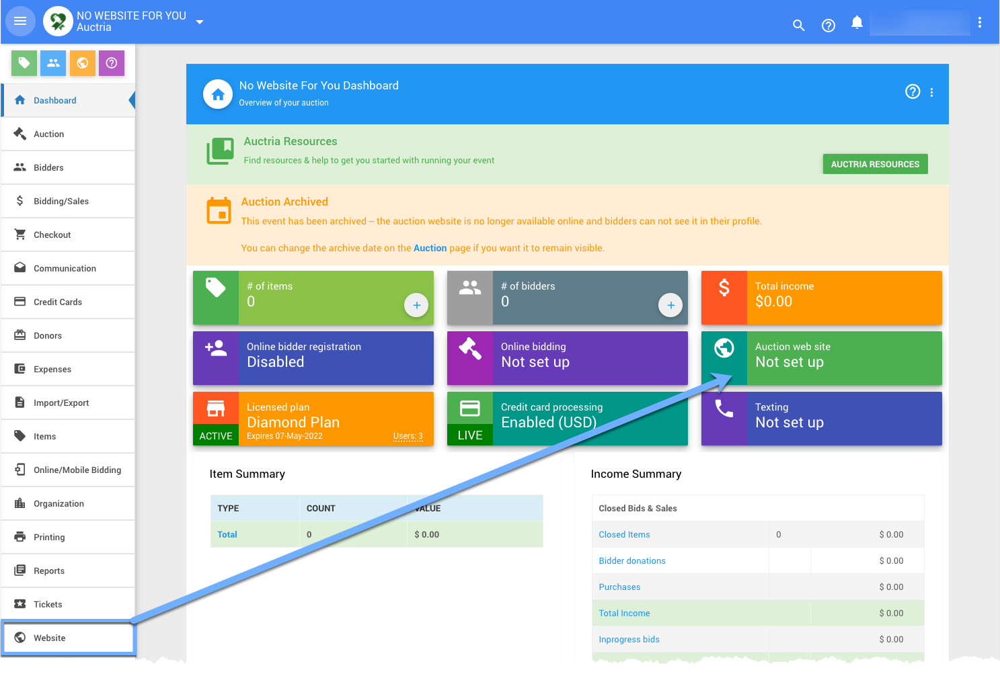
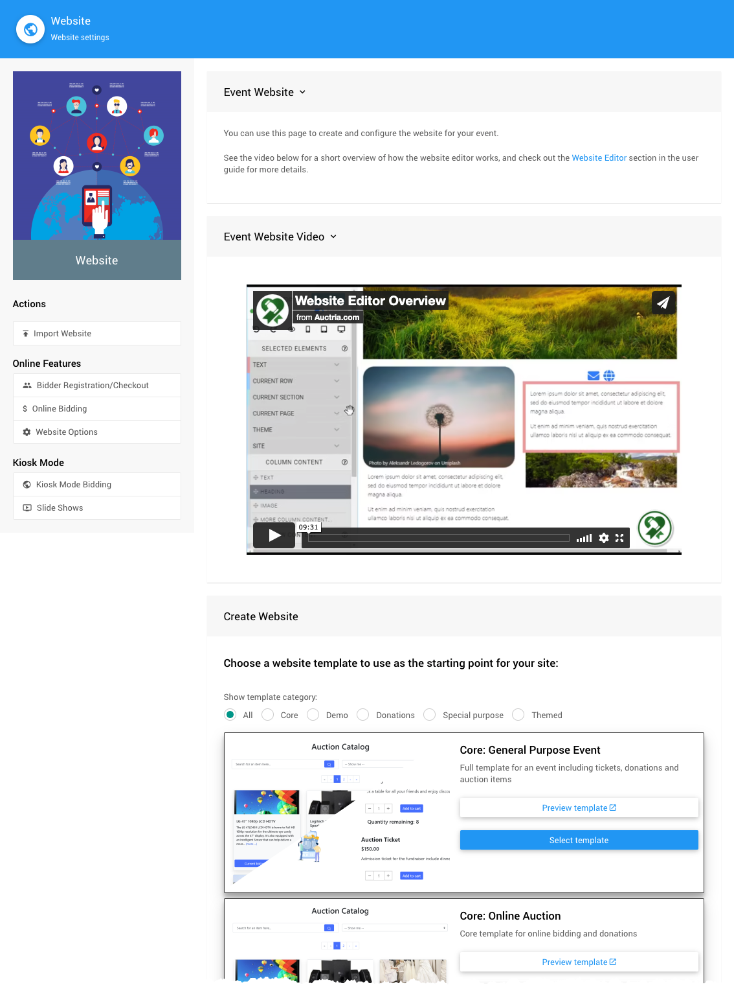
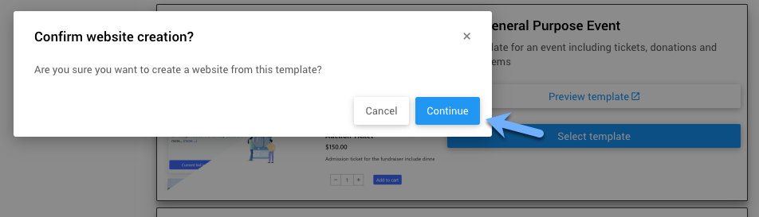
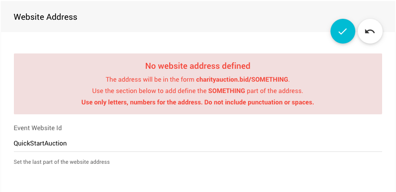
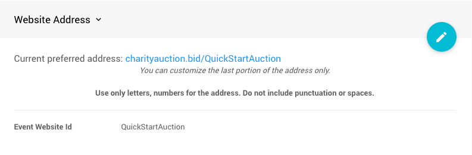
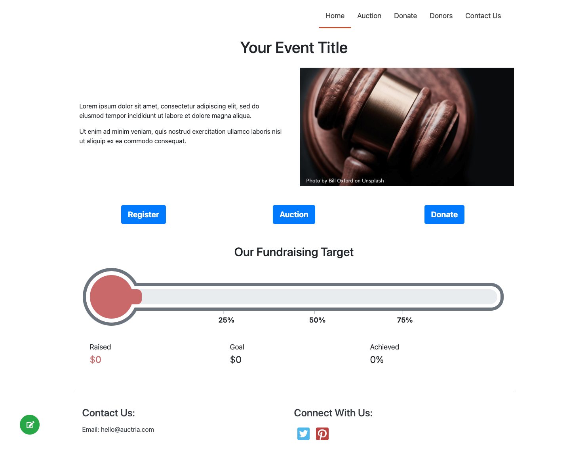
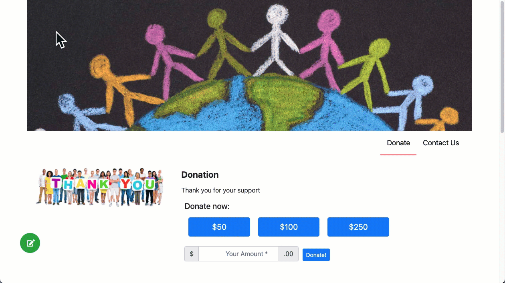

# How To Create A New Auction Website

If you have not created your **Auction Website**, yet, then from the main **Auction Dashboard** go to the **Website** dashboard to get started.

::: middle
*Both of these will take you to the __Website__ dashboard where you can create your website.*
:::

From the main **Auction Dashboard**, scroll down to the **Website** sidebar menu; or, click on the green **_Auction Website_** box at the top of the page where it says "Not set up".

<Link/> <IndexLink slug="AuctionDashboard"/>
<Link/> <IndexLink slug="Website"/>

<HRDiv/>

## Website Dashboard

Auctria offers a great many pre-made websites to be used as starting points. To use one of these **Templates** simply go to the one in the list you want to use and click its blue **_Select template_** button.

A confirmation window will pop-up before the operation is carried out.

Clicking on the "Continue" button will create the website and refresh the **Website** dashboard page.

::: danger
**NOTE**: A **Website Address** still needs to be set for your auction website URL to be complete.
:::

### Define the Website Address

After the website has been created you will still **need** to set its "address". Click the "pencil" icon to edit the **Event Website ID** address field.

::: yellow
**IMPORTANT**
**Website Addresses** should **only** use letters, numbers, and hyphens (`-`). The use of any other type of "special character" or "punctuation" could potentially make your auction website unreachable.
:::

The **Event Website ID** is the portion of the URL after `www.charityauction.bid/`. In this case, the default **Preferred Domain** is being used. There are more auction domains you can choose from, see <IndexLink slug="SetWebsiteAddress"/> for more information on these options.

Generally, your guests should be able to easily recognize the address being connected to your organization or to the current fundraiser event.

Make certain to click the "checkmark" icon to save the **Event Website ID** you entered.

After the **Website ID** has been set, the **Website** dashboard will refresh, again, and show the new complete URL for your auction website. There will also be a **_QR Code_** that links directly to the auction website you can use where you see fit.

There will also be a list of the available **Preferred Domains** you can select from if the default https://charityauction.bid/ does not suit your preferences. Changing the **Preferred Domain** will not affect the content of your auction website, it will only change the one being used for the website. All of our **Preferred Domains** will link back to the exact same auction website you are sharing.

::: info
If you are not satisfied with the template you selected, you can delete the website and select a different template to start from.
:::

<HRDiv/>

## Next Steps

You will often be viewing your website and editing it as well at the same time in the beginning. This might unintentionally trigger messages to your screen to let you know there may be other organizers trying to make changes at the same time you are; or, you may have left another browser tab open in "edit" mode. **_These concerns are easy for you to fix immediately._**

<Link/> <IndexLink slug="OpeningTheEditor" anchor="website-locked">Opening The Editor | Website Locked</IndexLink>
<Link/> <IndexLink slug="OpeningTheEditor" anchor="save-error">Opening The Editor | Save Error</IndexLink>

### View Website

Once you have created your **Auction Website** and set its **Website ID**, you are more than ready to click on the **View Website** under the **Actions** sidebar menu to see what you have created.

::: middle
*An example of the __Online Auction__ Core template immediately after creation.*
:::

Great job, but you might still want to make some edits since the website will only be using placeholder content to start with.

### Edit Website

Now, that you have created your **Auction Website**, you will probably want to add some organizational touches to the look and feel of the website and add your own appropriate information (replacing the placeholder content as needed).

::: middle
*Opening the __Website Editor__ of an example __Auction Website__.*
:::

With the website created you will most likely want to make some modifications to suit your organization's needs. This means **Opening The Website Editor**. From the **Auction Website** itself, if you see the green edit icon in the lower-left corner, you can click on it to open the **Website Editor**. This is one of the easiest ways to enter "edit" mode for the auction website.

::: middle
*Opening the __Website Editor__ from the __Auction Dashboard__.*
:::

The **Website Editor** can also be opened from the **Auction Dashboard** by clicking through **Website** and then **Edit Website** on the **Website Settings** dashboard.

<Link/> <IndexLink slug="OpeningTheEditor"/>
<Link/> <IndexLink slug="WebsiteEditor"/>

Please see the <IndexLink slug="Website"/> section of the User Guide for more information and assistance on this.

Well Done! You're now off to a great start!!

::: recread
- <IndexLink slug="OpeningTheEditor"/>
- <IndexLink slug="EditWebsitePages"/>
- <IndexLink slug="ComingSoon"/>
- <IndexLink slug="RedirectWebsite"/> <Advanced/>
:::

<ChildPages/>
<Revised text="Added" date="2021-11-26"/>
<Revised text="Updated" date="2021-11-29"/>
