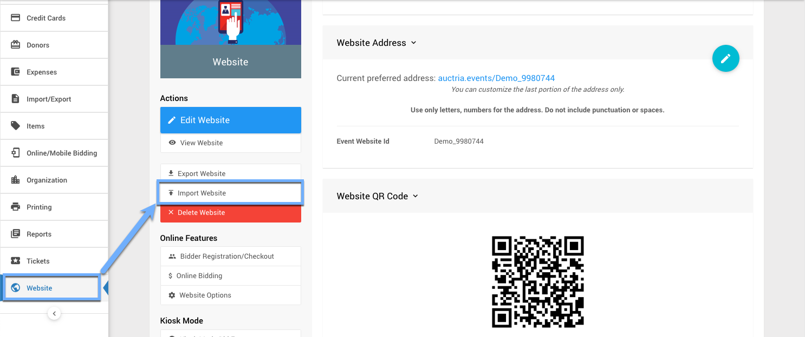
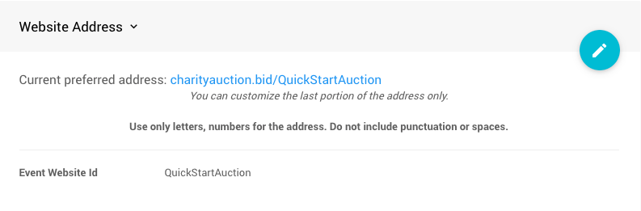

# How To Copy Your Website Using Export And Import <New/>

There may be cases where you have had a previous event under Auctria and now with your new event you want to use the same website layout and colors again. This can be done easily and quickly using the **Export Website** and **Import Website** functions.

::: prereq
- **Auctria Auction Website** (see <IndexLink slug="Walkthroughs_CreateNewWebSite2021"/> if needed)
:::

<HRDiv/>

  
How To Copy Your Website using Export and Import: Table Of Contents

  [[toc]]

## 1. Export Website

From the main **Auction Dashboard**, scroll down to the **Website** entry in the sidebar and click through to the **Website Dashboard**; then, from under the **Actions** click on the **Export Website** entry.

::: middle
*An example from a demonstration website.*
:::

Clicking on the **Export Website** entry will immediately create a `.dat` file and trigger a download your browser would handle.

This exported file name will start with `website_export_` and finish with the timestamp when you triggered the action. As an example, `website_export_2022-03-07T19_25_44Z.dat` would be found in the "downloads" folder your browser is using but with the timestamp of your export applied.

<HRDiv/>

## 2. Change To The Target Auction

Before importing a website, make certain you are viewing the event you want to import the exported website.

::: red
**WARNING**
The **Import Website** operation does not have a confirmation and will overwrite any existing website for the event.
:::

### 2a. Import Website (Overwrite Existing)

From the main **Auction Dashboard**, scroll down to the **Website** entry in the sidebar and click through to the **Website Dashboard**; then, from under the **Actions** click on the **Import Website** entry.

::: middle
*An example from a demonstration auction where a website exists.*
:::
&nbsp;
::: ideas
The idea of using the **Import Website (Overwrite Existing)** option as a means to restore a "back-up" copy (from a previously exported website `.dat` file) of the website design and layout can work quite well as a quick and easy "safety net".
:::

### 2b. Import Website (New Auction)

From the main **Auction Dashboard**, scroll down to the **Website** entry in the sidebar and click through to the **Website Dashboard**; then, from under the **Actions** click on the **Import Website** entry.

::: middle
*An example from a demonstration auction where a website does not exist.*
:::

### 2c. Select Your Exported Website File

Once you click on the **Import Website** **_Actions_** menu entry a file selector will open for you to select your exported website `.dat` file.

Click on the **Choose File** button in the pop-up window and navigate to where you saved your **Export Website** file to select it. Once selected, the file will be uploaded and processed. The screen will be refreshed and the exported website will now be used in the current acution.

<HRDiv/>

## 3. Define Website Address (New Auction)

After the website has been created you will still **need** to set its "address". Click the "pencil" icon to edit the **Event Website ID** address field.

::: yellow
**IMPORTANT**
**Website Addresses** should **only** use letters, numbers, and hyphens (`-`). The use of any other type of "special character" or "punctuation" could potentially make your auction website unreachable.
:::

The **Event Website ID** is the portion of the URL after `www.charityauction.bid/`. In this case, the default **Preferred Domain** is being used. There are more auction domains you can choose from, see <IndexLink slug="SetWebsiteAddress"/> for more information on these options.

Generally, your guests should be able to easily recognize the address being connected to your organization or to the current fundraiser event.

Make certain to click the "checkmark" icon to save the **Event Website ID** you entered.

::: ideas
An alternative approach, if you have not already created your new auction, is to use the **_Copy auction web site_** option when you use the **Copy Auction** function.
&nbsp;
<Linked slug="CopyAuction" anchor="settings">Copy Auction - Settings</Linked>
:::

<ChildPages/>
<Revised text="Added" date="2022-03-07"/>
