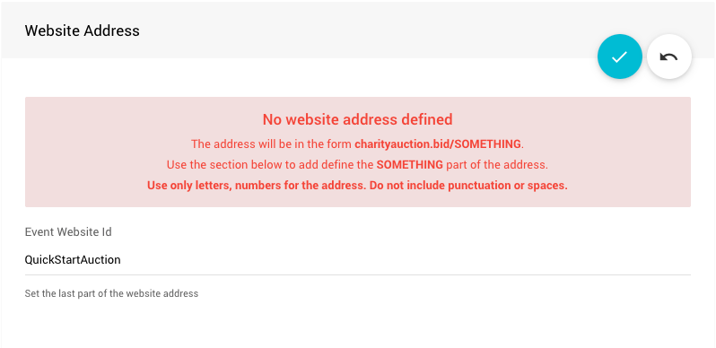

# Setting Up A Donation Only Event <Updated/>

**Setting Up A Donation Only Website** is one of the easiest and most straight-forward event websites to use in Auctria.

::: middle
*The default view of the __Donations Only__ website template.*
:::

## Create The Website

Once you have gone through the <IndexLink slug="InitialSetup"/> you will need to finish up with creating your website. In this case, one of the best choices for a starting template would be **Donations -- Special Purpose: Donation Only** and all the major work is done.

::: middle
*Select the __Donations__ category and then click the __Select template__ button*
:::

A confirmation will pop-up, just click the **Continue** button to finish the process.

::: info
For a more visual reference, you can click the **Preview template** button on the <IndexLink slug="Walkthroughs_CreateNewWebSite2021">Create New Website</IndexLink> page before the "Select template" button.
:::

### Define the Website Address

After the website has been created you will still **need** to set its "address". Click the "pencil" icon to edit the **Event Website ID** address field.

::: yellow
**IMPORTANT**
**Website Addresses** should **only** use letters, numbers, and hyphens (`-`). The use of any other type of "special character" or "punctuation" could potentially make your auction website unreachable.
:::

The **Event Website ID** is the portion of the URL after `www.charityauction.bid/`. In this case, the default **Preferred Domain** is being used. There are more auction domains you can choose from, see <IndexLink slug="SetWebsiteAddress"/> for more information on these options.

Generally, your guests should be able to easily recognize the address being connected to your organization or to the current fundraiser event.

Make certain to click the "checkmark" icon to save the **Event Website ID** you entered.

### Configure The Donation Element (Optional)

By default, when using the **Special Purpose: Donation Only** template, the **Donation Element** used will be configured in **_Cash Donation_** mode. The **Donation Element** can be configured to use **_Donation Items_** mode if you prefer to not use the generic *Cash Donation* approach to your fundraiser.

If your fundraiser is focused on a **single** project, using the **_Cash Donation_** approach will work quite well but if your fundraiser is focused on **multiple** projects, the **_Donation Items_** approach works much better at designating specific donations to specific projects.

::: info
When creating the **Donation Only Event** website you might also consider using the **Fund-A-Need** template instead. It uses an **Item Catalog** pre-configured to display **Donation** type items instead of the **Donation Element**.
:::

<Link/> <IndexLink slug="RowContent_DonationElement"/>
<Link/> <IndexLink slug="DonationItems"/>
<Link/> <IndexLink slug="FundANeed"/>
<Link/> <IndexLink slug="RowContent_ItemCatalog"/>

<HRDiv/>

## Make The Site Your Own

You may find that the default <IndexLink slug="RowContent_DonationElement"/> does not have the **Donation Levels** you want to use, you can make those changes by <IndexLink slug="SettingDonationLevels"/> you want.

You can make adjustments to the <IndexLink slug="BasicContent_Thermometer"/> element as well such as changing the fundraiser **Progress Tracker** element's <IndexLink slug="BasicContent_Thermometer" anchor="type-thermometer"/> *Target* amount.

You can also make other changes to this "Special Purpose" template by using the <IndexLink slug="WebsiteEditor"/>.

<Link/> <IndexLink slug="OpeningTheEditor"/>
<Link/> <IndexLink slug="EditWebsitePages"/>

<HRDiv/>

## Enable Bidder Registration

Although you may not have any bidding for a **Donation Only** website you will still need to enable <IndexLink slug="BidderRegistration"/> as it is required for the checkout portion when donors make their payments.

Start by clicking on **Website** -> **Bidder Registration** from the main <IndexLink slug="AuctionDashboard"/> menu.

This will open the **Bidder Registration** dashboard. Scroll down to the **Online Bidder Registration**.

You will need to set *Enable online bidder registration and ticket purchases* to **Yes**.

::: green
**NOTE**
Remember to click the "checkmark" icon to save your change after making them in a settings section.
:::

Although your event was live immediately, your **Donors** will now be able to pledge their donation and make their payments.

<HRDiv/>

## Further Options

You can now continue to add items to your event and make further customizations as needed.

- See the <IndexLink slug="CreditCardConcepts"/> Concepts section to learn about how to accept credit card payments through our integrated credit card processing services.
- Add details about your <IndexLink slug="Donors"/> to help promote them online using a <IndexLink slug="RowContent_DonorCatalog"/>.

<ChildPages/>
<Revised date="2021-12-09"/>
