# Setting Up A For Sale Items Auction <Updated/>

To set up an auction to only deal with <IndexLink slug="ForSaleItems"/> is very similar to setting up a basic <IndexLink slug="OnlineItems"/> auction (see <IndexLink slug="QuickStart_SetupOnlineAuction"/> for reference).

Although the essentials are still the same as an **Online Auction** there are some exceptions and modifications to take into consideration.

1. [Add Your Items](./#_1-add-your-items)
2. [Creating Your Auction Website](./#_2-creating-your-auction-website)
3. [Configure Auction Catalog](./#_3-configure-auction-catalog)
4. [Set Bidder Rules](./#_4.bidding-rules)

## 1. Add Your Items

You will be starting with creating <IndexLink slug="ForSaleItems"/> for your "auction".

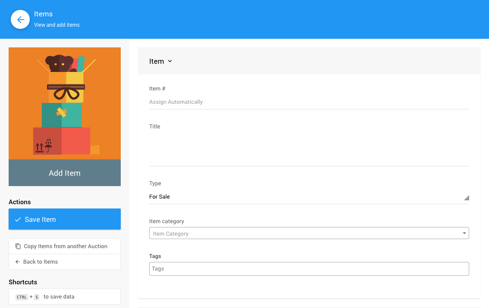

### For Sale Item Pricing

You will need to set your **Pricing** details for each item.

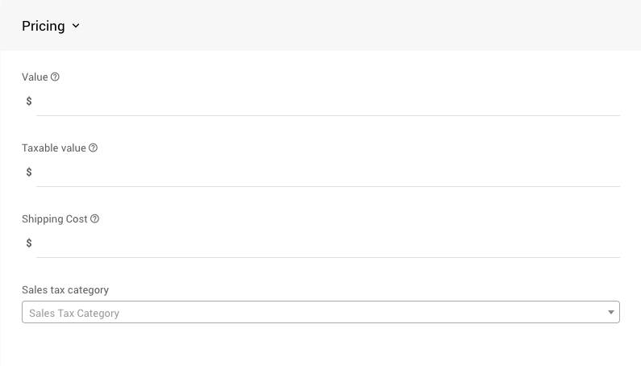

The most important property in the **Pricing** section is the *Value*. This is the price of the **For Sale** item you are listing. More information on the **Pricing** properties can be found at:
- <IndexLink slug="TaxableValue"/>
- <IndexLink slug="Shipping"/>
- <IndexLink slug="SalesTaxCategory"/>

### For Sale Item Specifics

You will also need to review the **For Sale Items** details for each item.

In most cases, there will be three values to consider:
- **Quantity** (recommended)
  This is the number of the **For Sale** item you have available. Leaving this value as blank (or zero) means an unlimited amount. Setting the quantity available here is recommended although not specifically required.
- **Coupons** (optional)
  This would be the place to offer discounts on the item. See <IndexLink slug="CouponCodes"/> for more details.
- **Online Purchase Behaviour**.
  The default is *Immediate Payment Only* and would generally be left as-is. See <IndexLink slug="OnlinePurchaseBehavior"/> for more information on this option.

<HRDiv/>

## 2. Creating Your Auction Website

To **Create A Website** click on **Website** from the main Auction Dashboard.

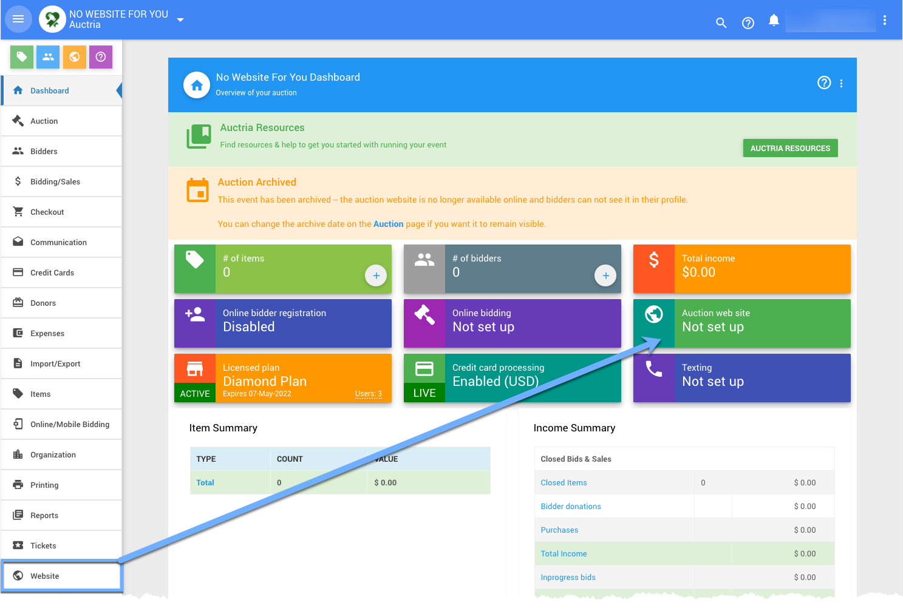

Scroll down to view the available website templates in the **Create Website** section and click on the **Select this template** button to create your website.

There are several template categories you can start with to create your Auction Website.

<Link/> <IndexLink slug="Walkthroughs_CreateNewWebSite2021"/>

### Define the Website Address

After the website has been created you will still **need** to set its "address". Click the "pencil" icon to edit the **Event Website ID** address field.

::: yellow
**IMPORTANT**
**Website Addresses** should **only** use letters, numbers, and hyphens (`-`). The use of any other type of "special character" or "punctuation" could potentially make your auction website unreachable.
:::

The **Event Website ID** is the portion of the URL after `www.charityauction.bid/`. In this case, the default **Preferred Domain** is being used. There are more auction domains you can choose from, see <IndexLink slug="SetWebsiteAddress"/> for more information on these options.

Generally, your guests should be able to easily recognize the address being connected to your organization or to the current fundraiser event.

Make certain to click the "checkmark" icon to save the **Event Website ID** you entered.

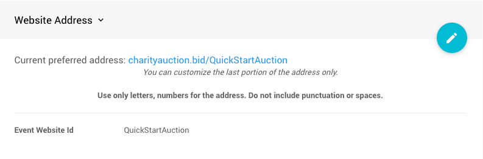

<HRDiv/>

## 3. Configure Auction Catalog

::: green
**NOTE**
If you do not have an "Auction Catalog" pre-built from the website template, you can still add one as needed. See <IndexLink slug="AddNewWebsitePage"/> and <IndexLink slug="Section_AddSection" anchor="auction-catalog"/> for more details.
:::

In most cases, the pre-built **Auction Catalog** inserted into the website will need to be re-configured to just display <IndexLink slug="ForSaleItems"/>. See <IndexLink slug="ConfigureItemsDisplayed"/> for more details.

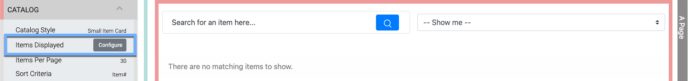

Clicking on the *Configure* button will open the **Select Items** window.

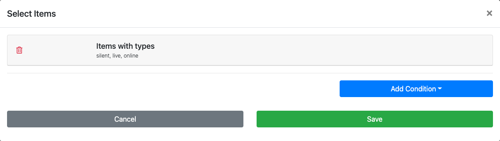

Most **Auction Catalogs** will be configured to display the "Biddable" item types... you will be changing this to the <IndexLink slug="ForSaleItems"/> type.

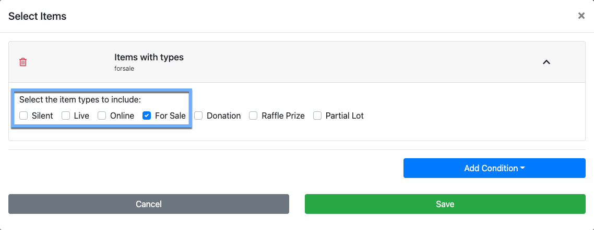

Once you have set your items to be displayed as the **For Sale** type, you can then set a more appropriate item card for the catalog. In many cases, using an "Immediate" style of card will provide for a better buyer experience.

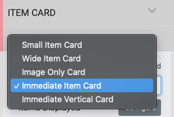

You may also want to toggle off the "<IndexLink slug="RowContent_ItemCatalog" anchor="allow-drill-to-details"/>" option which will then have the items go immediately to the shopping cart. Leaving the option enabled will allow potential buyers to click through to the <IndexLink slug="ItemDetails"/> which may be used to provide in-depth information about the item.

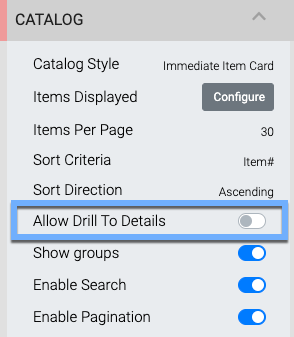

<HRDiv/>

## 4. Bidding Rules

With <IndexLink slug="ForSaleItems"/> you do not need to specifically set <IndexLink slug="OnlineBidding"/> start and end times as the **For Sale Items** will be immediately available until their relevant quantity available is purchased.

### Enable Bidder Registration

To enable <IndexLink slug="BidderRegistration"/>, start by clicking on **Website** -> **Bidder Registration**.

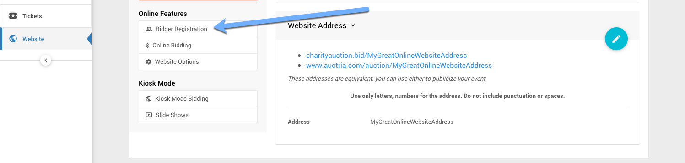

This will open the **Bidder Registration** dashboard. Scroll down to the **Online Bidder Registration**.

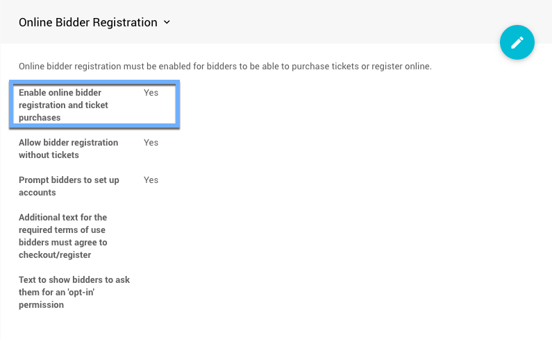

With most new auctions, this option is normally enabled by default. If it is not enabled, you will need to set *Enable online bidder registration and ticket purchases* to **Yes**.

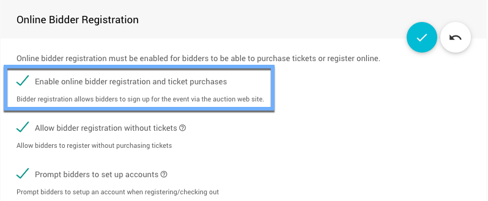

::: info
Remember to click the "checkmark" icon to "save" any changes after making them in a setting section.
:::

Although you will not have "bidder registration" in most cases, you will still need to allow for it as this functionality is part of the <IndexLink slug="Checkout"/> processes.

<HRDiv/>

## More Options To Consider

You can now continue to add items to your event and make further customizations as needed.

- See the <IndexLink slug="CreditCardConcepts"/> Concepts section to learn about how to accept credit card payments through our integrated credit card processing services.
- See the <IndexLink slug="WebsiteEditor"/> section to learn how to customize your event website with more details.
- Add details about your <IndexLink slug="Donors"/> to help promote them online.

<ChildPages/>
<Revised date="2021-11-15"/>
