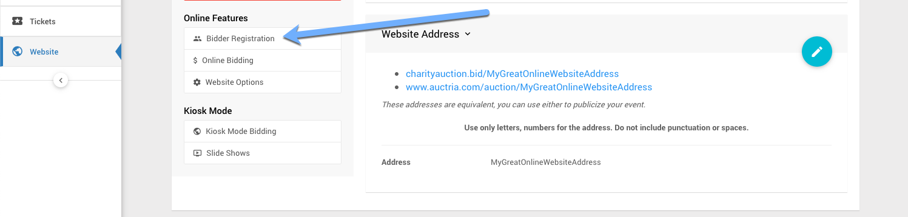

# Setting Up An In-Person Auction <Updated/>

There are four major steps to setting up an **In-Person Auction** in Auctria.
1. [Adding Your Items](./#adding-your-items)
2. [Create A Website](./#creating-a-website)
3. [Set Up The Bidding Rules](./#set-up-the-bidding-rules)
4. [Print Bid Sheets](./#print-bid-sheets)

<HRDiv/>

Setting Up An In-Person Auction - Table Of Contents

[[toc]]

<HRDiv/>

## 1. Adding Your Items

You can <IndexLink slug="AddNewItem">add items</IndexLink> from the main Auction Dashboard under **Items** -> **Add New Item**.

For an *in-person* event, these items should have their type set to **Silent**. See <IndexLink slug="ItemTypes"/> for more information on the different items types in Auctria. This is the **Item Type** that will provide for the ability to use "paper" **Bid Sheets** to close out and record final bids from.

::: info
You can continue with the rest of the setup process before you finish adding all, or any, of your items. Items can be added at any time.
:::

::: red
**WARNING**
Please also ensure you have enabled the **_Participate in online bidding_** property for each of the **Silent** type items you want to allow "pre-bidding" on before the in-person event.

::: middle
*An example using the default __Online Bidding Times__. Note: the default for this is `No`.*
:::

::: middle
<Linked slug="SilentItems"/>
<Linked slug="AddNewItem"/>
<Linked slug="EditItemDetails"/>
:::

::: middle
<Linked slug="SetupOnlinePreBidding"/>
:::

### Add Admission Tickets For The Event

Many **In-Person** events will have tickets to help organizers track a number of things such as expected attendance, tables and seating arrangements, meal choices, etc. Using the Auctria **Tickets** functions will help with this.

::: middle
<Link/> <IndexLink slug="Tickets"/>
<Link/> <IndexLink slug="SellTickets"/>
<Link/> <IndexLink slug="TablesAndSeating"/>
:::

<HRDiv/>

## 2. Create A Website

To **Create A Website** click on **Website** from the main Auction Dashboard.

Scroll down to view the available website templates in the **Create Website** section and click on the **Select this template** button to create your website.

There are numerous templates available to choose from the above is only a small sampling.

### Define the Website Address

After the website has been created you will still **need** to set its "address". Click the "pencil" icon to edit the **Event Website ID** address field.

::: yellow
**IMPORTANT**
**Website Addresses** should **only** use letters, numbers, and hyphens (`-`). The use of any other type of "special character" or "punctuation" could potentially make your auction website unreachable.
:::

The **Event Website ID** is the portion of the URL after `www.charityauction.bid/`. In this case, the default **Preferred Domain** is being used. There are more auction domains you can choose from, see <IndexLink slug="SetWebsiteAddress"/> for more information on these options.

Generally, your guests should be able to easily recognize the address being connected to your organization or to the current fundraiser event.

Make certain to click the "checkmark" icon to save the **Event Website ID** you entered.

See <IndexLink slug="Walkthroughs_CreateNewWebSite2021"/> for more details and information.

<HRDiv/>

## 3. Set Up The Bidding Rules

This is where you will set the **Online Bidding Times**, if you are having **Online Pre-bidding** for your items as well as enabling your **Bidder Registration** options.

### Online Bidding Times

To enable <IndexLink slug="OnlineBidding"/>, start by clicking on **Website** -> **Online Bidding**.

Enter both **Online bidding start** and **Online bidding end** times. These will be used as the default start and end times for "online" items.

::: yellow
**IMPORTANT**
Online bidding will **not** be enabled until either both default **Online bidding start** and **Online bidding end** times are set; or, set relevant item's specific **Override Online Bidding** times have been set. **_NOTE_**: The "default" **Online Bidding Times** should always be set.
:::

::: middle
<Linked slug="OnlineBiddingTimes"/>
:::

::: info
**NOTE:** The **Online Bidding End** times will only stop bids from being accepted online for **Silent Type** items, the end time will not trigger any closing actions like using the **Online Type** for your items will.
:::

### Enable Bidder Registration

To enable <IndexLink slug="BidderRegistration"/>, start by clicking on **Website** -> **Bidder Registration**.

This will open the **Bidder Registration** dashboard. Scroll down to the **Online Bidder Registration**.

You will need to set *Enable online bidder registration and ticket purchases* to **Yes**.

::: info
Remember to click the "checkmark" icon to save after making changes in a settings section.
:::

Your event will now be live! Bidders will be able to register and bid within the current **Online Bidding Times** you have set for your items.

<HRDiv/>

## 4. Print Bid Sheets

Once online bidding reaches its end time, especially for in-person events, you will want to have printed (read: **_paper_**) **Bid Sheets** available for your bidders to finish placing their bids.

Once your "in-person" bidding end time has passed you can collect these printed **Bid Sheets** to record the **Final Bids** for your items.

::: info
The "in-person" end time is managed outside of Auctria although it can be included in the printed  **Bid Sheet** if set in the **Other** section of the **Item Details**.
:::

One of the keys to a **Silent Auction Event** is the final bids for items are made on paper **Bid Sheets** and then recorded in Auctria to complete and close out bidding on the items.

::: middle
<Link/> <IndexLink slug="BidSheets"/>
<Link/> <IndexLink slug="RecordBid" anchor="final-bid">Record Bids | Final Bid</IndexLink>
<Link/> <IndexLink slug="SilentItemsDetails" anchor="other">Silent Items Detailed | Other (Bidsheet Closing Time)</IndexLink>
:::

<HRDiv/>

## Further Options

You can now continue to add items to your event and make further customizations as needed.

- See the <IndexLink slug="CreditCardConcepts"/> Concepts section to learn about how to accept credit card payments through our integrated credit card processing services.
- See the <IndexLink slug="WebsiteEditor"/> section to learn how to customize your event website with more details.
- Have a look at the walkthrough <IndexLink slug="Walkthroughs_AddDonationPage"/> to help increase the fundraiser income by offering your guests more opportunities to give.
- Add details about your <IndexLink slug="Donors"/> to help promote them online.

<HRDiv/>

## More About Silent Item Auctions

The following User Guide sections and pages about **Silent Item Auctions** may also be of assistance.

- <IndexLink slug="SetupOnlinePreBidding"/>
- <IndexLink slug="OnlineAuctions"/>
---
- <IndexLink slug="AuctionDashboard"/>
- <IndexLink slug="BatchCheckout"/>

<ChildPages/>
<Revised date="June 2022"/>
