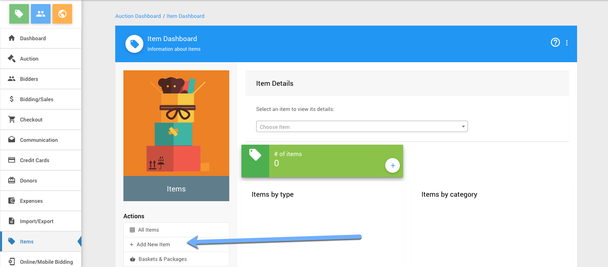
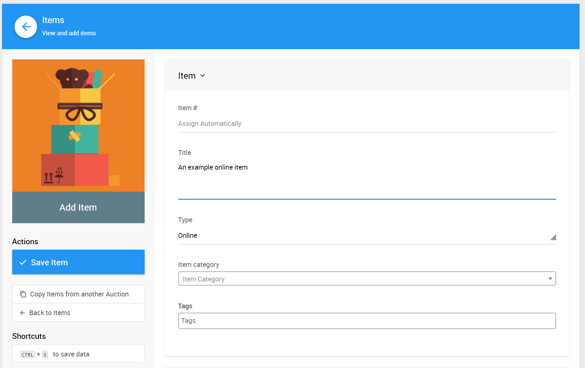
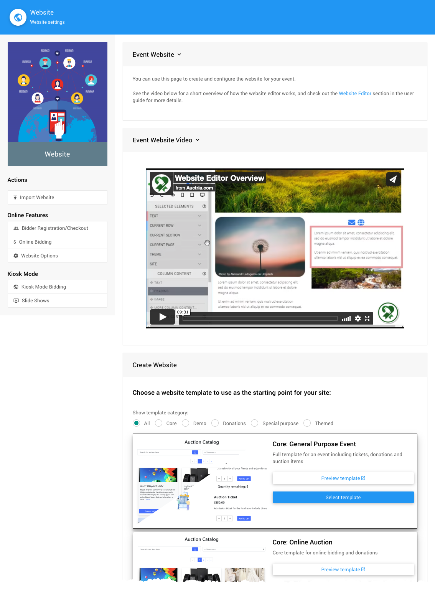
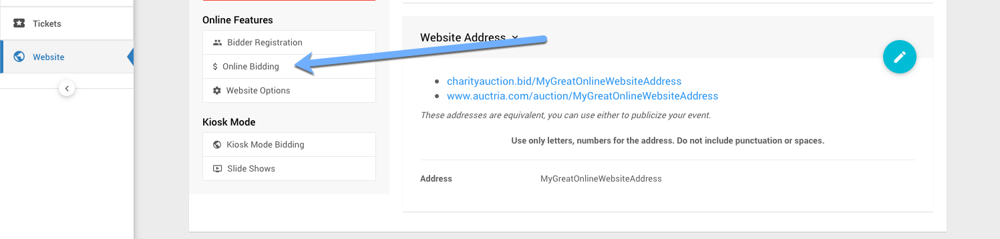
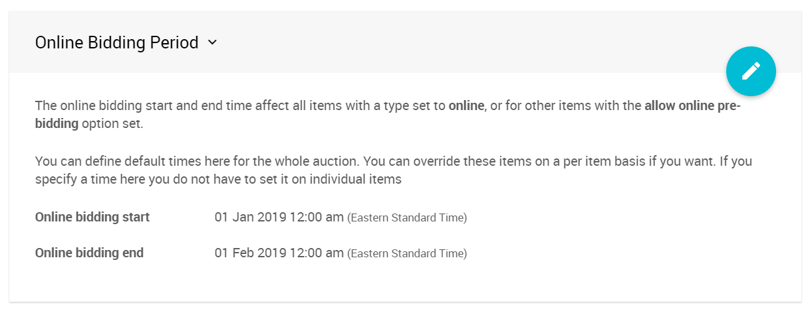

# Setting Up An Online Items Auction <Updated/>

There are three main steps to setting up an online auction in Auctria.

1. [Adding Your Items](./#_1-adding-your-items)
2. [Creating Your Auction Website](./#_2-creating-your-auction-website)
3. [Set Up The Bidding Rules](./#_3.set-up-the-bidding-rules)

## 1. Adding Your Items

You can <IndexLink slug="AddNewItem">add items</IndexLink> from the main Auction Dashboard under **Items** -> **Add New Item**.

For a fully online event, these items should have their type set to **Online**. See <IndexLink slug="ItemTypes"/> for more information on the different items types in Auctria.

You can continue with the rest of the setup process before you finish adding all of your items. Items can be added at any time.

<HRDiv/>

## 2. Creating Your Auction Website

To **Create A Website** click on **Website** from the main Auction Dashboard.

Scroll down to view the available website templates in the **Create Website** section and click on the **Select this template** button to create your website.

There are several template categories you can start with to create your Auction Website.

<Link/> <IndexLink slug="Walkthroughs_CreateNewWebSite2021"/>

### Define the Website Address

After the website has been created you will still **need** to set its "address". Click the "pencil" icon to edit the **Event Website ID** address field.

::: yellow
**IMPORTANT**
**Website Addresses** should **only** use letters, numbers, and hyphens (`-`). The use of any other type of "special character" or "punctuation" could potentially make your auction website unreachable.
:::

The **Event Website ID** is the portion of the URL after `www.charityauction.bid/`. In this case, the default **Preferred Domain** is being used. There are more auction domains you can choose from, see <IndexLink slug="SetWebsiteAddress"/> for more information on these options.

Generally, your guests should be able to easily recognize the address being connected to your organization or to the current fundraiser event.

Make certain to click the "checkmark" icon to save the **Event Website ID** you entered.

::: recread
- <IndexLink slug="Walkthroughs_CreateNewWebSite2021"/>
:::

<HRDiv/>

## 3. Set Up The Bidding Rules

### Online Bidding Times

To enable <IndexLink slug="OnlineBidding"/>, start by clicking on **Website** -> **Online Bidding**.

Enter both **Online bidding start** and **Online bidding end** times. These times will be used as the default start and end times for your "online" items. These times will also apply to all "Biddable" items.

::: red
**IMPORTANT**
Online bidding will **not** be enabled until you have specified both **Online bidding start** and **Online bidding end** times.
:::

::: recread
- <IndexLink slug="OnlineBiddingTimes"/>
- <IndexLink slug="Glossary_BiddableItems"/>
:::

### Enable Bidder Registration

To enable <IndexLink slug="BidderRegistration"/>, start by clicking on **Website** -> **Bidder Registration**.

This will open the **Bidder Registration** dashboard. Scroll down to the **Online Bidder Registration**.

You will need to set *Enable online bidder registration and ticket purchases* to **Yes**.

::: info
Remember to click the "checkmark" icon to "save" any changes after making them in a setting section.
:::

Your event **Auction Website** is "live" as soon as it is created and its **Website Address** is set! Bidders will be able to register and bid within the online bidding start and end window of time.

<HRDiv/>

## Further Options

You can now continue to add items to your event and make further customizations as needed.

- See the <IndexLink slug="CreditCardConcepts"/> Concepts section to learn about how to accept credit card payments through our integrated credit card processing services.
- See the <IndexLink slug="WebsiteEditor"/> section to learn how to customize your event website with more details.
- Add details about your <IndexLink slug="Donors"/> to help promote them online.

<HRDiv/>

## More About Online Auctions

The following User Guide sections and pages about **Online Auctions** may also be of assistance.

- <IndexLink slug="ProxyBidding"/>
- <IndexLink slug="OnlineAuctions"/>
---
- <IndexLink slug="AuctionDashboard"/>
- <IndexLink slug="BatchCheckout"/>
- <IndexLink slug="COVID19" anchor="converting-to-an-online-fundraiser"/>

<ChildPages/>
<Revised date="2021-12-10"/>
