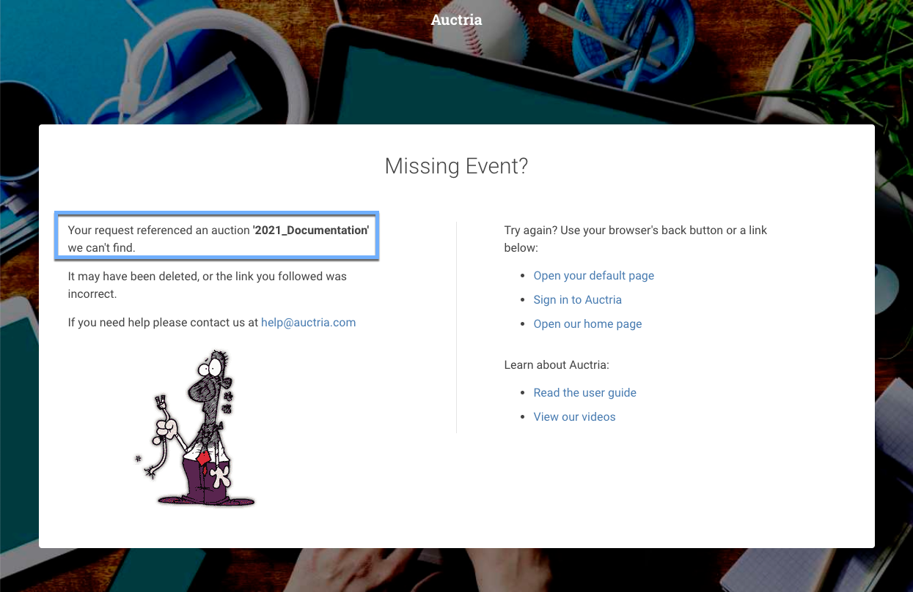
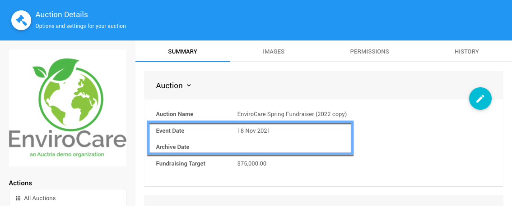

# Archiving Your Auction <New/>

**Archiving Your Auction** happens after the event is completed. This can be based on a specific date or, by default, will be six (`6`) months after the **Event Date** set under the **Auction Details** dashboard.

::: info
Although a specific **Archive Date** can be set to be immediately after your event has ended, a `30` day grace period is enforced to help ensure all payments have been made by bidders allowing them to clear any outstanding balances themselves.

See **<IndexLink slug="FinancialReports" anchor="accounts">Reports > Financial > Accounts</IndexLink> | Outstanding Accounts** for reference.
:::

Once the event is over and all of your items have been addressed appropriately, for example **Closing Online Bidding**, and you have cleared all of your **Outstanding Accounts** (and organization fees balances, if any), you will generally want to consider **Archiving Your Auction**.

<Linked slug="AuctionDetails"/>
<Linked slug="Walkthroughs_ClosingOnlineBidding"/>

## What Happens?

Once the auction has been archived, visitors to the **Auction Website** will get a **Missing Event?** page displayed with a reference to the auction event **Website ID** you used.

::: middle
*An example of an archived __Auction Website__ landing page.*
:::

<HRDiv/>

## Set The Auction Archive Date

In most cases, the **Auction Website** will automatically be archived approximately six (`6`) months after the **Event Date** set under the **Auction Details** dashboard.

::: middle
*An example of the __Auction Details__ taken from an Auctria demonstration site.*
:::

The **Event Date** is set when the event is created using the **Add New Auction** function. By default, the **Event Date** will be set to when the auction was added (this can be modified at any time).

The **Archive Date** will also be automatically set, by default, as six (`6`) months after the **Event Date**. The **Archive Date** can be modified at any time and, if left blank, it will be treated as though the date was set six (`6`) months after the **Event Date**.

<Link/> <IndexLink slug="AddAuction"/>

::: recread
- <IndexLink slug="ArchiveAuction"/> for more details on setting a specific archive date.
:::

<ChildPages/>
<Revised text="Added" date="2022-01-12"/>
